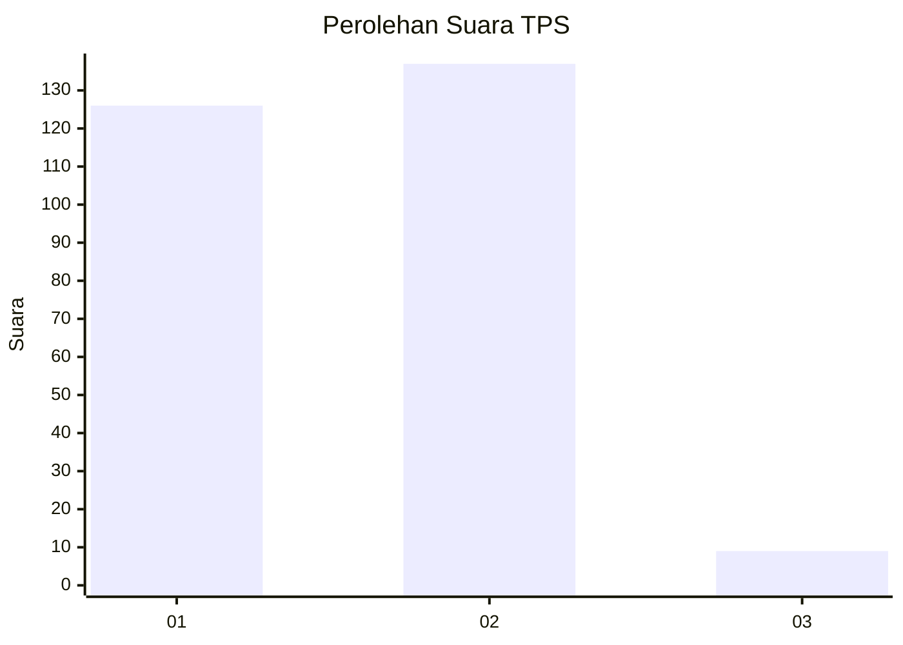
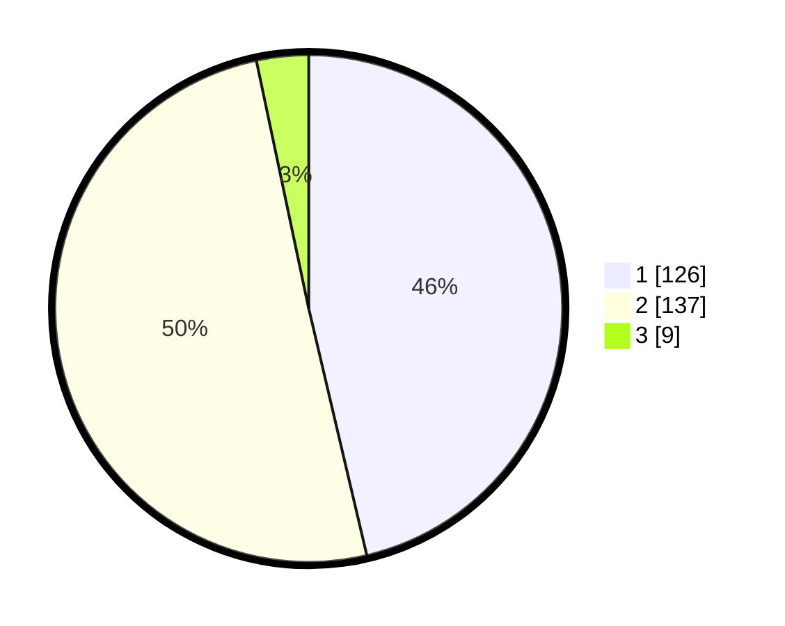

# Hasil

## Grafik

## Tabel

| No. | Nama Paslon    | Suara | Suara (raw) | Persentase |
|:--- |:-------------- | -----:| -----------:| ----------:|
| 1   | ANIES MUHAIMIN | 126   | [126][p-1]  | 46,32      |
| 2   | PRABOWO GIBRAN | 137   | [137][p-2]  | 50,37      |
| 3   | GANJAR MAHFUD  | 9     | [9][p-3]    | 3,31       |

[p-1]: https://github.com/gigit-pemilu/pemilu-2024-35-jawa-timur/blob/main/pilpres/hitung-suara/sub/35-jawa-timur/sub/28-pamekasan/sub/12-kadur/sub/2001-pamaroh/sub/001-tps/sub/paslon-1.txt
[p-2]: https://github.com/gigit-pemilu/pemilu-2024-35-jawa-timur/blob/main/pilpres/hitung-suara/sub/35-jawa-timur/sub/28-pamekasan/sub/12-kadur/sub/2001-pamaroh/sub/001-tps/sub/paslon-2.txt
[p-3]: https://github.com/gigit-pemilu/pemilu-2024-35-jawa-timur/blob/main/pilpres/hitung-suara/sub/35-jawa-timur/sub/28-pamekasan/sub/12-kadur/sub/2001-pamaroh/sub/001-tps/sub/paslon-3.txt

## Foto C Plano

https://sirekap-obj-formc.kpu.go.id/3905/pemilu/ppwp/35/28/12/20/01/3528122001001-20240215-080312--4b1a19c3-68fa-4aee-bab4-1aca7bd11279.jpg

https://sirekap-obj-formc.kpu.go.id/3905/pemilu/ppwp/35/28/12/20/01/3528122001001-20240214-213954--33e61e4f-6fe7-49af-8c64-5279d3d1c5bd.jpg

https://sirekap-obj-formc.kpu.go.id/3905/pemilu/ppwp/35/28/12/20/01/3528122001001-20240214-214124--f0211917-ede4-4ab3-b696-9f3ab5ebb865.jpg

## Metadata

| Key        | Value               |
| ---------- | ------------------- |
| Time Stamp | 2024-02-15 19:00:26 |

