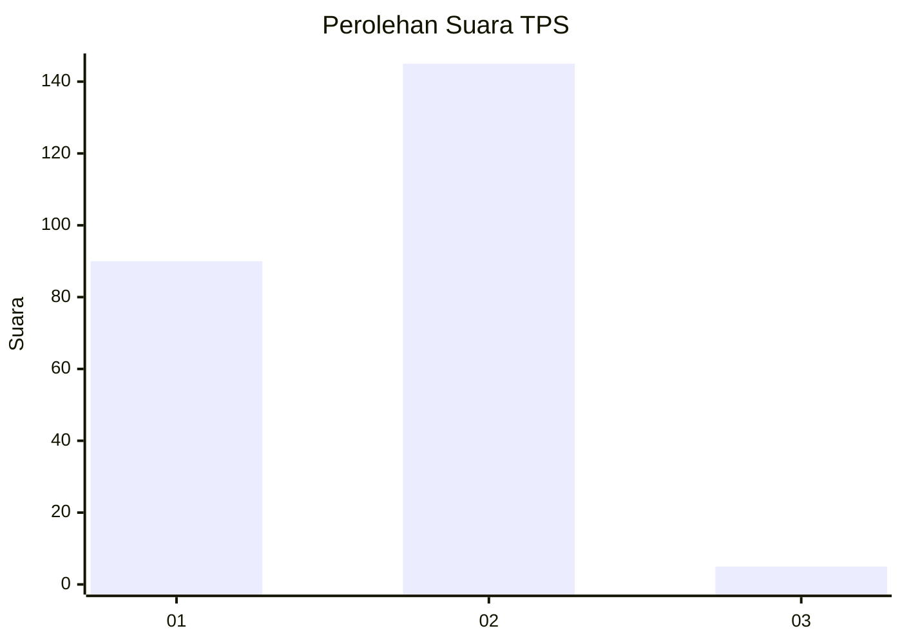
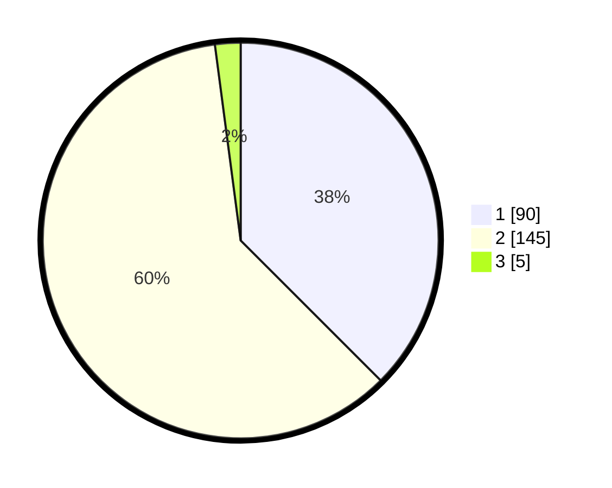

# Hasil

## Grafik

## Tabel

| No. | Nama Paslon    | Suara | Suara (raw) | Persentase |
|:--- |:-------------- | -----:| -----------:| ----------:|
| 1   | ANIES MUHAIMIN | 90    | [90][p-1]   | 37,50      |
| 2   | PRABOWO GIBRAN | 145   | [145][p-2]  | 60,42      |
| 3   | GANJAR MAHFUD  | 5     | [5][p-3]    | 2,08       |

[p-1]: https://github.com/gigit-pemilu/pemilu-2024/blob/main/pilpres/hitung-suara/sub/35-jawa-timur/sub/28-pamekasan/sub/12-kadur/sub/2001-pamaroh/sub/003-tps/sub/paslon-1.txt
[p-2]: https://github.com/gigit-pemilu/pemilu-2024/blob/main/pilpres/hitung-suara/sub/35-jawa-timur/sub/28-pamekasan/sub/12-kadur/sub/2001-pamaroh/sub/003-tps/sub/paslon-2.txt
[p-3]: https://github.com/gigit-pemilu/pemilu-2024/blob/main/pilpres/hitung-suara/sub/35-jawa-timur/sub/28-pamekasan/sub/12-kadur/sub/2001-pamaroh/sub/003-tps/sub/paslon-3.txt

## Foto C Plano

https://sirekap-obj-formc.kpu.go.id/13e3/pemilu/ppwp/35/28/12/20/01/3528122001003-20240214-222239--06adf2de-306a-4543-a8e8-f849b5ccc64f.jpg

https://sirekap-obj-formc.kpu.go.id/13e3/pemilu/ppwp/35/28/12/20/01/3528122001003-20240214-222333--dfe53a13-2c21-4bb0-b1d2-f3960bde0033.jpg

https://sirekap-obj-formc.kpu.go.id/13e3/pemilu/ppwp/35/28/12/20/01/3528122001003-20240214-222426--08d58400-77d7-4b65-9f3a-bddd89213cc2.jpg

## Metadata

| Key        | Value               |
| ---------- | ------------------- |
| Time Stamp | 2024-02-15 19:30:26 |

