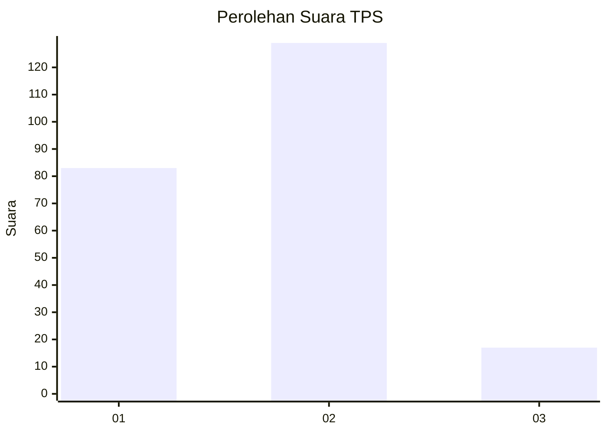

# Hasil

## Grafik

## Tabel

| No. | Nama Paslon    | Suara | Suara (raw) | Persentase |
|:--- |:-------------- | -----:| -----------:| ----------:|
| 1   | ANIES MUHAIMIN | 83    | [83][p-1]   | 36,24      |
| 2   | PRABOWO GIBRAN | 129   | [129][p-2]  | 56,33      |
| 3   | GANJAR MAHFUD  | 17    | [17][p-3]   | 7,42       |

[p-1]: https://github.com/gigit-pemilu/pemilu-2024/blob/main/pilpres/hitung-suara/sub/35-jawa-timur/sub/28-pamekasan/sub/12-kadur/sub/2001-pamaroh/sub/005-tps/sub/paslon-1.txt
[p-2]: https://github.com/gigit-pemilu/pemilu-2024/blob/main/pilpres/hitung-suara/sub/35-jawa-timur/sub/28-pamekasan/sub/12-kadur/sub/2001-pamaroh/sub/005-tps/sub/paslon-2.txt
[p-3]: https://github.com/gigit-pemilu/pemilu-2024/blob/main/pilpres/hitung-suara/sub/35-jawa-timur/sub/28-pamekasan/sub/12-kadur/sub/2001-pamaroh/sub/005-tps/sub/paslon-3.txt

## Foto C Plano

https://sirekap-obj-formc.kpu.go.id/fb51/pemilu/ppwp/35/28/12/20/01/3528122001005-20240214-231655--ad3ac347-0104-4124-9bae-eaed953eb2b2.jpg

https://sirekap-obj-formc.kpu.go.id/fb51/pemilu/ppwp/35/28/12/20/01/3528122001005-20240214-231722--90cfecef-6433-46a7-80b1-71edca718751.jpg

https://sirekap-obj-formc.kpu.go.id/fb51/pemilu/ppwp/35/28/12/20/01/3528122001005-20240214-231755--09a56815-f527-488d-a877-2067850c1cb4.jpg

## Metadata

| Key        | Value               |
| ---------- | ------------------- |
| Time Stamp | 2024-02-24 22:31:28 |

