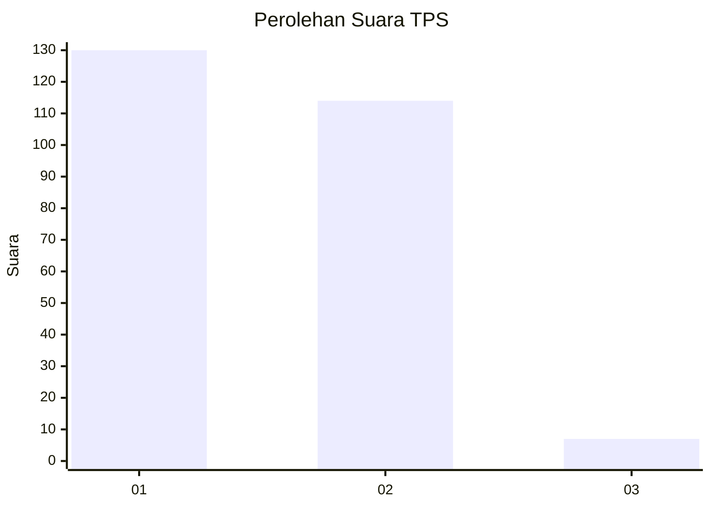
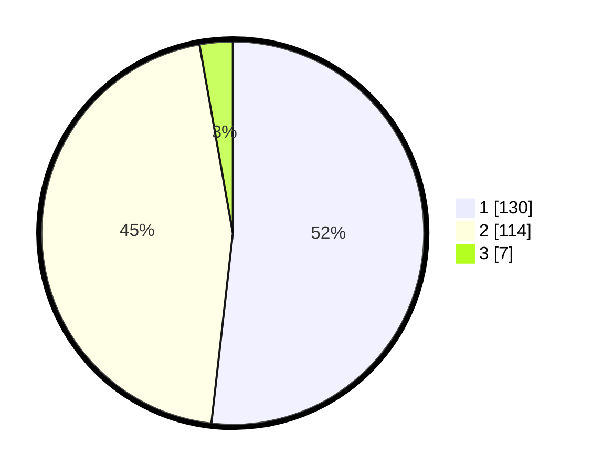

# Hasil

## Grafik

## Tabel

| No. | Nama Paslon    | Suara | Suara (raw) | Persentase |
|:--- |:-------------- | -----:| -----------:| ----------:|
| 1   | ANIES MUHAIMIN | 130   | [130][p-1]  | 51,79      |
| 2   | PRABOWO GIBRAN | 114   | [114][p-2]  | 45,42      |
| 3   | GANJAR MAHFUD  | 7     | [7][p-3]    | 2,79       |

[p-1]: https://github.com/gigit-pemilu/pemilu-2024/blob/main/pilpres/hitung-suara/sub/35-jawa-timur/sub/28-pamekasan/sub/12-kadur/sub/2001-pamaroh/sub/006-tps/sub/paslon-1.txt
[p-2]: https://github.com/gigit-pemilu/pemilu-2024/blob/main/pilpres/hitung-suara/sub/35-jawa-timur/sub/28-pamekasan/sub/12-kadur/sub/2001-pamaroh/sub/006-tps/sub/paslon-2.txt
[p-3]: https://github.com/gigit-pemilu/pemilu-2024/blob/main/pilpres/hitung-suara/sub/35-jawa-timur/sub/28-pamekasan/sub/12-kadur/sub/2001-pamaroh/sub/006-tps/sub/paslon-3.txt

## Foto C Plano

https://sirekap-obj-formc.kpu.go.id/05b1/pemilu/ppwp/35/28/12/20/01/3528122001006-20240214-212419--19c13a98-df68-46cf-8cf1-1247925a7542.jpg

https://sirekap-obj-formc.kpu.go.id/05b1/pemilu/ppwp/35/28/12/20/01/3528122001006-20240214-212454--e8b89d09-49a5-4436-9ed7-1792fa5eabcd.jpg

https://sirekap-obj-formc.kpu.go.id/05b1/pemilu/ppwp/35/28/12/20/01/3528122001006-20240214-212603--521a7639-63eb-4b01-a3d2-894eb45ddd72.jpg

## Metadata

| Key        | Value               |
| ---------- | ------------------- |
| Time Stamp | 2024-02-16 14:00:34 |

