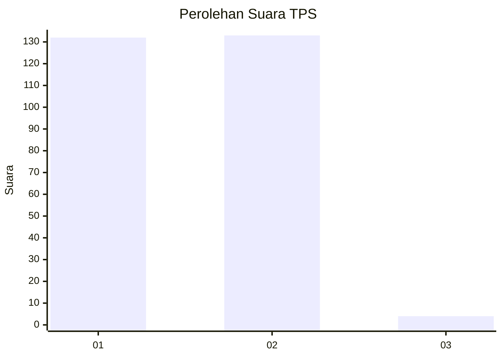
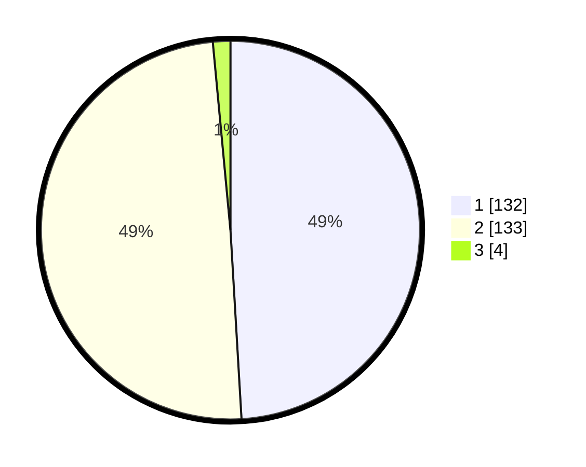

# Hasil

## Grafik

## Tabel

| No. | Nama Paslon    | Suara | Suara (raw) | Persentase |
|:--- |:-------------- | -----:| -----------:| ----------:|
| 1   | ANIES MUHAIMIN | 132   | [132][p-1]  | 49,07      |
| 2   | PRABOWO GIBRAN | 133   | [133][p-2]  | 49,44      |
| 3   | GANJAR MAHFUD  | 4     | [4][p-3]    | 1,49       |

[p-1]: https://github.com/gigit-pemilu/pemilu-2024/blob/main/pilpres/hitung-suara/sub/35-jawa-timur/sub/28-pamekasan/sub/12-kadur/sub/2001-pamaroh/sub/009-tps/sub/paslon-1.txt
[p-2]: https://github.com/gigit-pemilu/pemilu-2024/blob/main/pilpres/hitung-suara/sub/35-jawa-timur/sub/28-pamekasan/sub/12-kadur/sub/2001-pamaroh/sub/009-tps/sub/paslon-2.txt
[p-3]: https://github.com/gigit-pemilu/pemilu-2024/blob/main/pilpres/hitung-suara/sub/35-jawa-timur/sub/28-pamekasan/sub/12-kadur/sub/2001-pamaroh/sub/009-tps/sub/paslon-3.txt

## Foto C Plano

https://sirekap-obj-formc.kpu.go.id/bbba/pemilu/ppwp/35/28/12/20/01/3528122001009-20240214-231717--9d4894b7-2e1a-46d5-970b-f01cf97a9a80.jpg

https://sirekap-obj-formc.kpu.go.id/bbba/pemilu/ppwp/35/28/12/20/01/3528122001009-20240214-231810--31393347-156e-4e5a-8077-27088fba1d63.jpg

https://sirekap-obj-formc.kpu.go.id/bbba/pemilu/ppwp/35/28/12/20/01/3528122001009-20240214-231934--cdb21f53-1da0-4a72-8e2f-be55502c24ba.jpg

## Metadata

| Key        | Value               |
| ---------- | ------------------- |
| Time Stamp | 2024-02-16 14:00:34 |

