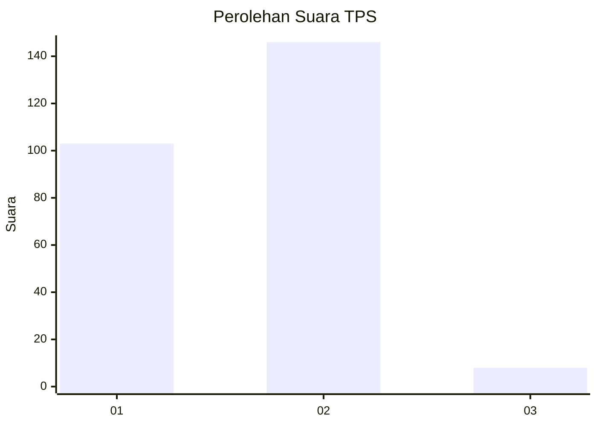
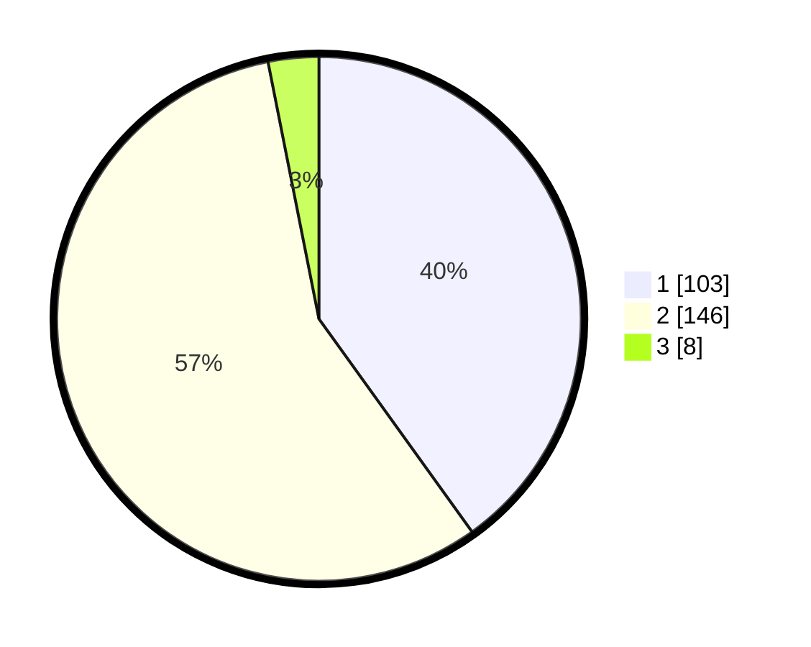

# Hasil

## Grafik

## Tabel

| No. | Nama Paslon    | Suara | Suara (raw) | Persentase |
|:--- |:-------------- | -----:| -----------:| ----------:|
| 1   | ANIES MUHAIMIN | 103   | [103][p-1]  | 40,08      |
| 2   | PRABOWO GIBRAN | 146   | [146][p-2]  | 56,81      |
| 3   | GANJAR MAHFUD  | 8     | [8][p-3]    | 3,11       |

[p-1]: https://github.com/gigit-pemilu/pemilu-2024/blob/main/pilpres/hitung-suara/sub/35-jawa-timur/sub/28-pamekasan/sub/12-kadur/sub/2001-pamaroh/sub/011-tps/sub/paslon-1.txt
[p-2]: https://github.com/gigit-pemilu/pemilu-2024/blob/main/pilpres/hitung-suara/sub/35-jawa-timur/sub/28-pamekasan/sub/12-kadur/sub/2001-pamaroh/sub/011-tps/sub/paslon-2.txt
[p-3]: https://github.com/gigit-pemilu/pemilu-2024/blob/main/pilpres/hitung-suara/sub/35-jawa-timur/sub/28-pamekasan/sub/12-kadur/sub/2001-pamaroh/sub/011-tps/sub/paslon-3.txt

## Foto C Plano

https://sirekap-obj-formc.kpu.go.id/62e0/pemilu/ppwp/35/28/12/20/01/3528122001011-20240214-225035--ff57cf73-6729-4f95-ab7c-d0646796d38a.jpg

https://sirekap-obj-formc.kpu.go.id/62e0/pemilu/ppwp/35/28/12/20/01/3528122001011-20240214-225329--13c3b9f8-4510-4d84-91f2-afe01f69702f.jpg

https://sirekap-obj-formc.kpu.go.id/62e0/pemilu/ppwp/35/28/12/20/01/3528122001011-20240214-225512--405c2ad9-2c73-47d0-92ba-2010f93445aa.jpg

## Metadata

| Key        | Value               |
| ---------- | ------------------- |
| Time Stamp | 2024-02-16 14:00:34 |

