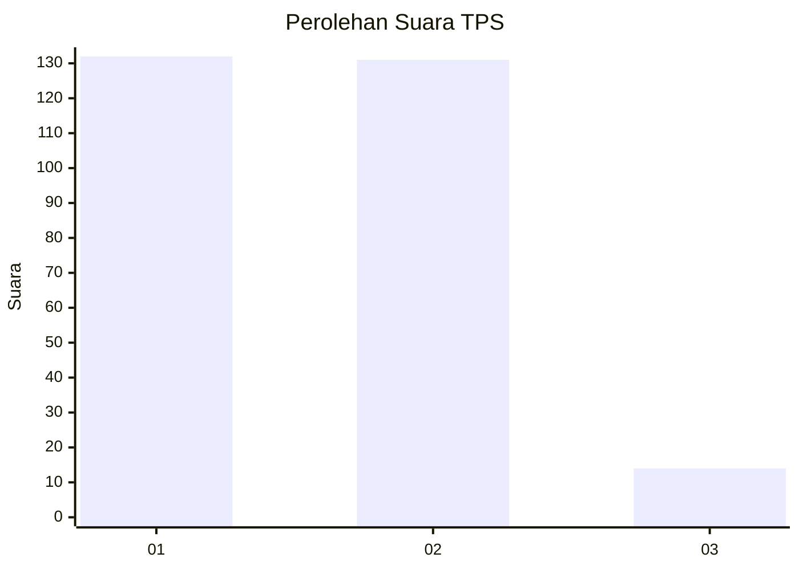
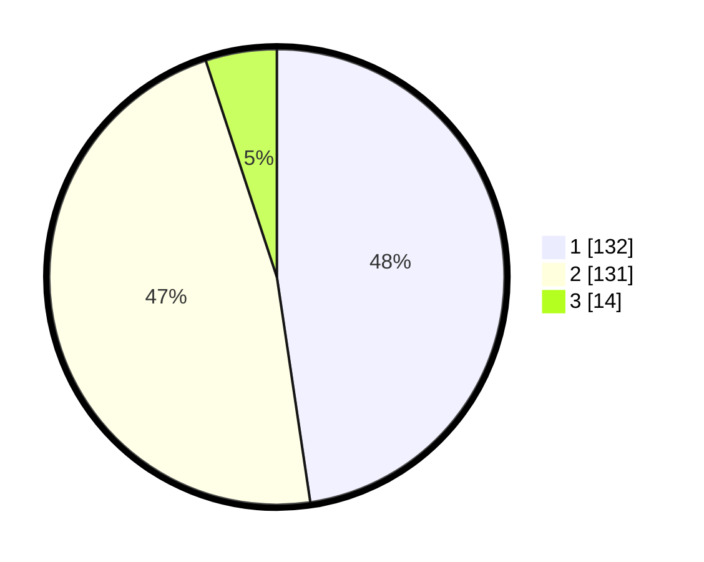

# Hasil

## Grafik

## Tabel

| No. | Nama Paslon    | Suara | Suara (raw) | Persentase |
|:--- |:-------------- | -----:| -----------:| ----------:|
| 1   | ANIES MUHAIMIN | 132   | [132][p-1]  | 47,65      |
| 2   | PRABOWO GIBRAN | 131   | [131][p-2]  | 47,29      |
| 3   | GANJAR MAHFUD  | 14    | [14][p-3]   | 5,05       |

[p-1]: https://github.com/gigit-pemilu/pemilu-2024/blob/main/pilpres/hitung-suara/sub/35-jawa-timur/sub/28-pamekasan/sub/12-kadur/sub/2002-pamoroh/sub/002-tps/sub/paslon-1.txt
[p-2]: https://github.com/gigit-pemilu/pemilu-2024/blob/main/pilpres/hitung-suara/sub/35-jawa-timur/sub/28-pamekasan/sub/12-kadur/sub/2002-pamoroh/sub/002-tps/sub/paslon-2.txt
[p-3]: https://github.com/gigit-pemilu/pemilu-2024/blob/main/pilpres/hitung-suara/sub/35-jawa-timur/sub/28-pamekasan/sub/12-kadur/sub/2002-pamoroh/sub/002-tps/sub/paslon-3.txt

## Foto C Plano

https://sirekap-obj-formc.kpu.go.id/47bb/pemilu/ppwp/35/28/12/20/02/3528122002002-20240216-204406--3268aa4e-2437-4c22-8e9f-b65c21f4a236.jpg

https://sirekap-obj-formc.kpu.go.id/47bb/pemilu/ppwp/35/28/12/20/02/3528122002002-20240216-204521--ce038dab-e406-4437-a17f-5612b52e5eed.jpg

https://sirekap-obj-formc.kpu.go.id/47bb/pemilu/ppwp/35/28/12/20/02/3528122002002-20240216-204643--78c4b314-581f-4c42-9dc2-c69acfe856e2.jpg

## Metadata

| Key        | Value               |
| ---------- | ------------------- |
| Time Stamp | 2024-02-25 16:00:00 |

