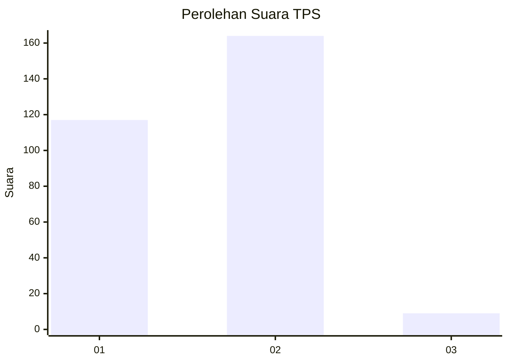
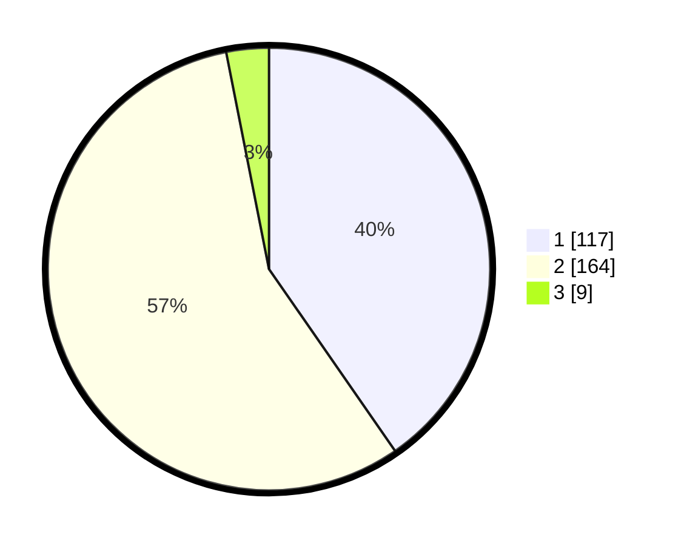

# Hasil

## Grafik

## Tabel

| No. | Nama Paslon    | Suara | Suara (raw) | Persentase |
|:--- |:-------------- | -----:| -----------:| ----------:|
| 1   | ANIES MUHAIMIN | 117   | [117][p-1]  | 40,34      |
| 2   | PRABOWO GIBRAN | 164   | [164][p-2]  | 56,55      |
| 3   | GANJAR MAHFUD  | 9     | [9][p-3]    | 3,10       |

[p-1]: https://github.com/gigit-pemilu/pemilu-2024/blob/main/pilpres/hitung-suara/sub/35-jawa-timur/sub/28-pamekasan/sub/12-kadur/sub/2002-pamoroh/sub/007-tps/sub/paslon-1.txt
[p-2]: https://github.com/gigit-pemilu/pemilu-2024/blob/main/pilpres/hitung-suara/sub/35-jawa-timur/sub/28-pamekasan/sub/12-kadur/sub/2002-pamoroh/sub/007-tps/sub/paslon-2.txt
[p-3]: https://github.com/gigit-pemilu/pemilu-2024/blob/main/pilpres/hitung-suara/sub/35-jawa-timur/sub/28-pamekasan/sub/12-kadur/sub/2002-pamoroh/sub/007-tps/sub/paslon-3.txt

## Foto C Plano

https://sirekap-obj-formc.kpu.go.id/e142/pemilu/ppwp/35/28/12/20/02/3528122002007-20240214-222909--2c7dd8a6-faab-419f-813c-1ee9de98c9ee.jpg

https://sirekap-obj-formc.kpu.go.id/e142/pemilu/ppwp/35/28/12/20/02/3528122002007-20240214-223342--a562b986-089c-4905-868f-6ec78d40e52a.jpg

https://sirekap-obj-formc.kpu.go.id/e142/pemilu/ppwp/35/28/12/20/02/3528122002007-20240214-223730--f6aed1d6-c6a3-4b54-bdc1-da87cafb097d.jpg

## Metadata

| Key        | Value               |
| ---------- | ------------------- |
| Time Stamp | 2024-02-16 14:00:34 |

