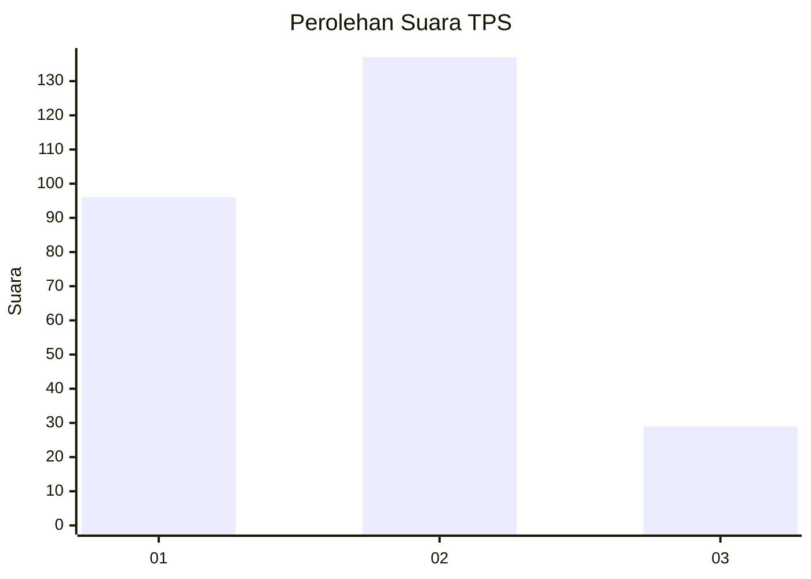
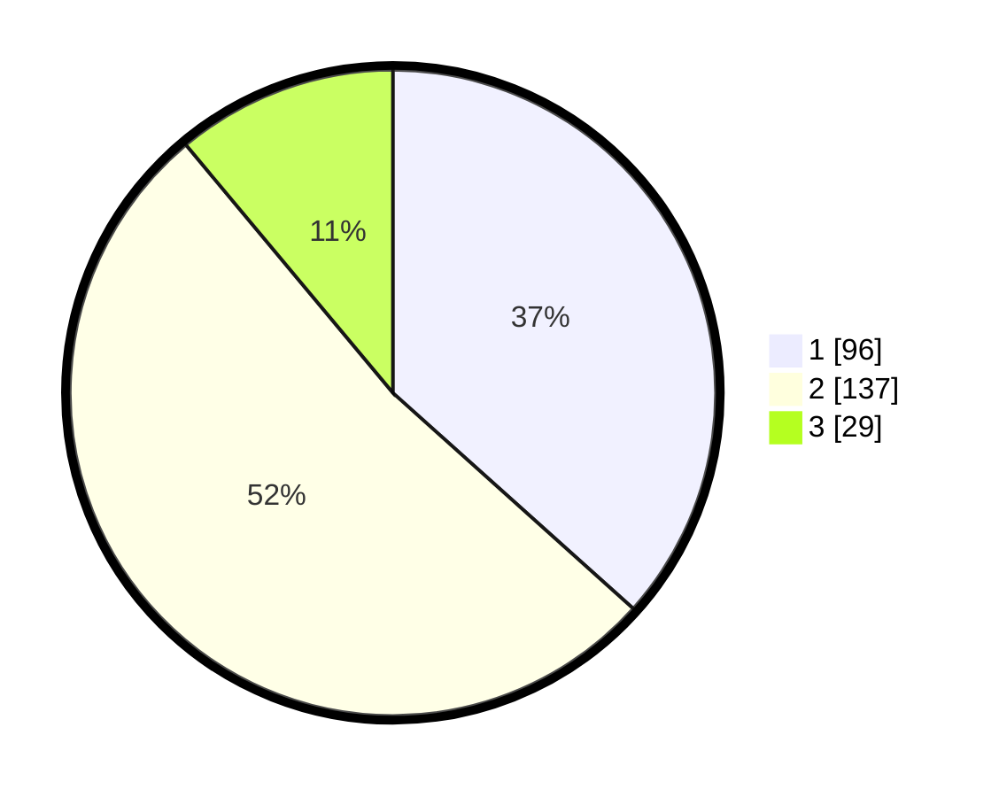

# Hasil

## Grafik

## Tabel

| No. | Nama Paslon    | Suara | Suara (raw) | Persentase |
|:--- |:-------------- | -----:| -----------:| ----------:|
| 1   | ANIES MUHAIMIN | 96    | [96][p-1]   | 36,64      |
| 2   | PRABOWO GIBRAN | 137   | [137][p-2]  | 52,29      |
| 3   | GANJAR MAHFUD  | 29    | [29][p-3]   | 11,07      |

[p-1]: https://github.com/gigit-pemilu/pemilu-2024/blob/main/pilpres/hitung-suara/sub/35-jawa-timur/sub/28-pamekasan/sub/12-kadur/sub/2002-pamoroh/sub/015-tps/sub/paslon-1.txt
[p-2]: https://github.com/gigit-pemilu/pemilu-2024/blob/main/pilpres/hitung-suara/sub/35-jawa-timur/sub/28-pamekasan/sub/12-kadur/sub/2002-pamoroh/sub/015-tps/sub/paslon-2.txt
[p-3]: https://github.com/gigit-pemilu/pemilu-2024/blob/main/pilpres/hitung-suara/sub/35-jawa-timur/sub/28-pamekasan/sub/12-kadur/sub/2002-pamoroh/sub/015-tps/sub/paslon-3.txt

## Foto C Plano

https://sirekap-obj-formc.kpu.go.id/7661/pemilu/ppwp/35/28/12/20/02/3528122002015-20240215-012018--131bc6d3-5eb4-4d74-ac71-563744af0d63.jpg

https://sirekap-obj-formc.kpu.go.id/7661/pemilu/ppwp/35/28/12/20/02/3528122002015-20240215-022849--3b3bf429-48bd-4168-9fd7-132714d9d9f8.jpg

https://sirekap-obj-formc.kpu.go.id/7661/pemilu/ppwp/35/28/12/20/02/3528122002015-20240215-012404--789e193b-79c8-497f-87d1-7a3e302fd270.jpg

## Metadata

| Key        | Value               |
| ---------- | ------------------- |
| Time Stamp | 2024-02-16 14:00:34 |

