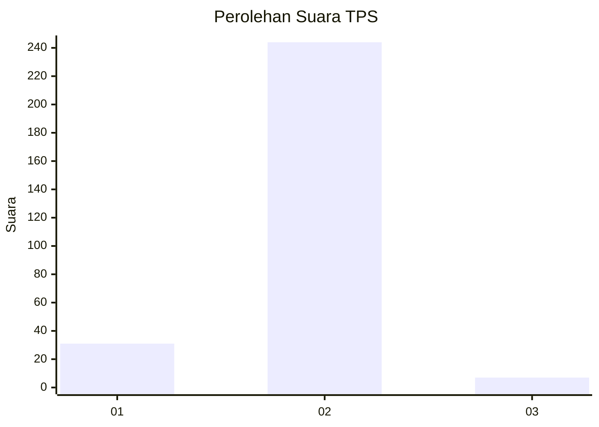
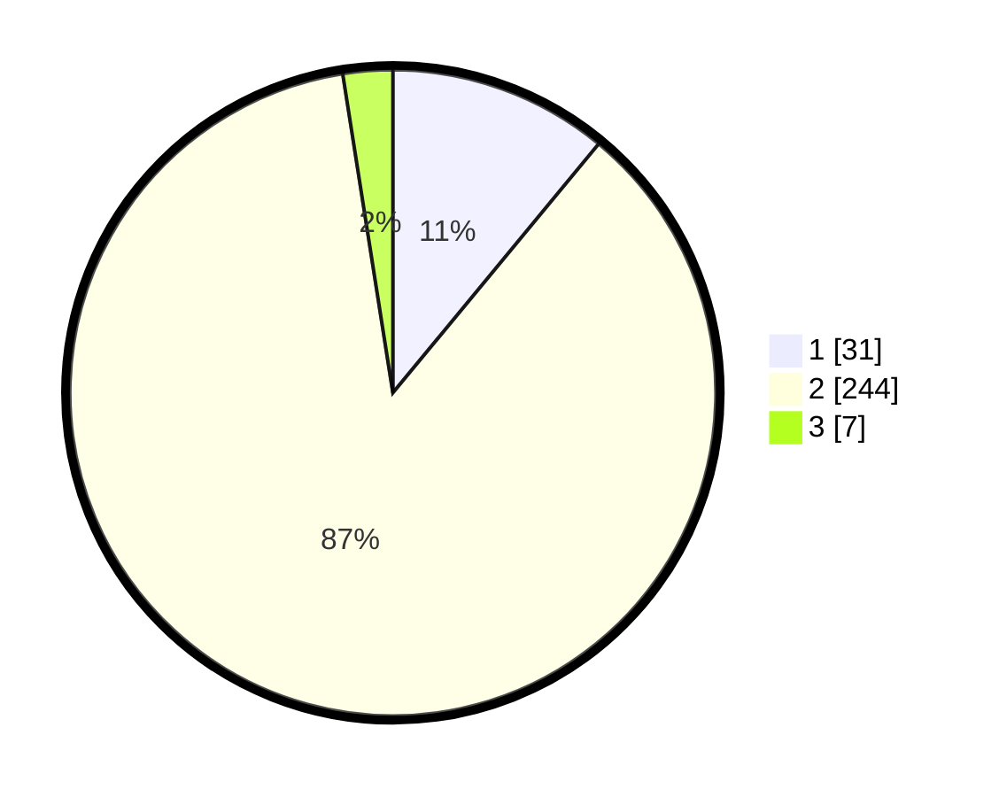

# Hasil

## Grafik

## Tabel

| No. | Nama Paslon    | Suara | Suara (raw) | Persentase |
|:--- |:-------------- | -----:| -----------:| ----------:|
| 1   | ANIES MUHAIMIN | 31    | [31][p-1]   | 10,99      |
| 2   | PRABOWO GIBRAN | 244   | [244][p-2]  | 86,52      |
| 3   | GANJAR MAHFUD  | 7     | [7][p-3]    | 2,48       |

[p-1]: https://github.com/gigit-pemilu/pemilu-2024/blob/main/pilpres/hitung-suara/sub/35-jawa-timur/sub/28-pamekasan/sub/12-kadur/sub/2002-pamoroh/sub/017-tps/sub/paslon-1.txt
[p-2]: https://github.com/gigit-pemilu/pemilu-2024/blob/main/pilpres/hitung-suara/sub/35-jawa-timur/sub/28-pamekasan/sub/12-kadur/sub/2002-pamoroh/sub/017-tps/sub/paslon-2.txt
[p-3]: https://github.com/gigit-pemilu/pemilu-2024/blob/main/pilpres/hitung-suara/sub/35-jawa-timur/sub/28-pamekasan/sub/12-kadur/sub/2002-pamoroh/sub/017-tps/sub/paslon-3.txt

## Foto C Plano

https://sirekap-obj-formc.kpu.go.id/f418/pemilu/ppwp/35/28/12/20/02/3528122002017-20240214-223107--474aa93b-1dab-4a9b-9ae2-ddfe69bfb9ee.jpg

https://sirekap-obj-formc.kpu.go.id/f418/pemilu/ppwp/35/28/12/20/02/3528122002017-20240214-222630--01a9c0cc-443e-4599-8696-1f799a07a748.jpg

https://sirekap-obj-formc.kpu.go.id/f418/pemilu/ppwp/35/28/12/20/02/3528122002017-20240214-223323--7e511832-9464-4b91-8c23-9133e24f8112.jpg

## Metadata

| Key        | Value               |
| ---------- | ------------------- |
| Time Stamp | 2024-02-24 22:31:28 |

