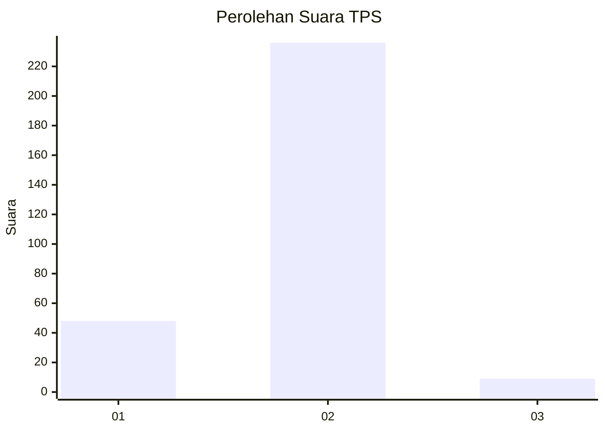
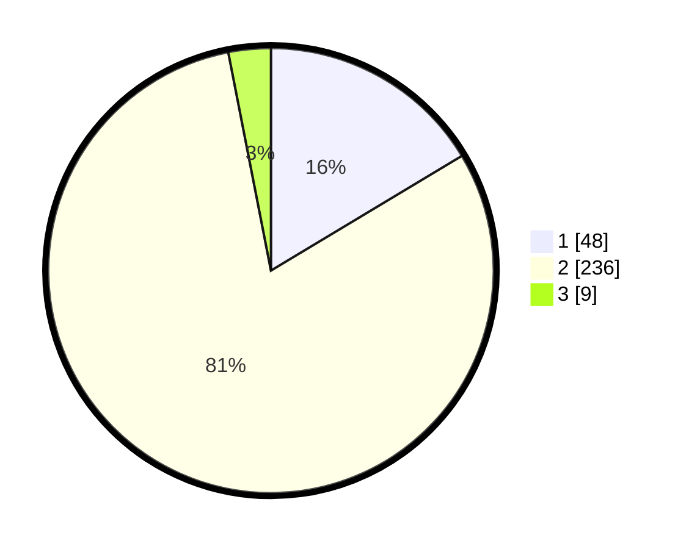

# Hasil

## Grafik

## Tabel

| No. | Nama Paslon    | Suara | Suara (raw) | Persentase |
|:--- |:-------------- | -----:| -----------:| ----------:|
| 1   | ANIES MUHAIMIN | 48    | [48][p-1]   | 16,38      |
| 2   | PRABOWO GIBRAN | 236   | [236][p-2]  | 80,55      |
| 3   | GANJAR MAHFUD  | 9     | [9][p-3]    | 3,07       |

[p-1]: https://github.com/gigit-pemilu/pemilu-2024-35-jawa-timur/blob/main/pilpres/hitung-suara/sub/35-jawa-timur/sub/28-pamekasan/sub/12-kadur/sub/2002-pamoroh/sub/018-tps/sub/paslon-1.txt
[p-2]: https://github.com/gigit-pemilu/pemilu-2024-35-jawa-timur/blob/main/pilpres/hitung-suara/sub/35-jawa-timur/sub/28-pamekasan/sub/12-kadur/sub/2002-pamoroh/sub/018-tps/sub/paslon-2.txt
[p-3]: https://github.com/gigit-pemilu/pemilu-2024-35-jawa-timur/blob/main/pilpres/hitung-suara/sub/35-jawa-timur/sub/28-pamekasan/sub/12-kadur/sub/2002-pamoroh/sub/018-tps/sub/paslon-3.txt

## Foto C Plano

https://sirekap-obj-formc.kpu.go.id/51da/pemilu/ppwp/35/28/12/20/02/3528122002018-20240214-230308--a83ed8d5-9cf8-4e6e-a796-a8c2dbb6ff44.jpg

https://sirekap-obj-formc.kpu.go.id/51da/pemilu/ppwp/35/28/12/20/02/3528122002018-20240214-230501--fa99bfd8-c408-4b67-9f79-ee45eaf6f975.jpg

https://sirekap-obj-formc.kpu.go.id/51da/pemilu/ppwp/35/28/12/20/02/3528122002018-20240214-230545--4d74f022-aaf2-4e82-bc85-605dcec68496.jpg

## Metadata

| Key        | Value               |
| ---------- | ------------------- |
| Time Stamp | 2024-02-16 14:00:34 |

