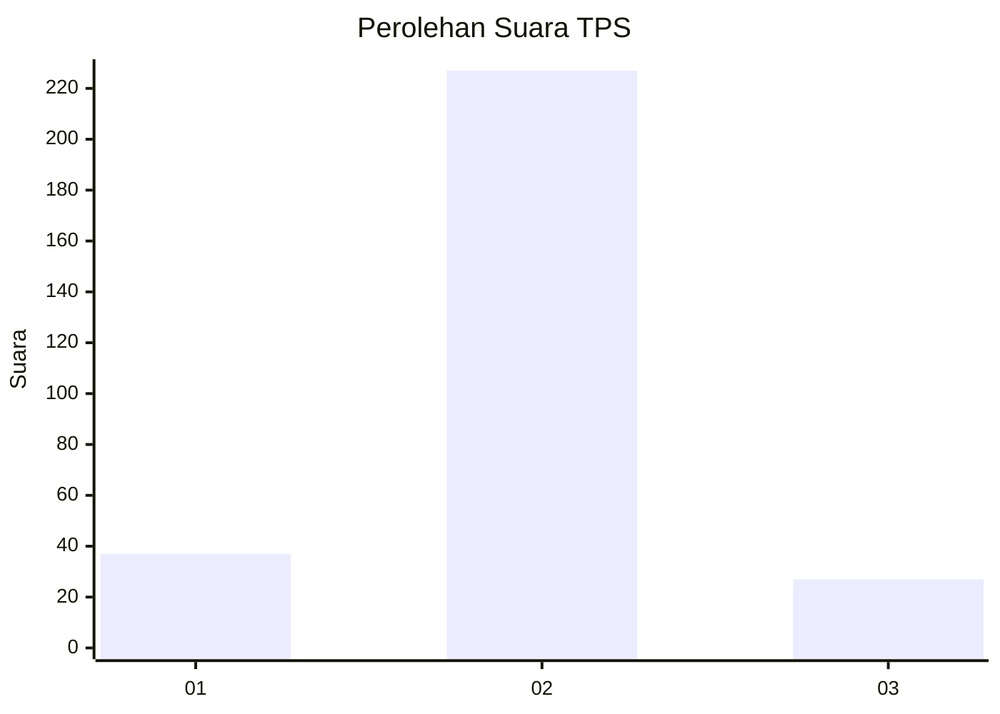
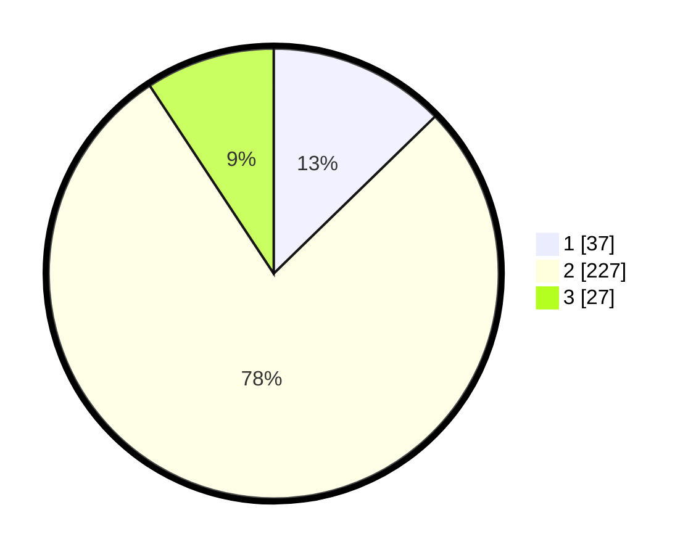

# Hasil

## Grafik

## Tabel

| No. | Nama Paslon    | Suara | Suara (raw) | Persentase |
|:--- |:-------------- | -----:| -----------:| ----------:|
| 1   | ANIES MUHAIMIN | 37    | [37][p-1]   | 12,71      |
| 2   | PRABOWO GIBRAN | 227   | [227][p-2]  | 78,01      |
| 3   | GANJAR MAHFUD  | 27    | [27][p-3]   | 9,28       |

[p-1]: https://github.com/gigit-pemilu/pemilu-2024/blob/main/pilpres/hitung-suara/sub/35-jawa-timur/sub/28-pamekasan/sub/12-kadur/sub/2003-sokolelah/sub/006-tps/sub/paslon-1.txt
[p-2]: https://github.com/gigit-pemilu/pemilu-2024/blob/main/pilpres/hitung-suara/sub/35-jawa-timur/sub/28-pamekasan/sub/12-kadur/sub/2003-sokolelah/sub/006-tps/sub/paslon-2.txt
[p-3]: https://github.com/gigit-pemilu/pemilu-2024/blob/main/pilpres/hitung-suara/sub/35-jawa-timur/sub/28-pamekasan/sub/12-kadur/sub/2003-sokolelah/sub/006-tps/sub/paslon-3.txt

## Foto C Plano

https://sirekap-obj-formc.kpu.go.id/2f37/pemilu/ppwp/35/28/12/20/03/3528122003006-20240214-224648--2b0cb911-d2ac-4a65-be9c-e7c0262eab76.jpg

https://sirekap-obj-formc.kpu.go.id/2f37/pemilu/ppwp/35/28/12/20/03/3528122003006-20240214-224759--5c3d5c48-7316-438a-bf1f-7af89afdd651.jpg

https://sirekap-obj-formc.kpu.go.id/2f37/pemilu/ppwp/35/28/12/20/03/3528122003006-20240214-224853--b2891f57-a25b-4bc6-b6c3-a8c26111ba86.jpg

## Metadata

| Key        | Value               |
| ---------- | ------------------- |
| Time Stamp | 2024-02-16 14:00:34 |

