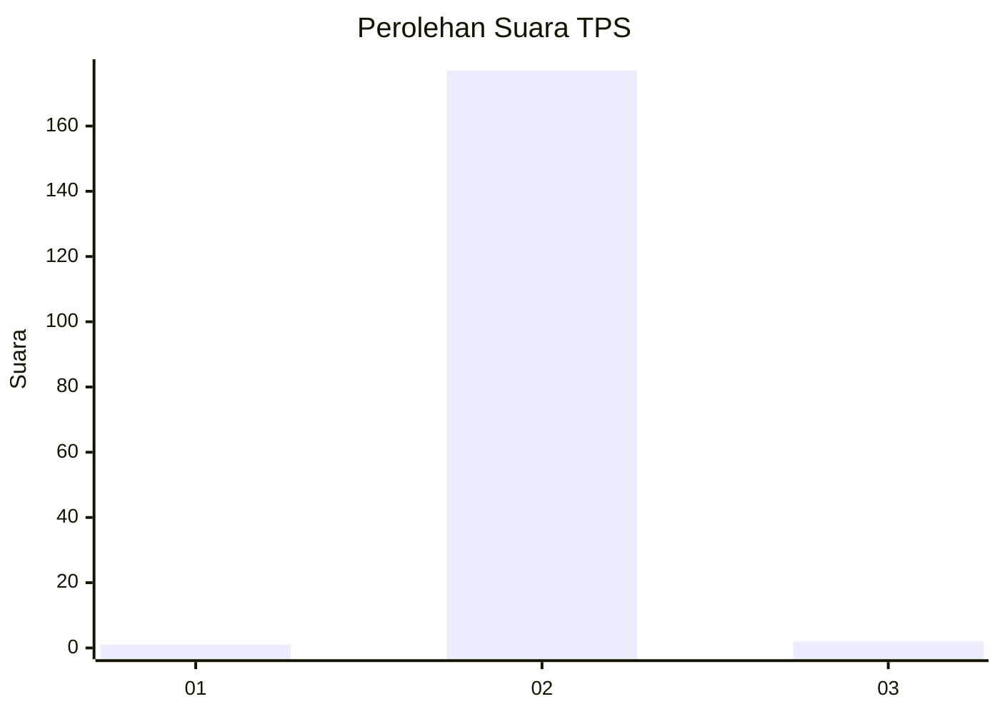
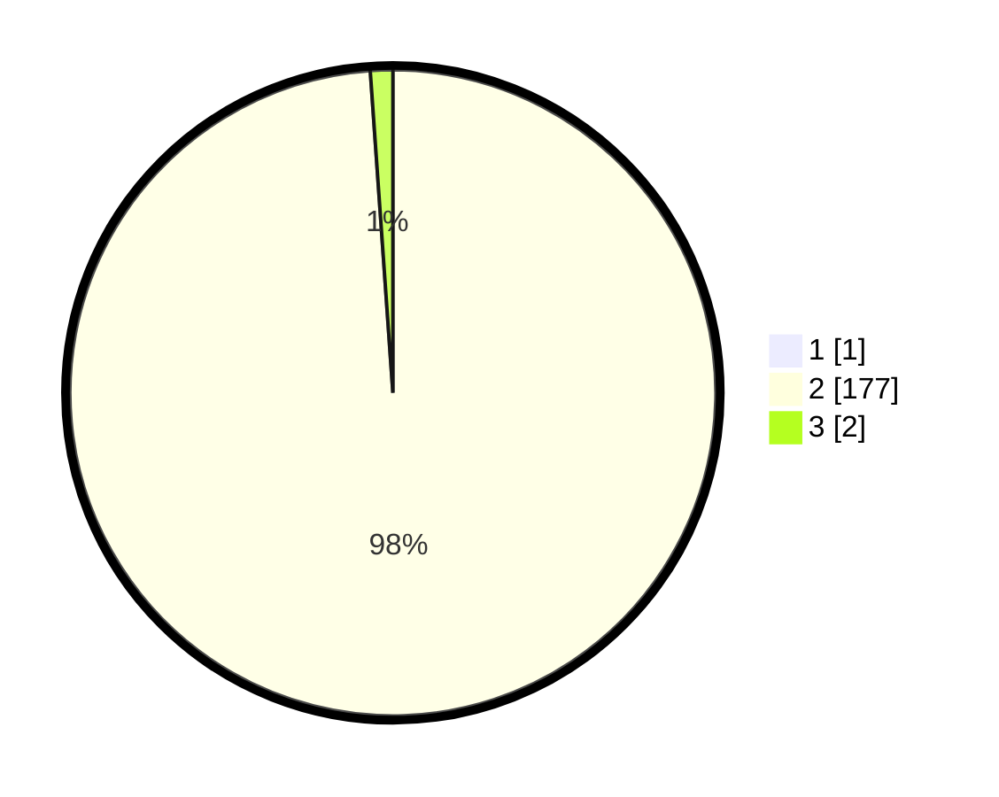

# Hasil

## Grafik

## Tabel

| No. | Nama Paslon    | Suara | Suara (raw) | Persentase |
|:--- |:-------------- | -----:| -----------:| ----------:|
| 1   | ANIES MUHAIMIN | 1     | [1][p-1]    | 0,56       |
| 2   | PRABOWO GIBRAN | 177   | [177][p-2]  | 98,33      |
| 3   | GANJAR MAHFUD  | 2     | [2][p-3]    | 1,11       |

[p-1]: https://github.com/gigit-pemilu/pemilu-2024/blob/main/pilpres/hitung-suara/sub/35-jawa-timur/sub/28-pamekasan/sub/12-kadur/sub/2004-gagah/sub/002-tps/sub/paslon-1.txt
[p-2]: https://github.com/gigit-pemilu/pemilu-2024/blob/main/pilpres/hitung-suara/sub/35-jawa-timur/sub/28-pamekasan/sub/12-kadur/sub/2004-gagah/sub/002-tps/sub/paslon-2.txt
[p-3]: https://github.com/gigit-pemilu/pemilu-2024/blob/main/pilpres/hitung-suara/sub/35-jawa-timur/sub/28-pamekasan/sub/12-kadur/sub/2004-gagah/sub/002-tps/sub/paslon-3.txt

## Foto C Plano

https://sirekap-obj-formc.kpu.go.id/99a2/pemilu/ppwp/35/28/12/20/04/3528122004002-20240215-005918--dfaeac42-892d-4c2d-a871-f8578456e851.jpg

https://sirekap-obj-formc.kpu.go.id/99a2/pemilu/ppwp/35/28/12/20/04/3528122004002-20240215-010107--d917511d-35c6-498f-8a1c-2e1d8e8ff31b.jpg

https://sirekap-obj-formc.kpu.go.id/99a2/pemilu/ppwp/35/28/12/20/04/3528122004002-20240215-010226--43754991-3cbb-4f6f-9daa-bfdb9f4e1ca1.jpg

## Metadata

| Key        | Value               |
| ---------- | ------------------- |
| Time Stamp | 2024-02-16 14:30:33 |

