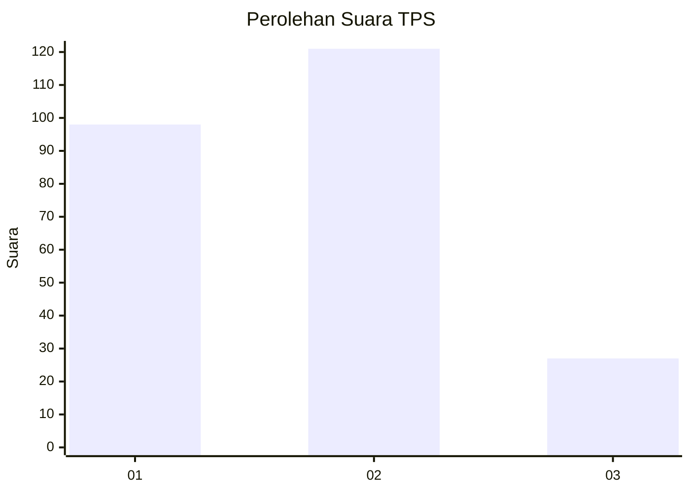
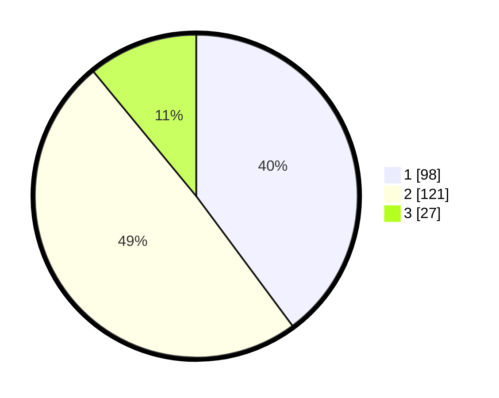

# Hasil

## Grafik

## Tabel

| No. | Nama Paslon    | Suara | Suara (raw) | Persentase |
|:--- |:-------------- | -----:| -----------:| ----------:|
| 1   | ANIES MUHAIMIN | 98    | [98][p-1]   | 39,84      |
| 2   | PRABOWO GIBRAN | 121   | [121][p-2]  | 49,19      |
| 3   | GANJAR MAHFUD  | 27    | [27][p-3]   | 10,98      |

[p-1]: https://github.com/gigit-pemilu/pemilu-2024/blob/main/pilpres/hitung-suara/sub/35-jawa-timur/sub/28-pamekasan/sub/12-kadur/sub/2005-kertagena-laok/sub/005-tps/sub/paslon-1.txt
[p-2]: https://github.com/gigit-pemilu/pemilu-2024/blob/main/pilpres/hitung-suara/sub/35-jawa-timur/sub/28-pamekasan/sub/12-kadur/sub/2005-kertagena-laok/sub/005-tps/sub/paslon-2.txt
[p-3]: https://github.com/gigit-pemilu/pemilu-2024/blob/main/pilpres/hitung-suara/sub/35-jawa-timur/sub/28-pamekasan/sub/12-kadur/sub/2005-kertagena-laok/sub/005-tps/sub/paslon-3.txt

## Foto C Plano

https://sirekap-obj-formc.kpu.go.id/b48b/pemilu/ppwp/35/28/12/20/05/3528122005005-20240215-071619--7e14785c-f27b-4eae-9c33-caec7659d187.jpg

https://sirekap-obj-formc.kpu.go.id/b48b/pemilu/ppwp/35/28/12/20/05/3528122005005-20240215-071653--966d8fc0-9300-4ad8-b97f-743135029828.jpg

https://sirekap-obj-formc.kpu.go.id/b48b/pemilu/ppwp/35/28/12/20/05/3528122005005-20240215-071728--c3c2d7c3-8a68-4d89-b5e0-dd16fcc8bcb4.jpg

## Metadata

| Key        | Value               |
| ---------- | ------------------- |
| Time Stamp | 2024-02-16 16:25:10 |

