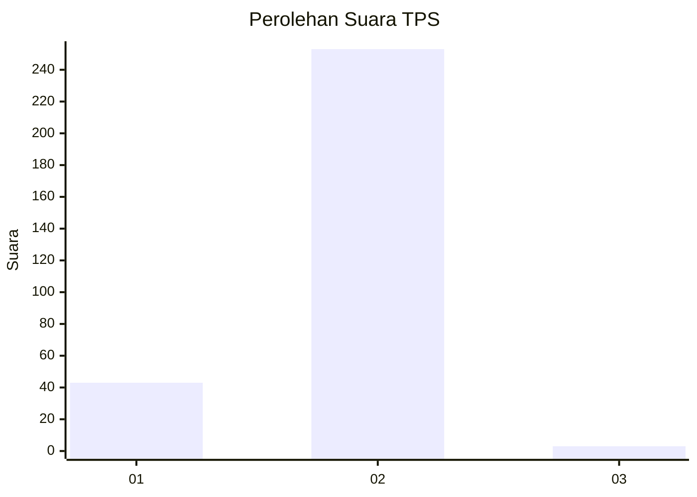
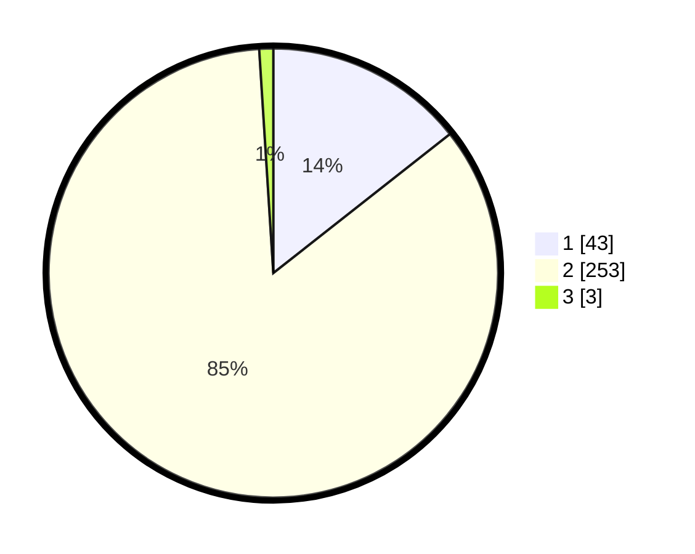

# Hasil

## Grafik

## Tabel

| No. | Nama Paslon    | Suara | Suara (raw) | Persentase |
|:--- |:-------------- | -----:| -----------:| ----------:|
| 1   | ANIES MUHAIMIN | 43    | [43][p-1]   | 14,38      |
| 2   | PRABOWO GIBRAN | 253   | [253][p-2]  | 84,62      |
| 3   | GANJAR MAHFUD  | 3     | [3][p-3]    | 1,00       |

[p-1]: https://github.com/gigit-pemilu/pemilu-2024/blob/main/pilpres/hitung-suara/sub/35-jawa-timur/sub/28-pamekasan/sub/12-kadur/sub/2007-bungbaruh/sub/001-tps/sub/paslon-1.txt
[p-2]: https://github.com/gigit-pemilu/pemilu-2024/blob/main/pilpres/hitung-suara/sub/35-jawa-timur/sub/28-pamekasan/sub/12-kadur/sub/2007-bungbaruh/sub/001-tps/sub/paslon-2.txt
[p-3]: https://github.com/gigit-pemilu/pemilu-2024/blob/main/pilpres/hitung-suara/sub/35-jawa-timur/sub/28-pamekasan/sub/12-kadur/sub/2007-bungbaruh/sub/001-tps/sub/paslon-3.txt

## Foto C Plano

https://sirekap-obj-formc.kpu.go.id/a6e1/pemilu/ppwp/35/28/12/20/07/3528122007001-20240214-232733--a63de7e0-4e67-407f-ba8c-6666e8abf2af.jpg

https://sirekap-obj-formc.kpu.go.id/a6e1/pemilu/ppwp/35/28/12/20/07/3528122007001-20240214-232725--950db843-9564-430f-b2f7-37aaed81d4da.jpg

https://sirekap-obj-formc.kpu.go.id/a6e1/pemilu/ppwp/35/28/12/20/07/3528122007001-20240214-232720--003d04f5-84e8-4015-b73b-60c6f5e71c92.jpg

## Metadata

| Key        | Value               |
| ---------- | ------------------- |
| Time Stamp | 2024-02-15 15:00:29 |

