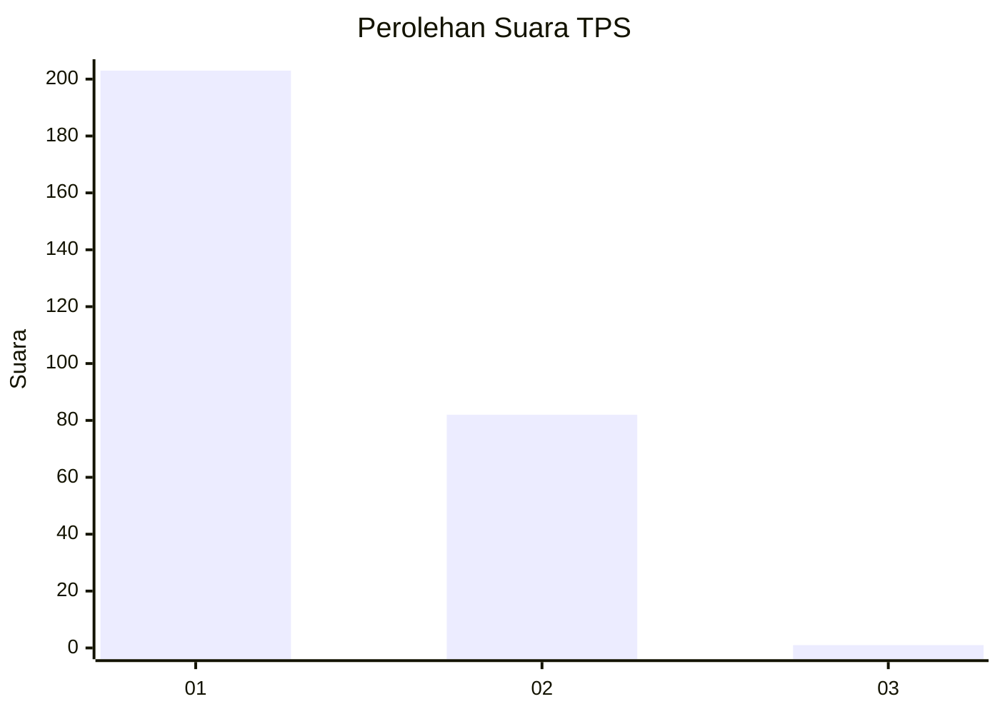
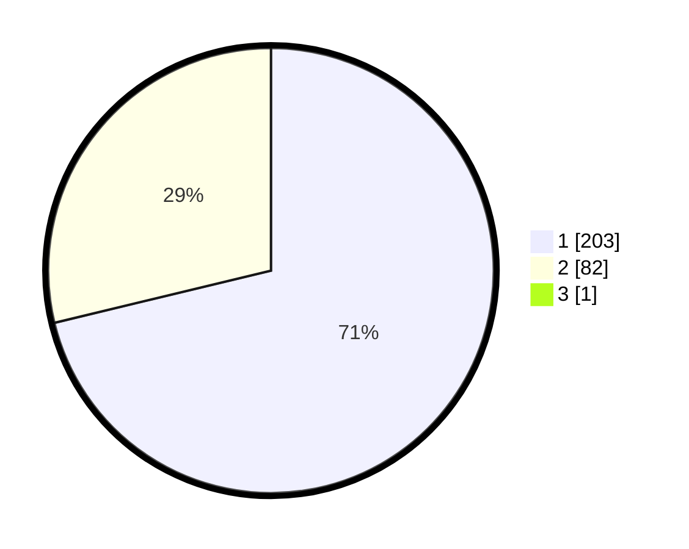

# Hasil

## Grafik

## Tabel

| No. | Nama Paslon    | Suara | Suara (raw) | Persentase |
|:--- |:-------------- | -----:| -----------:| ----------:|
| 1   | ANIES MUHAIMIN | 203   | [203][p-1]  | 70,98      |
| 2   | PRABOWO GIBRAN | 82    | [82][p-2]   | 28,67      |
| 3   | GANJAR MAHFUD  | 1     | [1][p-3]    | 0,35       |

[p-1]: https://github.com/gigit-pemilu/pemilu-2024-35-jawa-timur/blob/main/pilpres/hitung-suara/sub/35-jawa-timur/sub/28-pamekasan/sub/12-kadur/sub/2007-bungbaruh/sub/002-tps/sub/paslon-1.txt
[p-2]: https://github.com/gigit-pemilu/pemilu-2024-35-jawa-timur/blob/main/pilpres/hitung-suara/sub/35-jawa-timur/sub/28-pamekasan/sub/12-kadur/sub/2007-bungbaruh/sub/002-tps/sub/paslon-2.txt
[p-3]: https://github.com/gigit-pemilu/pemilu-2024-35-jawa-timur/blob/main/pilpres/hitung-suara/sub/35-jawa-timur/sub/28-pamekasan/sub/12-kadur/sub/2007-bungbaruh/sub/002-tps/sub/paslon-3.txt

## Foto C Plano

https://sirekap-obj-formc.kpu.go.id/6294/pemilu/ppwp/35/28/12/20/07/3528122007002-20240217-151722--4507c79c-df3e-4e5f-a69a-2f7b1c9ab895.jpg

https://sirekap-obj-formc.kpu.go.id/6294/pemilu/ppwp/35/28/12/20/07/3528122007002-20240217-150902--e5e88f72-8fd1-4650-8eab-5f6797d7da30.jpg

https://sirekap-obj-formc.kpu.go.id/6294/pemilu/ppwp/35/28/12/20/07/3528122007002-20240217-151001--51ee569f-e31b-45d0-8a28-2cfe64e30f20.jpg

## Metadata

| Key        | Value               |
| ---------- | ------------------- |
| Time Stamp | 2024-02-25 13:00:00 |

