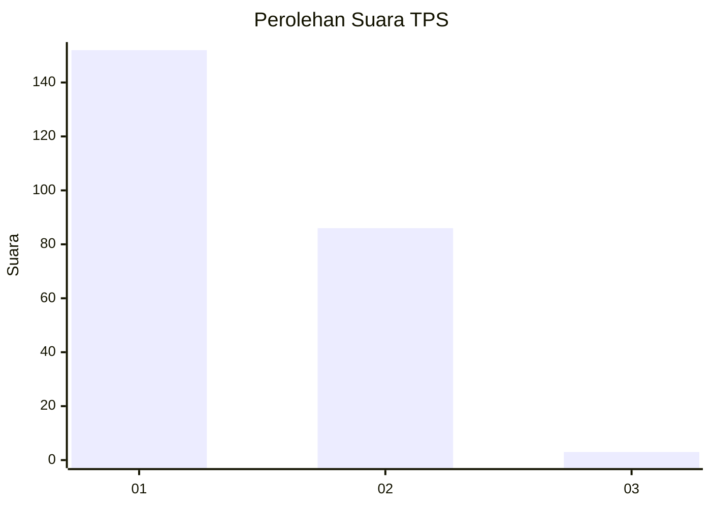
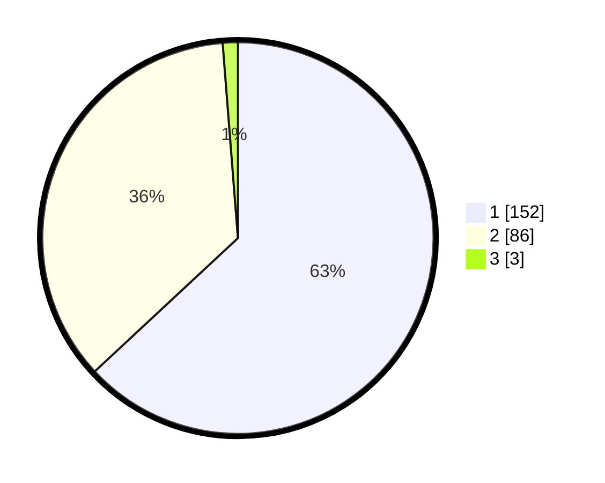

# Hasil

## Grafik

## Tabel

| No. | Nama Paslon    | Suara | Suara (raw) | Persentase |
|:--- |:-------------- | -----:| -----------:| ----------:|
| 1   | ANIES MUHAIMIN | 152   | [152][p-1]  | 63,07      |
| 2   | PRABOWO GIBRAN | 86    | [86][p-2]   | 35,68      |
| 3   | GANJAR MAHFUD  | 3     | [3][p-3]    | 1,24       |

[p-1]: https://github.com/gigit-pemilu/pemilu-2024-35-jawa-timur/blob/main/pilpres/hitung-suara/sub/35-jawa-timur/sub/28-pamekasan/sub/12-kadur/sub/2007-bungbaruh/sub/007-tps/sub/paslon-1.txt
[p-2]: https://github.com/gigit-pemilu/pemilu-2024-35-jawa-timur/blob/main/pilpres/hitung-suara/sub/35-jawa-timur/sub/28-pamekasan/sub/12-kadur/sub/2007-bungbaruh/sub/007-tps/sub/paslon-2.txt
[p-3]: https://github.com/gigit-pemilu/pemilu-2024-35-jawa-timur/blob/main/pilpres/hitung-suara/sub/35-jawa-timur/sub/28-pamekasan/sub/12-kadur/sub/2007-bungbaruh/sub/007-tps/sub/paslon-3.txt

## Foto C Plano

https://sirekap-obj-formc.kpu.go.id/5600/pemilu/ppwp/35/28/12/20/07/3528122007007-20240217-092032--3c701cb2-cf38-4eec-b2e2-98016f1664e5.jpg

https://sirekap-obj-formc.kpu.go.id/5600/pemilu/ppwp/35/28/12/20/07/3528122007007-20240217-092026--2225432f-f212-4e26-8321-fe5a457bb54d.jpg

https://sirekap-obj-formc.kpu.go.id/5600/pemilu/ppwp/35/28/12/20/07/3528122007007-20240217-092022--17cda098-6ccb-4f1d-98c5-6467303e03b1.jpg

## Metadata

| Key        | Value               |
| ---------- | ------------------- |
| Time Stamp | 2024-02-17 13:37:34 |

