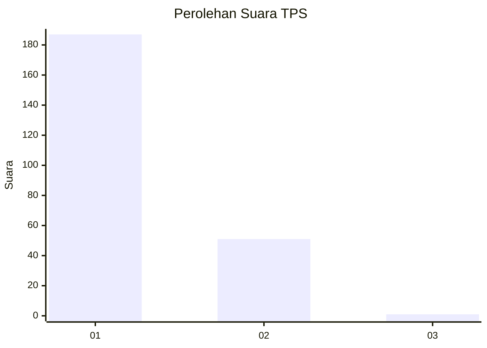
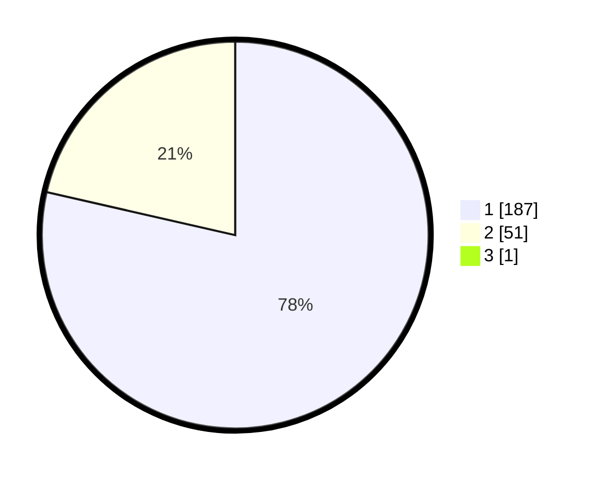

# Hasil

## Grafik

## Tabel

| No. | Nama Paslon    | Suara | Suara (raw) | Persentase |
|:--- |:-------------- | -----:| -----------:| ----------:|
| 1   | ANIES MUHAIMIN | 187   | [187][p-1]  | 78,24      |
| 2   | PRABOWO GIBRAN | 51    | [51][p-2]   | 21,34      |
| 3   | GANJAR MAHFUD  | 1     | [1][p-3]    | 0,42       |

[p-1]: https://github.com/gigit-pemilu/pemilu-2024/blob/main/pilpres/hitung-suara/sub/35-jawa-timur/sub/28-pamekasan/sub/12-kadur/sub/2008-kadur/sub/018-tps/sub/paslon-1.txt
[p-2]: https://github.com/gigit-pemilu/pemilu-2024/blob/main/pilpres/hitung-suara/sub/35-jawa-timur/sub/28-pamekasan/sub/12-kadur/sub/2008-kadur/sub/018-tps/sub/paslon-2.txt
[p-3]: https://github.com/gigit-pemilu/pemilu-2024/blob/main/pilpres/hitung-suara/sub/35-jawa-timur/sub/28-pamekasan/sub/12-kadur/sub/2008-kadur/sub/018-tps/sub/paslon-3.txt

## Foto C Plano

https://sirekap-obj-formc.kpu.go.id/f05d/pemilu/ppwp/35/28/12/20/08/3528122008018-20240214-213940--67b1e2fc-0879-4e53-8952-e2acc7275f67.jpg

https://sirekap-obj-formc.kpu.go.id/f05d/pemilu/ppwp/35/28/12/20/08/3528122008018-20240214-214114--b92fe5f8-f2cb-4291-8a7b-41ad2758b26b.jpg

https://sirekap-obj-formc.kpu.go.id/f05d/pemilu/ppwp/35/28/12/20/08/3528122008018-20240214-214332--6d77b1a0-cdb5-4dca-8fec-eb666655f0dc.jpg

## Metadata

| Key        | Value               |
| ---------- | ------------------- |
| Time Stamp | 2024-02-16 16:25:10 |

