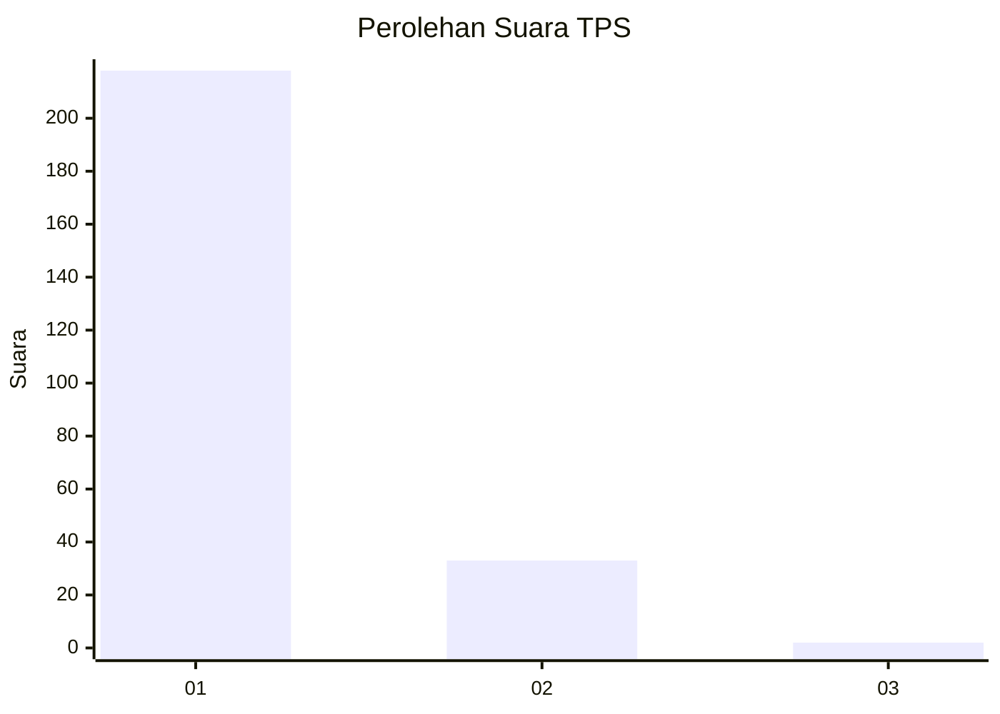
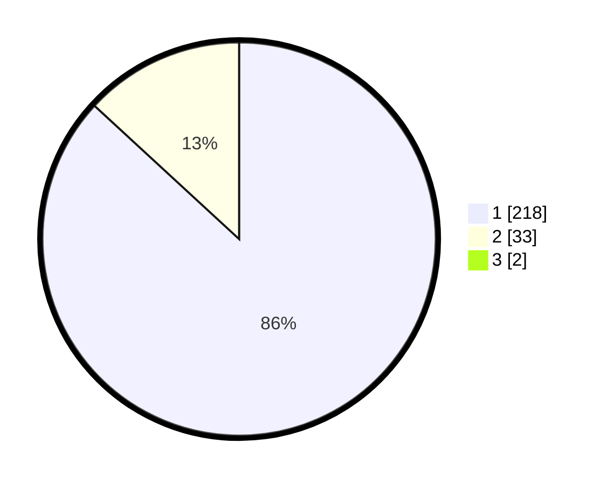

# Hasil

## Grafik

## Tabel

| No. | Nama Paslon    | Suara | Suara (raw) | Persentase |
|:--- |:-------------- | -----:| -----------:| ----------:|
| 1   | ANIES MUHAIMIN | 218   | [218][p-1]  | 86,17      |
| 2   | PRABOWO GIBRAN | 33    | [33][p-2]   | 13,04      |
| 3   | GANJAR MAHFUD  | 2     | [2][p-3]    | 0,79       |

[p-1]: https://github.com/gigit-pemilu/pemilu-2024/blob/main/pilpres/hitung-suara/sub/35-jawa-timur/sub/28-pamekasan/sub/12-kadur/sub/2008-kadur/sub/020-tps/sub/paslon-1.txt
[p-2]: https://github.com/gigit-pemilu/pemilu-2024/blob/main/pilpres/hitung-suara/sub/35-jawa-timur/sub/28-pamekasan/sub/12-kadur/sub/2008-kadur/sub/020-tps/sub/paslon-2.txt
[p-3]: https://github.com/gigit-pemilu/pemilu-2024/blob/main/pilpres/hitung-suara/sub/35-jawa-timur/sub/28-pamekasan/sub/12-kadur/sub/2008-kadur/sub/020-tps/sub/paslon-3.txt

## Foto C Plano

https://sirekap-obj-formc.kpu.go.id/c1b5/pemilu/ppwp/35/28/12/20/08/3528122008020-20240214-192519--0446cd56-77e0-4b59-b6cd-f2f6f04fbe20.jpg

https://sirekap-obj-formc.kpu.go.id/c1b5/pemilu/ppwp/35/28/12/20/08/3528122008020-20240214-192438--100611f5-f934-48ec-a216-4c01cdfbdbe7.jpg

https://sirekap-obj-formc.kpu.go.id/c1b5/pemilu/ppwp/35/28/12/20/08/3528122008020-20240214-192505--e96d88e0-6ec4-465e-9311-21ed2083d660.jpg

## Metadata

| Key        | Value               |
| ---------- | ------------------- |
| Time Stamp | 2024-02-16 22:30:00 |

