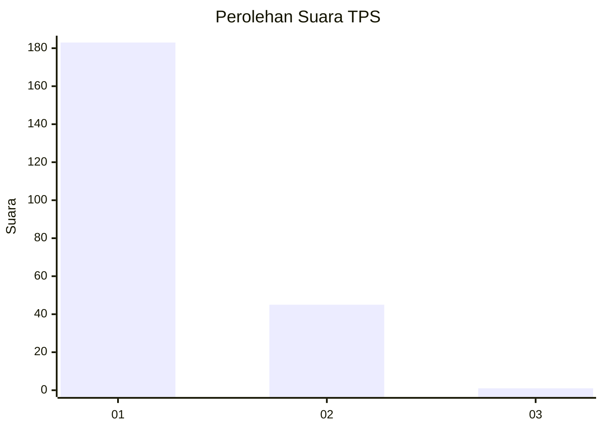
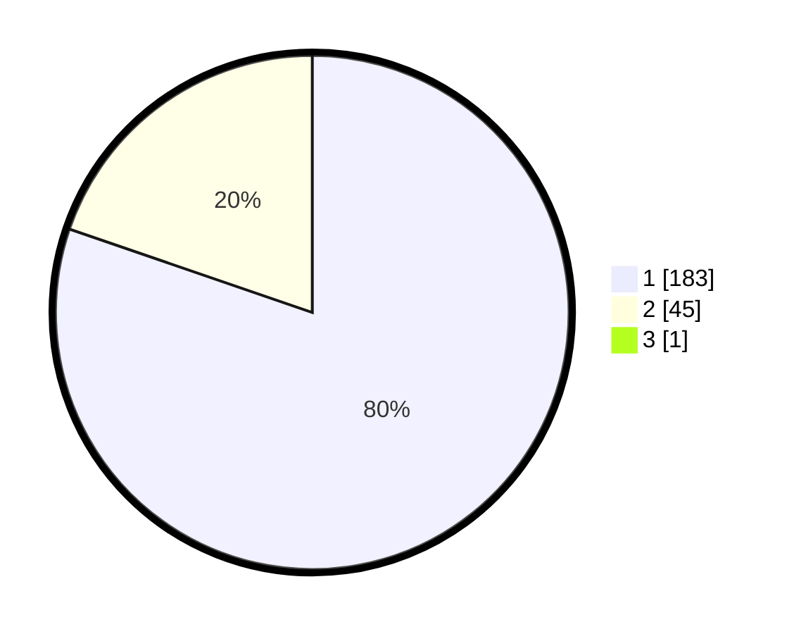

# Hasil

## Grafik

## Tabel

| No. | Nama Paslon    | Suara | Suara (raw) | Persentase |
|:--- |:-------------- | -----:| -----------:| ----------:|
| 1   | ANIES MUHAIMIN | 183   | [183][p-1]  | 79,91      |
| 2   | PRABOWO GIBRAN | 45    | [45][p-2]   | 19,65      |
| 3   | GANJAR MAHFUD  | 1     | [1][p-3]    | 0,44       |

[p-1]: https://github.com/gigit-pemilu/pemilu-2024/blob/main/pilpres/hitung-suara/sub/35-jawa-timur/sub/28-pamekasan/sub/12-kadur/sub/2008-kadur/sub/021-tps/sub/paslon-1.txt
[p-2]: https://github.com/gigit-pemilu/pemilu-2024/blob/main/pilpres/hitung-suara/sub/35-jawa-timur/sub/28-pamekasan/sub/12-kadur/sub/2008-kadur/sub/021-tps/sub/paslon-2.txt
[p-3]: https://github.com/gigit-pemilu/pemilu-2024/blob/main/pilpres/hitung-suara/sub/35-jawa-timur/sub/28-pamekasan/sub/12-kadur/sub/2008-kadur/sub/021-tps/sub/paslon-3.txt

## Foto C Plano

https://sirekap-obj-formc.kpu.go.id/0b72/pemilu/ppwp/35/28/12/20/08/3528122008021-20240214-233133--6c5e283a-599a-4677-bcdf-d4081890e2aa.jpg

https://sirekap-obj-formc.kpu.go.id/0b72/pemilu/ppwp/35/28/12/20/08/3528122008021-20240214-233216--14780484-3217-493b-a912-71ab93c92d78.jpg

https://sirekap-obj-formc.kpu.go.id/0b72/pemilu/ppwp/35/28/12/20/08/3528122008021-20240214-233241--8c2539dd-eb95-4740-896e-cee0144466d4.jpg

## Metadata

| Key        | Value               |
| ---------- | ------------------- |
| Time Stamp | 2024-02-17 13:37:34 |

