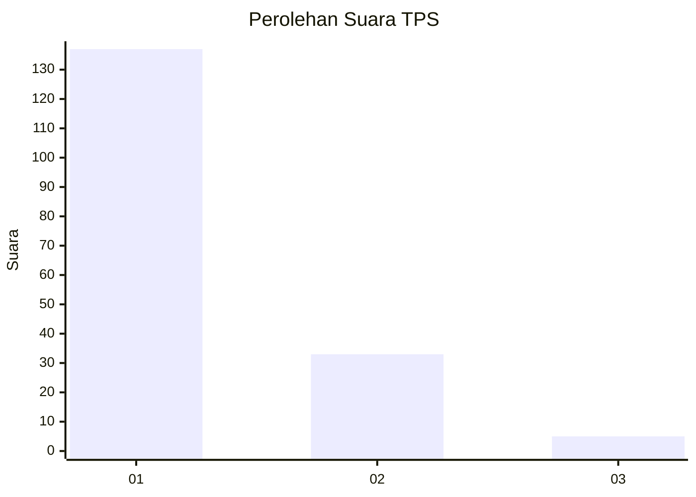
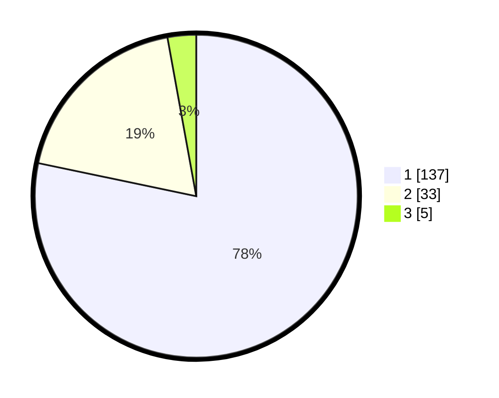

# Hasil

## Grafik

## Tabel

| No. | Nama Paslon    | Suara | Suara (raw) | Persentase |
|:--- |:-------------- | -----:| -----------:| ----------:|
| 1   | ANIES MUHAIMIN | 137   | [137][p-1]  | 78,29      |
| 2   | PRABOWO GIBRAN | 33    | [33][p-2]   | 18,86      |
| 3   | GANJAR MAHFUD  | 5     | [5][p-3]    | 2,86       |

[p-1]: https://github.com/gigit-pemilu/pemilu-2024-35-jawa-timur/blob/main/pilpres/hitung-suara/sub/35-jawa-timur/sub/28-pamekasan/sub/12-kadur/sub/2009-bangkes/sub/007-tps/sub/paslon-1.txt
[p-2]: https://github.com/gigit-pemilu/pemilu-2024-35-jawa-timur/blob/main/pilpres/hitung-suara/sub/35-jawa-timur/sub/28-pamekasan/sub/12-kadur/sub/2009-bangkes/sub/007-tps/sub/paslon-2.txt
[p-3]: https://github.com/gigit-pemilu/pemilu-2024-35-jawa-timur/blob/main/pilpres/hitung-suara/sub/35-jawa-timur/sub/28-pamekasan/sub/12-kadur/sub/2009-bangkes/sub/007-tps/sub/paslon-3.txt

## Foto C Plano

https://sirekap-obj-formc.kpu.go.id/330c/pemilu/ppwp/35/28/12/20/09/3528122009007-20240215-182203--c152f701-b18c-421a-b34c-8368ecd9f851.jpg

https://sirekap-obj-formc.kpu.go.id/330c/pemilu/ppwp/35/28/12/20/09/3528122009007-20240215-182240--93bd071d-ac4f-4498-b821-5f6267a9f72f.jpg

https://sirekap-obj-formc.kpu.go.id/330c/pemilu/ppwp/35/28/12/20/09/3528122009007-20240215-182252--fc0a9690-6e8f-47b0-8cdb-7b1e024b0248.jpg

## Metadata

| Key        | Value               |
| ---------- | ------------------- |
| Time Stamp | 2024-02-17 13:37:34 |

