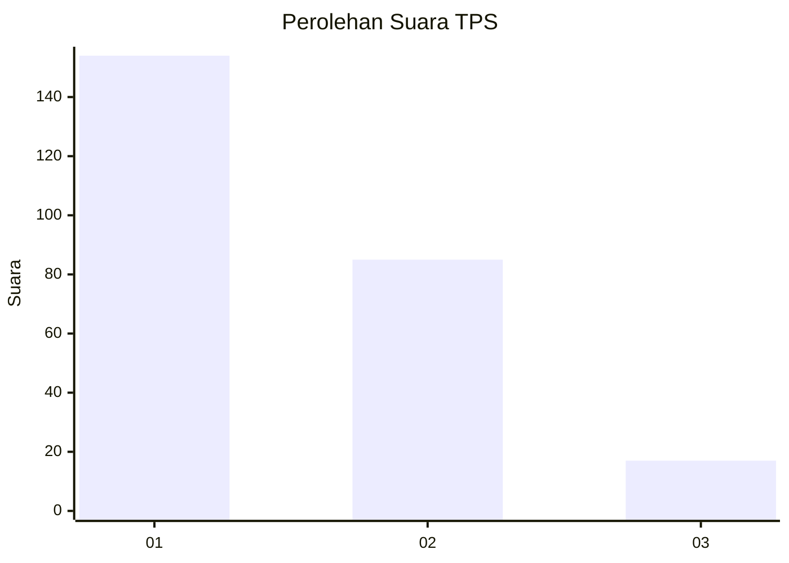
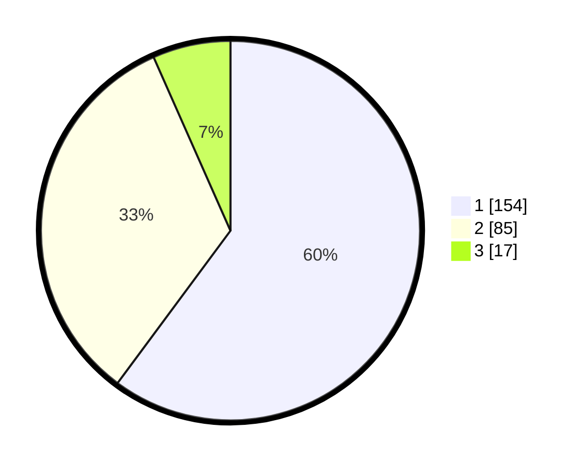

# Hasil

## Grafik

## Tabel

| No. | Nama Paslon    | Suara | Suara (raw) | Persentase |
|:--- |:-------------- | -----:| -----------:| ----------:|
| 1   | ANIES MUHAIMIN | 154   | [154][p-1]  | 60,16      |
| 2   | PRABOWO GIBRAN | 85    | [85][p-2]   | 33,20      |
| 3   | GANJAR MAHFUD  | 17    | [17][p-3]   | 6,64       |

[p-1]: https://github.com/gigit-pemilu/pemilu-2024/blob/main/pilpres/hitung-suara/sub/35-jawa-timur/sub/28-pamekasan/sub/12-kadur/sub/2009-bangkes/sub/011-tps/sub/paslon-1.txt
[p-2]: https://github.com/gigit-pemilu/pemilu-2024/blob/main/pilpres/hitung-suara/sub/35-jawa-timur/sub/28-pamekasan/sub/12-kadur/sub/2009-bangkes/sub/011-tps/sub/paslon-2.txt
[p-3]: https://github.com/gigit-pemilu/pemilu-2024/blob/main/pilpres/hitung-suara/sub/35-jawa-timur/sub/28-pamekasan/sub/12-kadur/sub/2009-bangkes/sub/011-tps/sub/paslon-3.txt

## Foto C Plano

https://sirekap-obj-formc.kpu.go.id/5060/pemilu/ppwp/35/28/12/20/09/3528122009011-20240215-005440--43bf97dc-4803-41bd-add4-baed97c30de8.jpg

https://sirekap-obj-formc.kpu.go.id/5060/pemilu/ppwp/35/28/12/20/09/3528122009011-20240215-005600--54fd4657-c892-4489-9c6b-53d0f31bd751.jpg

https://sirekap-obj-formc.kpu.go.id/5060/pemilu/ppwp/35/28/12/20/09/3528122009011-20240215-005631--a28a29e9-b923-4095-8059-c2b15f4e9110.jpg

## Metadata

| Key        | Value               |
| ---------- | ------------------- |
| Time Stamp | 2024-02-17 13:37:34 |

