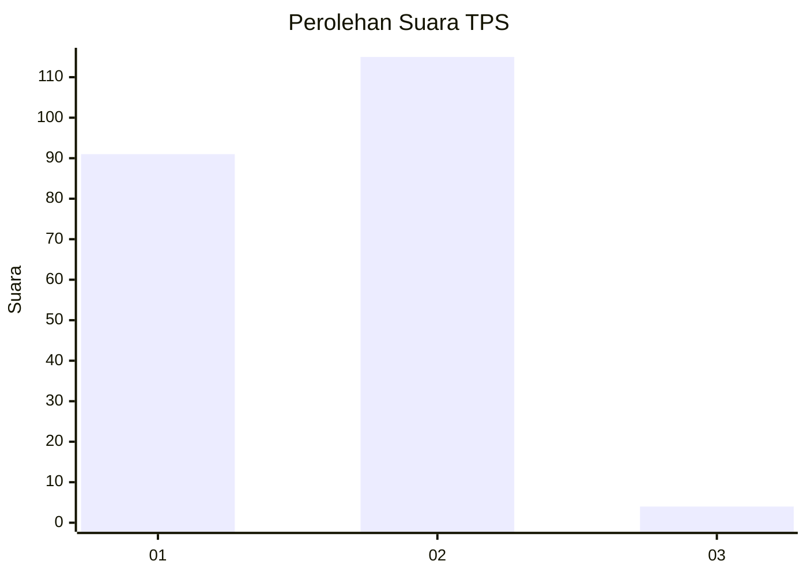
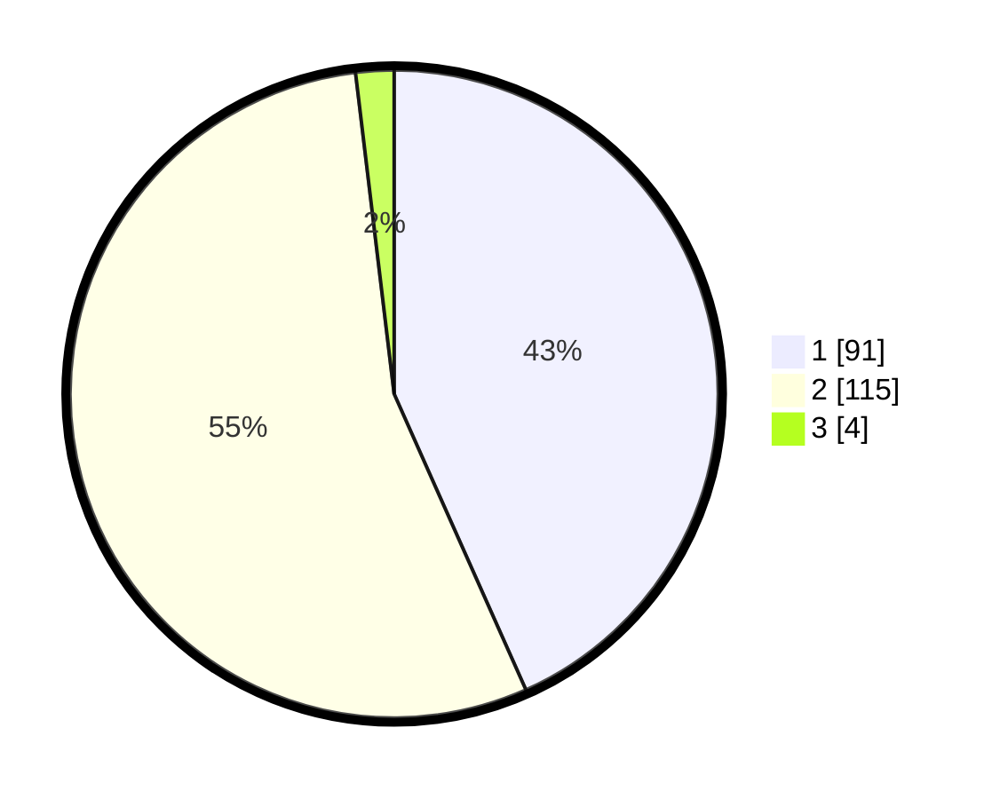

# Hasil

## Grafik

## Tabel

| No. | Nama Paslon    | Suara | Suara (raw) | Persentase |
|:--- |:-------------- | -----:| -----------:| ----------:|
| 1   | ANIES MUHAIMIN | 91    | [91][p-1]   | 43,33      |
| 2   | PRABOWO GIBRAN | 115   | [115][p-2]  | 54,76      |
| 3   | GANJAR MAHFUD  | 4     | [4][p-3]    | 1,90       |

[p-1]: https://github.com/gigit-pemilu/pemilu-2024/blob/main/pilpres/hitung-suara/sub/35-jawa-timur/sub/28-pamekasan/sub/12-kadur/sub/2009-bangkes/sub/014-tps/sub/paslon-1.txt
[p-2]: https://github.com/gigit-pemilu/pemilu-2024/blob/main/pilpres/hitung-suara/sub/35-jawa-timur/sub/28-pamekasan/sub/12-kadur/sub/2009-bangkes/sub/014-tps/sub/paslon-2.txt
[p-3]: https://github.com/gigit-pemilu/pemilu-2024/blob/main/pilpres/hitung-suara/sub/35-jawa-timur/sub/28-pamekasan/sub/12-kadur/sub/2009-bangkes/sub/014-tps/sub/paslon-3.txt

## Foto C Plano

https://sirekap-obj-formc.kpu.go.id/3d35/pemilu/ppwp/35/28/12/20/09/3528122009014-20240214-214637--377ad344-63a6-409d-a545-e64c38920323.jpg

https://sirekap-obj-formc.kpu.go.id/3d35/pemilu/ppwp/35/28/12/20/09/3528122009014-20240214-214647--a5c736c8-8588-415a-b40c-f0687ebc0aba.jpg

https://sirekap-obj-formc.kpu.go.id/3d35/pemilu/ppwp/35/28/12/20/09/3528122009014-20240214-231341--72cfe88b-5398-46ae-b4a5-92262d6e2014.jpg

## Metadata

| Key        | Value               |
| ---------- | ------------------- |
| Time Stamp | 2024-02-24 22:31:28 |

