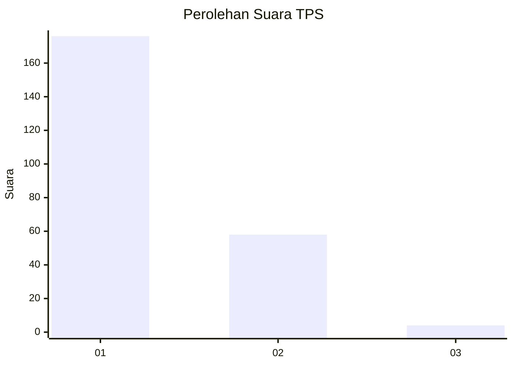
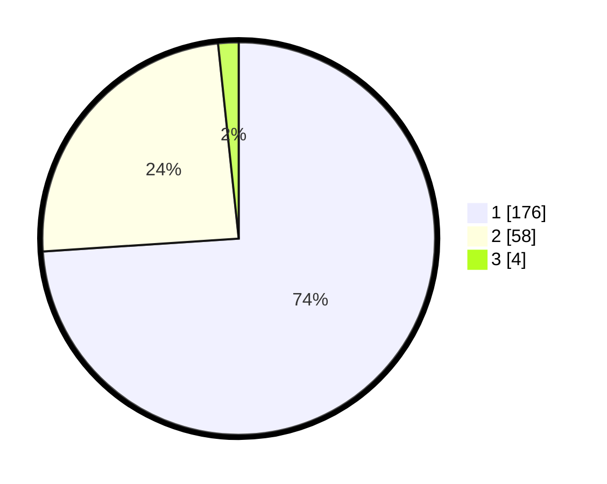

# Hasil

## Grafik

## Tabel

| No. | Nama Paslon    | Suara | Suara (raw) | Persentase |
|:--- |:-------------- | -----:| -----------:| ----------:|
| 1   | ANIES MUHAIMIN | 176   | [176][p-1]  | 73,95      |
| 2   | PRABOWO GIBRAN | 58    | [58][p-2]   | 24,37      |
| 3   | GANJAR MAHFUD  | 4     | [4][p-3]    | 1,68       |

[p-1]: https://github.com/gigit-pemilu/pemilu-2024/blob/main/pilpres/hitung-suara/sub/35-jawa-timur/sub/28-pamekasan/sub/12-kadur/sub/2009-bangkes/sub/017-tps/sub/paslon-1.txt
[p-2]: https://github.com/gigit-pemilu/pemilu-2024/blob/main/pilpres/hitung-suara/sub/35-jawa-timur/sub/28-pamekasan/sub/12-kadur/sub/2009-bangkes/sub/017-tps/sub/paslon-2.txt
[p-3]: https://github.com/gigit-pemilu/pemilu-2024/blob/main/pilpres/hitung-suara/sub/35-jawa-timur/sub/28-pamekasan/sub/12-kadur/sub/2009-bangkes/sub/017-tps/sub/paslon-3.txt

## Foto C Plano

https://sirekap-obj-formc.kpu.go.id/2e71/pemilu/ppwp/35/28/12/20/09/3528122009017-20240214-224539--4f0e583a-048f-43c6-bfa3-463646e73643.jpg

https://sirekap-obj-formc.kpu.go.id/2e71/pemilu/ppwp/35/28/12/20/09/3528122009017-20240215-023116--5f33706d-e590-44fd-a008-eb9a8b635bb6.jpg

https://sirekap-obj-formc.kpu.go.id/2e71/pemilu/ppwp/35/28/12/20/09/3528122009017-20240215-023249--c0ffa0c8-cf6c-48a2-9365-09dee02dadd4.jpg

## Metadata

| Key        | Value               |
| ---------- | ------------------- |
| Time Stamp | 2024-02-17 11:30:03 |

