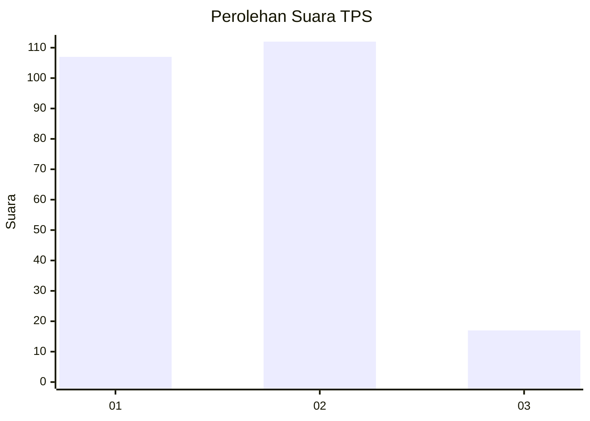
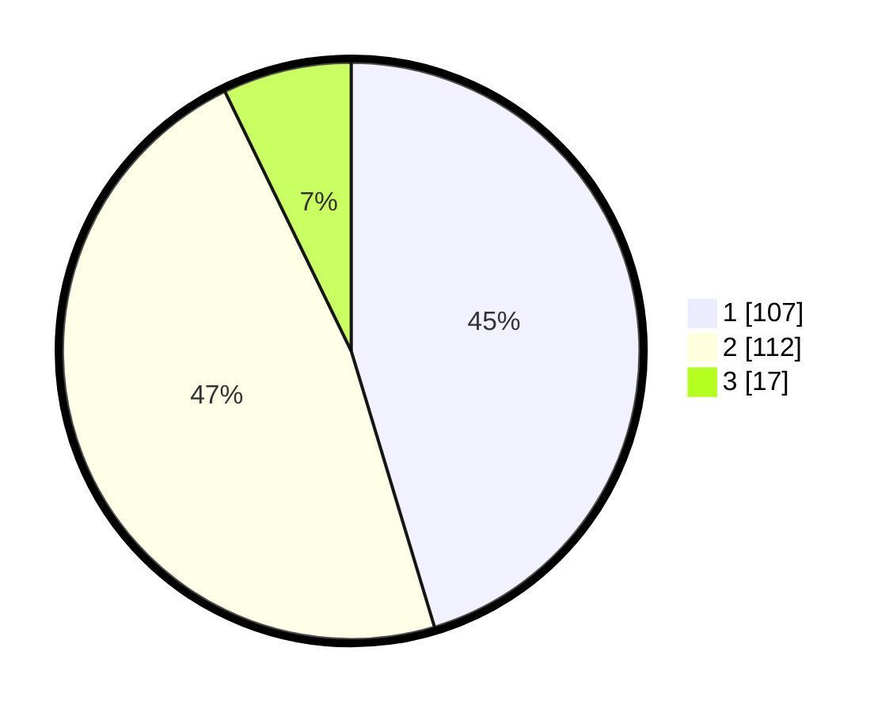

# Hasil

## Grafik

## Tabel

| No. | Nama Paslon    | Suara | Suara (raw) | Persentase |
|:--- |:-------------- | -----:| -----------:| ----------:|
| 1   | ANIES MUHAIMIN | 107   | [107][p-1]  | 45,34      |
| 2   | PRABOWO GIBRAN | 112   | [112][p-2]  | 47,46      |
| 3   | GANJAR MAHFUD  | 17    | [17][p-3]   | 7,20       |

[p-1]: https://github.com/gigit-pemilu/pemilu-2024-35-jawa-timur/blob/main/pilpres/hitung-suara/sub/35-jawa-timur/sub/28-pamekasan/sub/12-kadur/sub/2009-bangkes/sub/026-tps/sub/paslon-1.txt
[p-2]: https://github.com/gigit-pemilu/pemilu-2024-35-jawa-timur/blob/main/pilpres/hitung-suara/sub/35-jawa-timur/sub/28-pamekasan/sub/12-kadur/sub/2009-bangkes/sub/026-tps/sub/paslon-2.txt
[p-3]: https://github.com/gigit-pemilu/pemilu-2024-35-jawa-timur/blob/main/pilpres/hitung-suara/sub/35-jawa-timur/sub/28-pamekasan/sub/12-kadur/sub/2009-bangkes/sub/026-tps/sub/paslon-3.txt

## Foto C Plano

https://sirekap-obj-formc.kpu.go.id/d228/pemilu/ppwp/35/28/12/20/09/3528122009026-20240215-004649--172f5485-07a7-41e1-b785-7e74618c31da.jpg

https://sirekap-obj-formc.kpu.go.id/d228/pemilu/ppwp/35/28/12/20/09/3528122009026-20240215-004740--49f69fbd-b178-472e-ad89-f74a0b385e5d.jpg

https://sirekap-obj-formc.kpu.go.id/d228/pemilu/ppwp/35/28/12/20/09/3528122009026-20240215-005419--5b63ddb4-42f1-404a-86fd-65ff57b51464.jpg

## Metadata

| Key        | Value               |
| ---------- | ------------------- |
| Time Stamp | 2024-02-17 13:42:09 |

