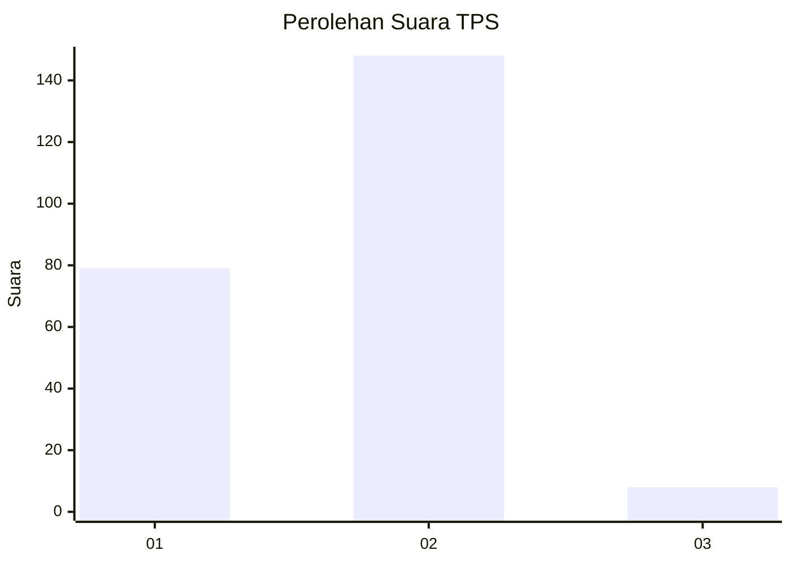
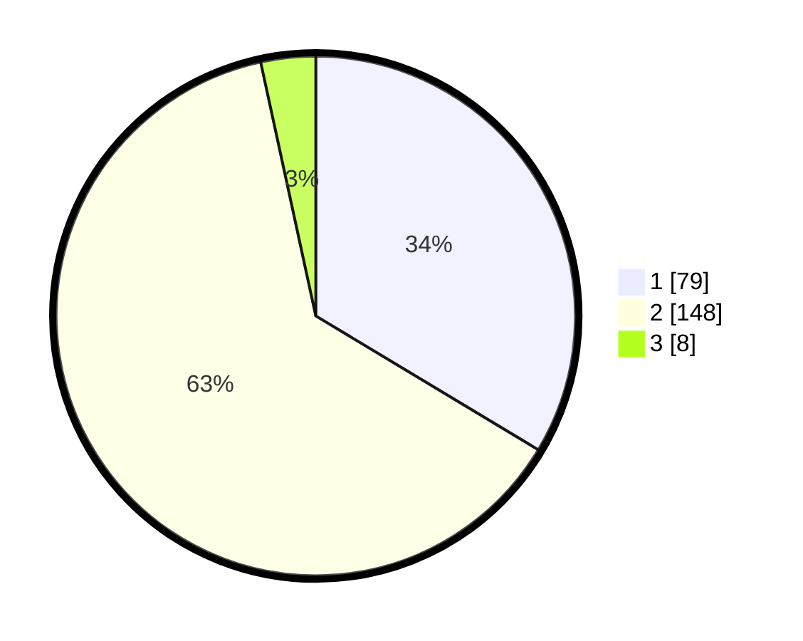

# Hasil

## Grafik

## Tabel

| No. | Nama Paslon    | Suara | Suara (raw) | Persentase |
|:--- |:-------------- | -----:| -----------:| ----------:|
| 1   | ANIES MUHAIMIN | 79    | [79][p-1]   | 33,62      |
| 2   | PRABOWO GIBRAN | 148   | [148][p-2]  | 62,98      |
| 3   | GANJAR MAHFUD  | 8     | [8][p-3]    | 3,40       |

[p-1]: https://github.com/gigit-pemilu/pemilu-2024/blob/main/pilpres/hitung-suara/sub/35-jawa-timur/sub/28-pamekasan/sub/12-kadur/sub/2010-kertagena-dajah/sub/006-tps/sub/paslon-1.txt
[p-2]: https://github.com/gigit-pemilu/pemilu-2024/blob/main/pilpres/hitung-suara/sub/35-jawa-timur/sub/28-pamekasan/sub/12-kadur/sub/2010-kertagena-dajah/sub/006-tps/sub/paslon-2.txt
[p-3]: https://github.com/gigit-pemilu/pemilu-2024/blob/main/pilpres/hitung-suara/sub/35-jawa-timur/sub/28-pamekasan/sub/12-kadur/sub/2010-kertagena-dajah/sub/006-tps/sub/paslon-3.txt

## Foto C Plano

https://sirekap-obj-formc.kpu.go.id/8d4b/pemilu/ppwp/35/28/12/20/10/3528122010006-20240214-221435--698580a6-df33-4980-bd9a-9e9463d68a4b.jpg

https://sirekap-obj-formc.kpu.go.id/8d4b/pemilu/ppwp/35/28/12/20/10/3528122010006-20240214-221542--2d9ff2aa-a9c6-49f7-af7f-aac5d94df0d1.jpg

https://sirekap-obj-formc.kpu.go.id/8d4b/pemilu/ppwp/35/28/12/20/10/3528122010006-20240214-221624--e41e65ce-6c64-4425-8372-252560ab7868.jpg

## Metadata

| Key        | Value               |
| ---------- | ------------------- |
| Time Stamp | 2024-02-24 22:31:28 |

