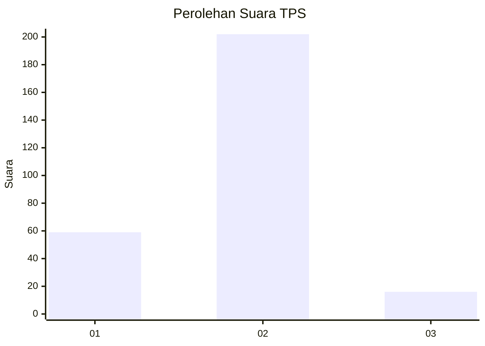

# Hasil

## Grafik

## Tabel

| No. | Nama Paslon    | Suara | Suara (raw) | Persentase |
|:--- |:-------------- | -----:| -----------:| ----------:|
| 1   | ANIES MUHAIMIN | 59    | [59][p-1]   | 21,30      |
| 2   | PRABOWO GIBRAN | 202   | [202][p-2]  | 72,92      |
| 3   | GANJAR MAHFUD  | 16    | [16][p-3]   | 5,78       |

[p-1]: https://github.com/gigit-pemilu/pemilu-2024/blob/main/pilpres/hitung-suara/sub/35-jawa-timur/sub/28-pamekasan/sub/13-pasean/sub/2001-sana-tengah/sub/010-tps/sub/paslon-1.txt
[p-2]: https://github.com/gigit-pemilu/pemilu-2024/blob/main/pilpres/hitung-suara/sub/35-jawa-timur/sub/28-pamekasan/sub/13-pasean/sub/2001-sana-tengah/sub/010-tps/sub/paslon-2.txt
[p-3]: https://github.com/gigit-pemilu/pemilu-2024/blob/main/pilpres/hitung-suara/sub/35-jawa-timur/sub/28-pamekasan/sub/13-pasean/sub/2001-sana-tengah/sub/010-tps/sub/paslon-3.txt

## Foto C Plano

https://sirekap-obj-formc.kpu.go.id/ecf1/pemilu/ppwp/35/28/13/20/01/3528132001010-20240215-082313--628beb2d-2b8d-4073-a899-4ae27bfb0593.jpg

https://sirekap-obj-formc.kpu.go.id/ecf1/pemilu/ppwp/35/28/13/20/01/3528132001010-20240215-085943--28b6681f-5ef0-486b-93e3-6d141e67d0b3.jpg

https://sirekap-obj-formc.kpu.go.id/ecf1/pemilu/ppwp/35/28/13/20/01/3528132001010-20240215-090154--a3062198-fa69-48e2-b265-c3f5551c71a1.jpg

## Metadata

| Key        | Value               |
| ---------- | ------------------- |
| Time Stamp | 2024-02-15 15:00:29 |

