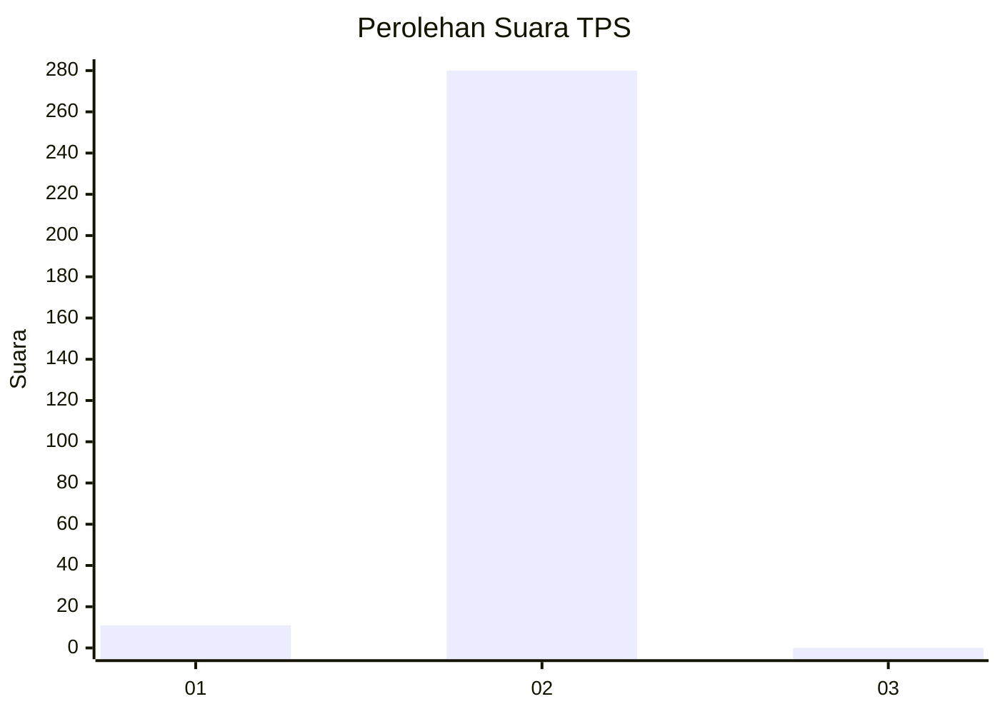
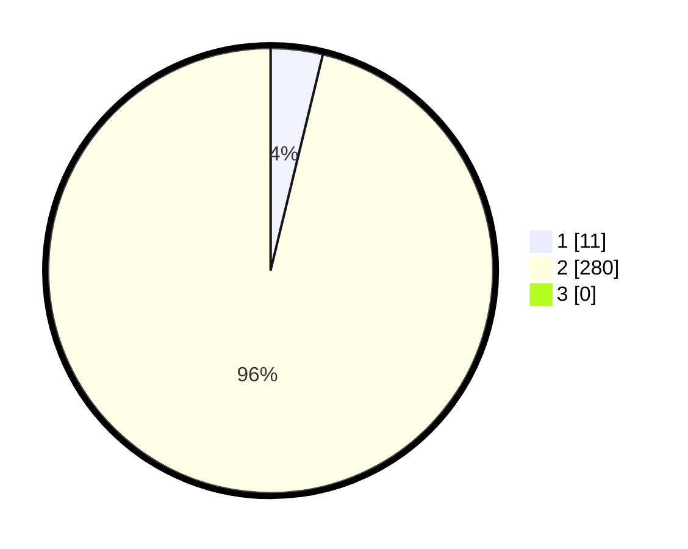

# Hasil

## Grafik

## Tabel

| No. | Nama Paslon    | Suara | Suara (raw) | Persentase |
|:--- |:-------------- | -----:| -----------:| ----------:|
| 1   | ANIES MUHAIMIN | 11    | [11][p-1]   | 3,78       |
| 2   | PRABOWO GIBRAN | 280   | [280][p-2]  | 96,22      |
| 3   | GANJAR MAHFUD  | 0     | [0][p-3]    | 0,00       |

[p-1]: https://github.com/gigit-pemilu/pemilu-2024/blob/main/pilpres/hitung-suara/sub/35-jawa-timur/sub/28-pamekasan/sub/13-pasean/sub/2001-sana-tengah/sub/011-tps/sub/paslon-1.txt
[p-2]: https://github.com/gigit-pemilu/pemilu-2024/blob/main/pilpres/hitung-suara/sub/35-jawa-timur/sub/28-pamekasan/sub/13-pasean/sub/2001-sana-tengah/sub/011-tps/sub/paslon-2.txt
[p-3]: https://github.com/gigit-pemilu/pemilu-2024/blob/main/pilpres/hitung-suara/sub/35-jawa-timur/sub/28-pamekasan/sub/13-pasean/sub/2001-sana-tengah/sub/011-tps/sub/paslon-3.txt

## Foto C Plano

https://sirekap-obj-formc.kpu.go.id/ac61/pemilu/ppwp/35/28/13/20/01/3528132001011-20240215-123131--94b2d2e7-e6e6-4cc9-a388-9a652535220c.jpg

https://sirekap-obj-formc.kpu.go.id/ac61/pemilu/ppwp/35/28/13/20/01/3528132001011-20240215-123238--7bc05e4a-0b99-4c9d-99b7-0ef4c48ff5b4.jpg

https://sirekap-obj-formc.kpu.go.id/ac61/pemilu/ppwp/35/28/13/20/01/3528132001011-20240215-003153--9022aa42-0279-4a7e-8068-fe00a687048a.jpg

## Metadata

| Key        | Value               |
| ---------- | ------------------- |
| Time Stamp | 2024-02-19 06:16:00 |

