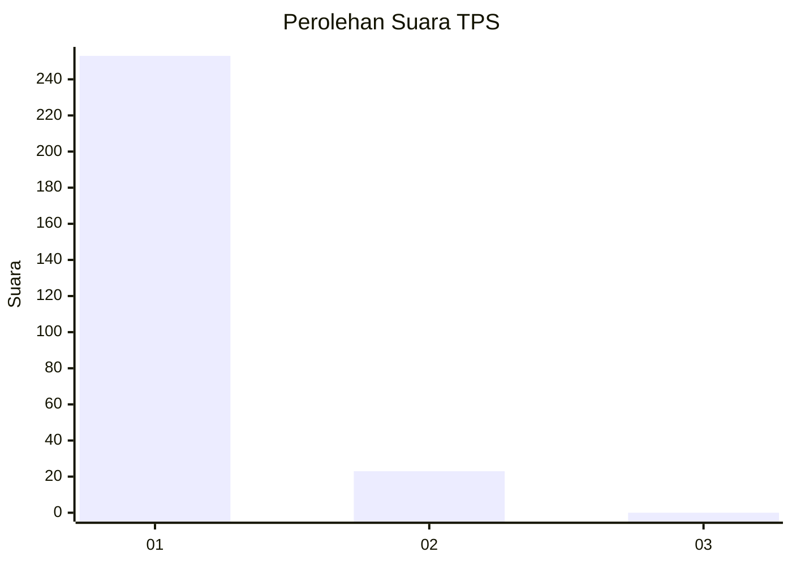
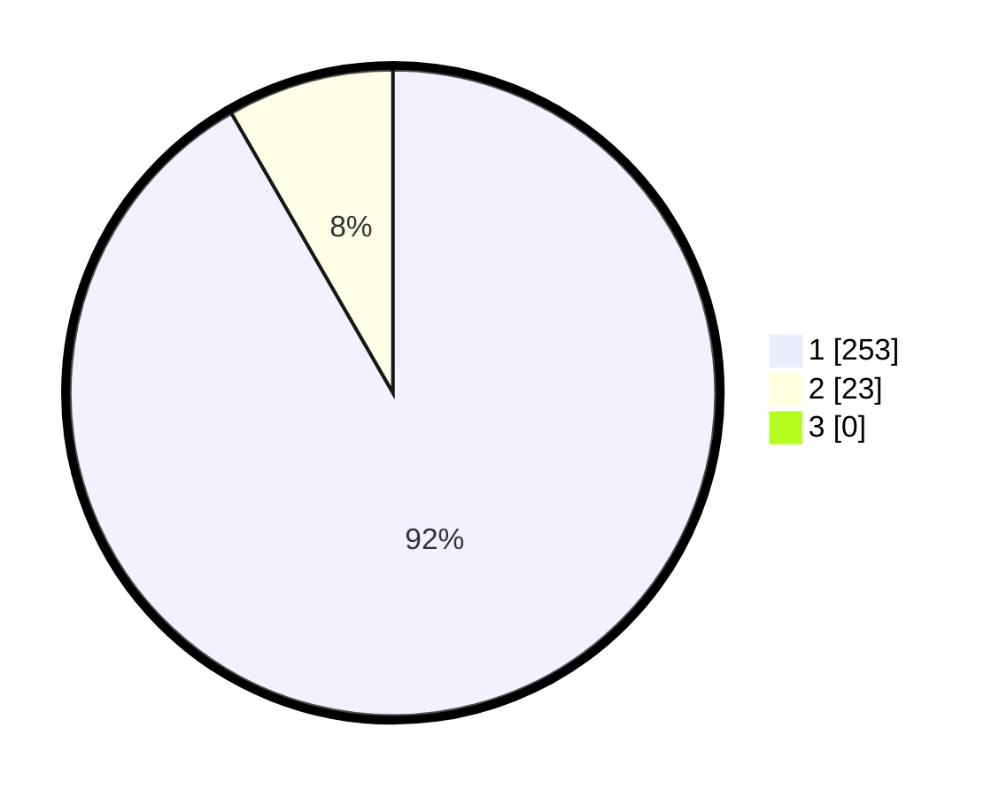

# Hasil

## Grafik

## Tabel

| No. | Nama Paslon    | Suara | Suara (raw) | Persentase |
|:--- |:-------------- | -----:| -----------:| ----------:|
| 1   | ANIES MUHAIMIN | 253   | [253][p-1]  | 91,67      |
| 2   | PRABOWO GIBRAN | 23    | [23][p-2]   | 8,33       |
| 3   | GANJAR MAHFUD  | 0     | [0][p-3]    | 0,00       |

[p-1]: https://github.com/gigit-pemilu/pemilu-2024-35-jawa-timur/blob/main/pilpres/hitung-suara/sub/35-jawa-timur/sub/28-pamekasan/sub/13-pasean/sub/2002-sana-daja/sub/004-tps/sub/paslon-1.txt
[p-2]: https://github.com/gigit-pemilu/pemilu-2024-35-jawa-timur/blob/main/pilpres/hitung-suara/sub/35-jawa-timur/sub/28-pamekasan/sub/13-pasean/sub/2002-sana-daja/sub/004-tps/sub/paslon-2.txt
[p-3]: https://github.com/gigit-pemilu/pemilu-2024-35-jawa-timur/blob/main/pilpres/hitung-suara/sub/35-jawa-timur/sub/28-pamekasan/sub/13-pasean/sub/2002-sana-daja/sub/004-tps/sub/paslon-3.txt

## Foto C Plano

https://sirekap-obj-formc.kpu.go.id/4019/pemilu/ppwp/35/28/13/20/02/3528132002004-20240214-230652--7199e90a-e0bc-407b-b54c-06e0418634e4.jpg

https://sirekap-obj-formc.kpu.go.id/4019/pemilu/ppwp/35/28/13/20/02/3528132002004-20240214-213608--5eb8483c-9ee1-43dc-b84c-2a03eb5b059a.jpg

https://sirekap-obj-formc.kpu.go.id/4019/pemilu/ppwp/35/28/13/20/02/3528132002004-20240214-213643--0a00b762-6fdb-432c-94ef-354f87f60a51.jpg

## Metadata

| Key        | Value               |
| ---------- | ------------------- |
| Time Stamp | 2024-02-19 06:16:00 |

## DATA PEMILIH TETAP

Jumlah pemilih dalam DPT: **280**.
 * L: **140**.
 * P: **140**.

## DATA PENGGUNA HAK PILIH

Jumlah pengguna hak pilih dalam DPT: **235**.
 * L: **382**.
 * P: **130**.

Jumlah pengguna hak pilih dalam DPTb: **708**.
 * L: **808**.
 * P: **8**.

Jumlah pengguna hak pilih dalam DPK: **880**.
 * L: **208**.
 * P: **808**.

Jumlah pengguna hak pilih: **276**.
 * L: **442**.
 * P: **335**.

## JUMLAH SUARA SAH DAN TIDAK SAH

JUMLAH SELURUH SUARA SAH: **276**.

JUMLAH SUARA TIDAK SAH: **0**.

JUMLAH SELURUH SUARA SAH DAN SUARA TIDAK SAH: **276**.

