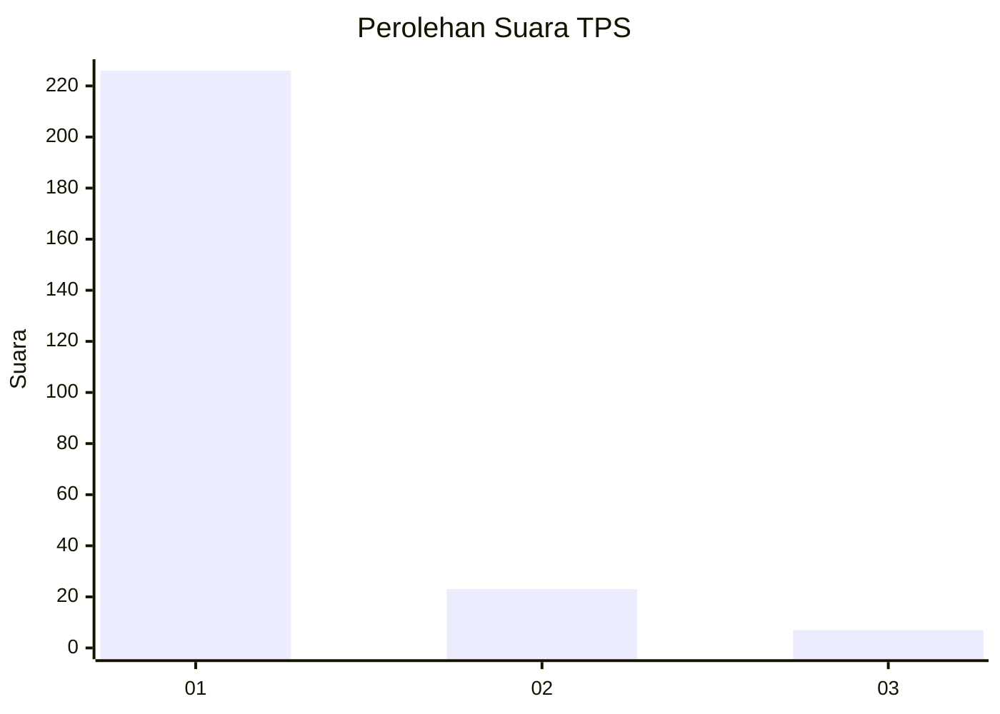
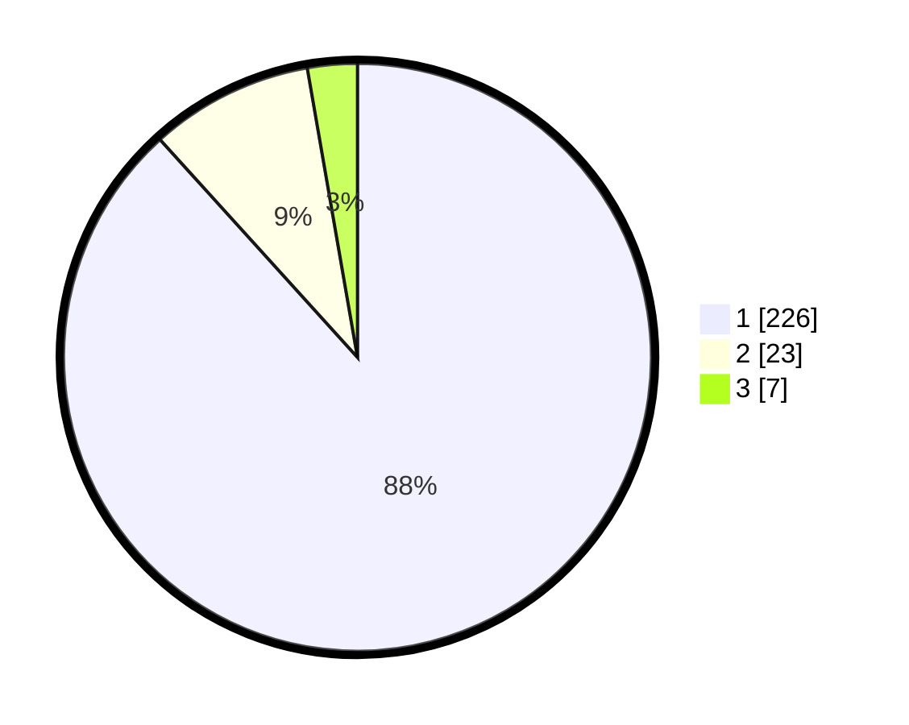

# Hasil

## Grafik

## Tabel

| No. | Nama Paslon    | Suara | Suara (raw) | Persentase |
|:--- |:-------------- | -----:| -----------:| ----------:|
| 1   | ANIES MUHAIMIN | 226   | [226][p-1]  | 88,28      |
| 2   | PRABOWO GIBRAN | 23    | [23][p-2]   | 8,98       |
| 3   | GANJAR MAHFUD  | 7     | [7][p-3]    | 2,73       |

[p-1]: https://github.com/gigit-pemilu/pemilu-2024-35-jawa-timur/blob/main/pilpres/hitung-suara/sub/35-jawa-timur/sub/28-pamekasan/sub/13-pasean/sub/2002-sana-daja/sub/005-tps/sub/paslon-1.txt
[p-2]: https://github.com/gigit-pemilu/pemilu-2024-35-jawa-timur/blob/main/pilpres/hitung-suara/sub/35-jawa-timur/sub/28-pamekasan/sub/13-pasean/sub/2002-sana-daja/sub/005-tps/sub/paslon-2.txt
[p-3]: https://github.com/gigit-pemilu/pemilu-2024-35-jawa-timur/blob/main/pilpres/hitung-suara/sub/35-jawa-timur/sub/28-pamekasan/sub/13-pasean/sub/2002-sana-daja/sub/005-tps/sub/paslon-3.txt

## Foto C Plano

https://sirekap-obj-formc.kpu.go.id/138b/pemilu/ppwp/35/28/13/20/02/3528132002005-20240214-221650--08a5c26c-7d19-40d4-9331-3cdd4301341f.jpg

https://sirekap-obj-formc.kpu.go.id/138b/pemilu/ppwp/35/28/13/20/02/3528132002005-20240214-221800--1194ba4a-e44d-4ac7-a2e7-1eaf3dea613e.jpg

https://sirekap-obj-formc.kpu.go.id/138b/pemilu/ppwp/35/28/13/20/02/3528132002005-20240214-221852--712c0b9b-b738-43cd-90a2-14d492577207.jpg

## Metadata

| Key        | Value               |
| ---------- | ------------------- |
| Time Stamp | 2024-02-19 06:16:00 |

