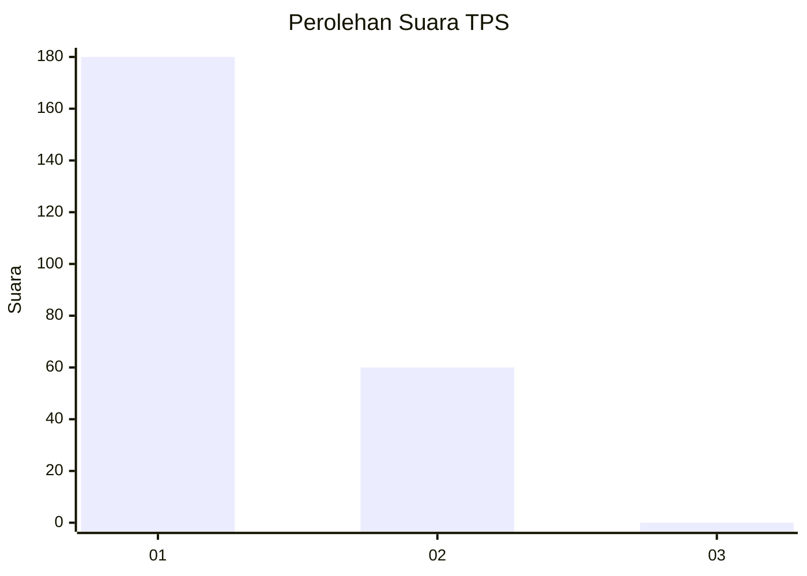
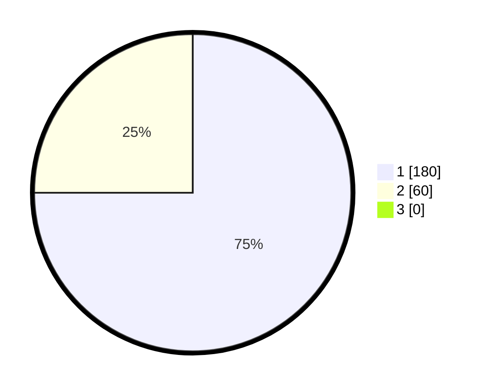

# Hasil

## Grafik

## Tabel

| No. | Nama Paslon    | Suara | Suara (raw) | Persentase |
|:--- |:-------------- | -----:| -----------:| ----------:|
| 1   | ANIES MUHAIMIN | 180   | [180][p-1]  | 75,00      |
| 2   | PRABOWO GIBRAN | 60    | [60][p-2]   | 25,00      |
| 3   | GANJAR MAHFUD  | 0     | [0][p-3]    | 0,00       |

[p-1]: https://github.com/gigit-pemilu/pemilu-2024-35-jawa-timur/blob/main/pilpres/hitung-suara/sub/35-jawa-timur/sub/28-pamekasan/sub/13-pasean/sub/2002-sana-daja/sub/015-tps/sub/paslon-1.txt
[p-2]: https://github.com/gigit-pemilu/pemilu-2024-35-jawa-timur/blob/main/pilpres/hitung-suara/sub/35-jawa-timur/sub/28-pamekasan/sub/13-pasean/sub/2002-sana-daja/sub/015-tps/sub/paslon-2.txt
[p-3]: https://github.com/gigit-pemilu/pemilu-2024-35-jawa-timur/blob/main/pilpres/hitung-suara/sub/35-jawa-timur/sub/28-pamekasan/sub/13-pasean/sub/2002-sana-daja/sub/015-tps/sub/paslon-3.txt

## Foto C Plano

https://sirekap-obj-formc.kpu.go.id/f50a/pemilu/ppwp/35/28/13/20/02/3528132002015-20240215-054450--7947caed-8c36-4d5e-ad0b-e415ce40625f.jpg

https://sirekap-obj-formc.kpu.go.id/f50a/pemilu/ppwp/35/28/13/20/02/3528132002015-20240215-054655--a8741eca-b199-47a2-8f44-a5075abd023e.jpg

https://sirekap-obj-formc.kpu.go.id/f50a/pemilu/ppwp/35/28/13/20/02/3528132002015-20240215-054723--d6e292b7-7cf4-4d7f-a76c-823aa0740c76.jpg

## Metadata

| Key        | Value               |
| ---------- | ------------------- |
| Time Stamp | 2024-02-19 06:16:00 |

