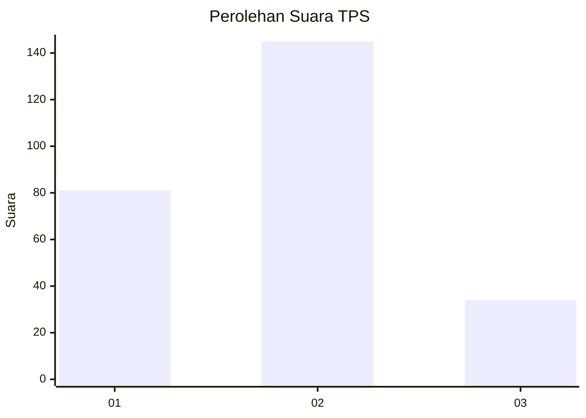
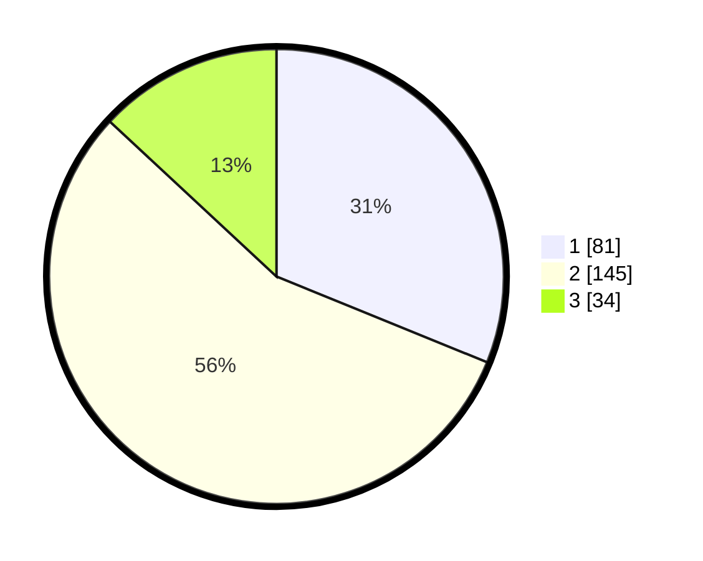

# Hasil

## Grafik

## Tabel

| No. | Nama Paslon    | Suara | Suara (raw) | Persentase |
|:--- |:-------------- | -----:| -----------:| ----------:|
| 1   | ANIES MUHAIMIN | 81    | [81][p-1]   | 31,15      |
| 2   | PRABOWO GIBRAN | 145   | [145][p-2]  | 55,77      |
| 3   | GANJAR MAHFUD  | 34    | [34][p-3]   | 13,08      |

[p-1]: https://github.com/gigit-pemilu/pemilu-2024/blob/main/pilpres/hitung-suara/sub/35-jawa-timur/sub/28-pamekasan/sub/13-pasean/sub/2003-tagangser-daja/sub/003-tps/sub/paslon-1.txt
[p-2]: https://github.com/gigit-pemilu/pemilu-2024/blob/main/pilpres/hitung-suara/sub/35-jawa-timur/sub/28-pamekasan/sub/13-pasean/sub/2003-tagangser-daja/sub/003-tps/sub/paslon-2.txt
[p-3]: https://github.com/gigit-pemilu/pemilu-2024/blob/main/pilpres/hitung-suara/sub/35-jawa-timur/sub/28-pamekasan/sub/13-pasean/sub/2003-tagangser-daja/sub/003-tps/sub/paslon-3.txt

## Foto C Plano

https://sirekap-obj-formc.kpu.go.id/78a4/pemilu/ppwp/35/28/13/20/03/3528132003003-20240214-213849--f22cbc87-c6bc-4f38-8ba4-9603804bf37c.jpg

https://sirekap-obj-formc.kpu.go.id/78a4/pemilu/ppwp/35/28/13/20/03/3528132003003-20240215-102408--3671f4f8-a477-46ea-8bef-6a1fa7163fb4.jpg

https://sirekap-obj-formc.kpu.go.id/78a4/pemilu/ppwp/35/28/13/20/03/3528132003003-20240214-213931--3edaa331-0d3e-4256-a954-997ad1f4f130.jpg

## Metadata

| Key        | Value               |
| ---------- | ------------------- |
| Time Stamp | 2024-02-19 06:16:00 |

