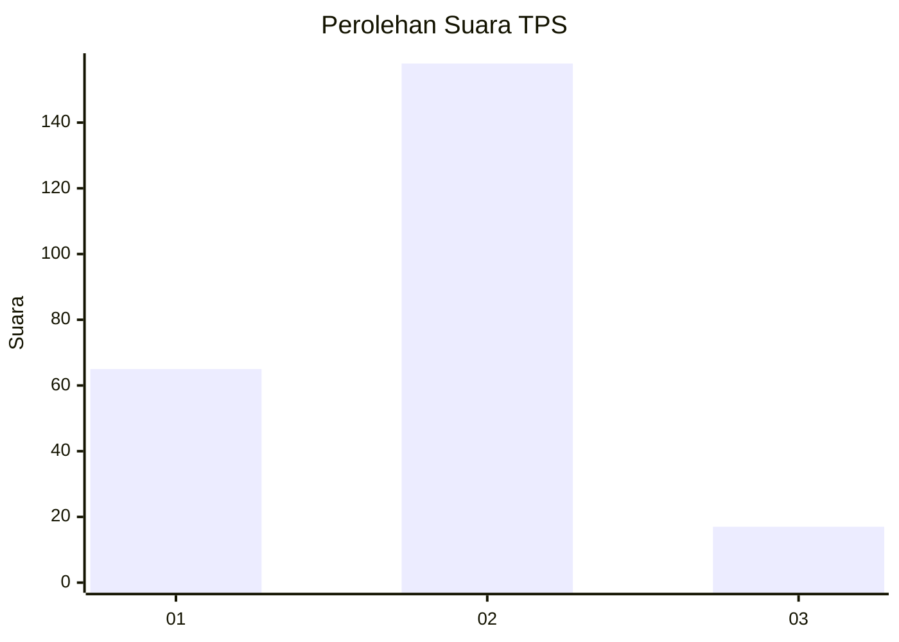
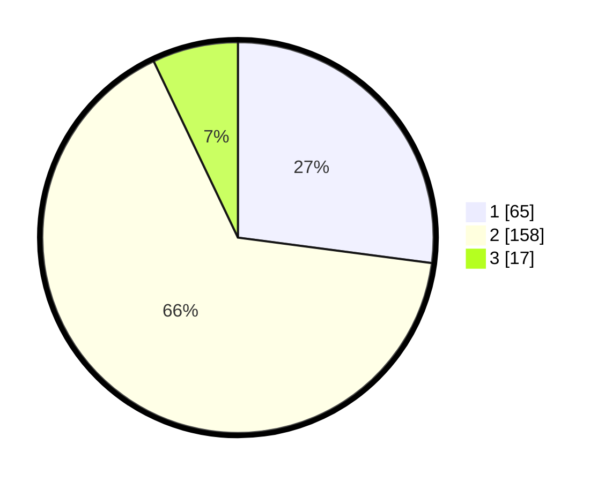

# Hasil

## Grafik

## Tabel

| No. | Nama Paslon    | Suara | Suara (raw) | Persentase |
|:--- |:-------------- | -----:| -----------:| ----------:|
| 1   | ANIES MUHAIMIN | 65    | [65][p-1]   | 27,08      |
| 2   | PRABOWO GIBRAN | 158   | [158][p-2]  | 65,83      |
| 3   | GANJAR MAHFUD  | 17    | [17][p-3]   | 7,08       |

[p-1]: https://github.com/gigit-pemilu/pemilu-2024/blob/main/pilpres/hitung-suara/sub/35-jawa-timur/sub/28-pamekasan/sub/13-pasean/sub/2003-tagangser-daja/sub/004-tps/sub/paslon-1.txt
[p-2]: https://github.com/gigit-pemilu/pemilu-2024/blob/main/pilpres/hitung-suara/sub/35-jawa-timur/sub/28-pamekasan/sub/13-pasean/sub/2003-tagangser-daja/sub/004-tps/sub/paslon-2.txt
[p-3]: https://github.com/gigit-pemilu/pemilu-2024/blob/main/pilpres/hitung-suara/sub/35-jawa-timur/sub/28-pamekasan/sub/13-pasean/sub/2003-tagangser-daja/sub/004-tps/sub/paslon-3.txt

## Foto C Plano

https://sirekap-obj-formc.kpu.go.id/d8c5/pemilu/ppwp/35/28/13/20/03/3528132003004-20240215-000900--c9fd50e8-e0ec-42ac-9828-26a66642d504.jpg

https://sirekap-obj-formc.kpu.go.id/d8c5/pemilu/ppwp/35/28/13/20/03/3528132003004-20240215-001031--aefadc8e-05e3-4103-98a1-10afac664ff6.jpg

https://sirekap-obj-formc.kpu.go.id/d8c5/pemilu/ppwp/35/28/13/20/03/3528132003004-20240215-001158--3d2012f3-6b35-4fb4-b995-7109adb3ad2e.jpg

## Metadata

| Key        | Value               |
| ---------- | ------------------- |
| Time Stamp | 2024-02-19 06:16:00 |

