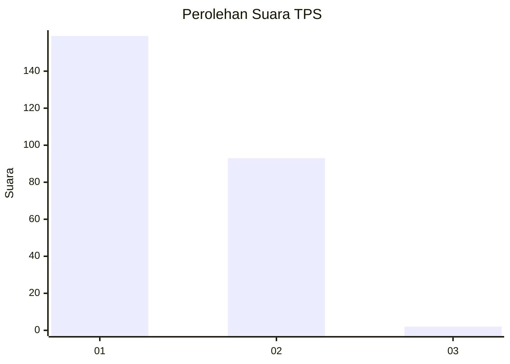
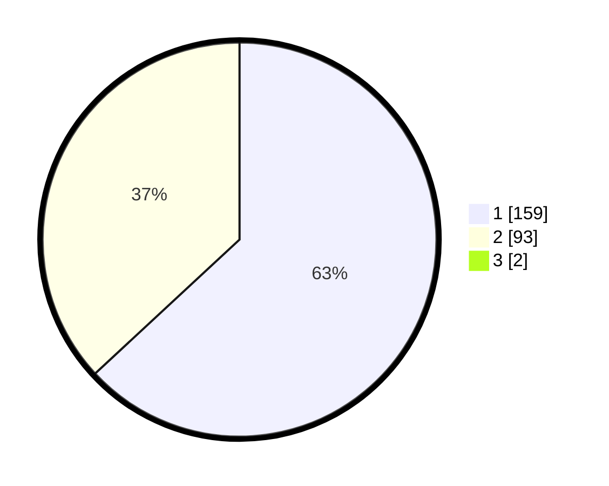

# Hasil

## Grafik

## Tabel

| No. | Nama Paslon    | Suara | Suara (raw) | Persentase |
|:--- |:-------------- | -----:| -----------:| ----------:|
| 1   | ANIES MUHAIMIN | 159   | [159][p-1]  | 62,60      |
| 2   | PRABOWO GIBRAN | 93    | [93][p-2]   | 36,61      |
| 3   | GANJAR MAHFUD  | 2     | [2][p-3]    | 0,79       |

[p-1]: https://github.com/gigit-pemilu/pemilu-2024-35-jawa-timur/blob/main/pilpres/hitung-suara/sub/35-jawa-timur/sub/28-pamekasan/sub/13-pasean/sub/2003-tagangser-daja/sub/006-tps/sub/paslon-1.txt
[p-2]: https://github.com/gigit-pemilu/pemilu-2024-35-jawa-timur/blob/main/pilpres/hitung-suara/sub/35-jawa-timur/sub/28-pamekasan/sub/13-pasean/sub/2003-tagangser-daja/sub/006-tps/sub/paslon-2.txt
[p-3]: https://github.com/gigit-pemilu/pemilu-2024-35-jawa-timur/blob/main/pilpres/hitung-suara/sub/35-jawa-timur/sub/28-pamekasan/sub/13-pasean/sub/2003-tagangser-daja/sub/006-tps/sub/paslon-3.txt

## Foto C Plano

https://sirekap-obj-formc.kpu.go.id/f725/pemilu/ppwp/35/28/13/20/03/3528132003006-20240215-115230--0f8e0bca-b228-49e9-8d1a-94f0f142d945.jpg

https://sirekap-obj-formc.kpu.go.id/f725/pemilu/ppwp/35/28/13/20/03/3528132003006-20240215-115328--fde180e7-71e4-4f86-aa2e-a87257f7d0dd.jpg

https://sirekap-obj-formc.kpu.go.id/f725/pemilu/ppwp/35/28/13/20/03/3528132003006-20240215-115456--391c9c2b-d1de-47b7-9f99-d7a68e4ff396.jpg

## Metadata

| Key        | Value               |
| ---------- | ------------------- |
| Time Stamp | 2024-02-19 06:16:00 |

