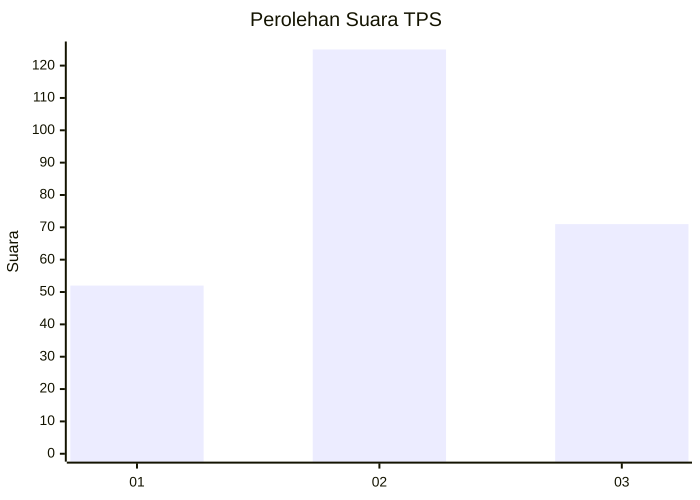
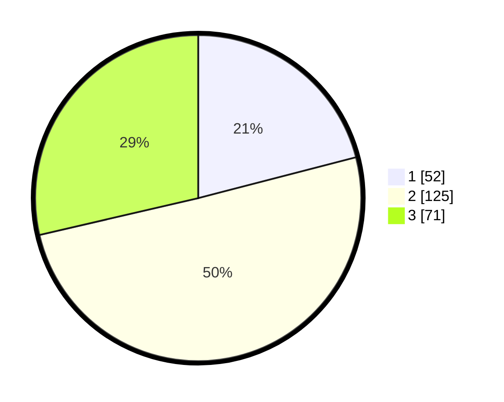

# Hasil

## Grafik

## Tabel

| No. | Nama Paslon    | Suara | Suara (raw) | Persentase |
|:--- |:-------------- | -----:| -----------:| ----------:|
| 1   | ANIES MUHAIMIN | 52    | [52][p-1]   | 20,97      |
| 2   | PRABOWO GIBRAN | 125   | [125][p-2]  | 50,40      |
| 3   | GANJAR MAHFUD  | 71    | [71][p-3]   | 28,63      |

[p-1]: https://github.com/gigit-pemilu/pemilu-2024/blob/main/pilpres/hitung-suara/sub/35-jawa-timur/sub/28-pamekasan/sub/13-pasean/sub/2003-tagangser-daja/sub/008-tps/sub/paslon-1.txt
[p-2]: https://github.com/gigit-pemilu/pemilu-2024/blob/main/pilpres/hitung-suara/sub/35-jawa-timur/sub/28-pamekasan/sub/13-pasean/sub/2003-tagangser-daja/sub/008-tps/sub/paslon-2.txt
[p-3]: https://github.com/gigit-pemilu/pemilu-2024/blob/main/pilpres/hitung-suara/sub/35-jawa-timur/sub/28-pamekasan/sub/13-pasean/sub/2003-tagangser-daja/sub/008-tps/sub/paslon-3.txt

## Foto C Plano

https://sirekap-obj-formc.kpu.go.id/cf31/pemilu/ppwp/35/28/13/20/03/3528132003008-20240215-121516--a2aa3358-0a58-4074-8a6c-771b80a0fdf7.jpg

https://sirekap-obj-formc.kpu.go.id/cf31/pemilu/ppwp/35/28/13/20/03/3528132003008-20240215-120429--5bb790eb-24d4-4c99-a2ea-79c9c15b5a7a.jpg

https://sirekap-obj-formc.kpu.go.id/cf31/pemilu/ppwp/35/28/13/20/03/3528132003008-20240215-122334--049330ca-76ef-40f3-9336-1da2ea7a729c.jpg

## Metadata

| Key        | Value               |
| ---------- | ------------------- |
| Time Stamp | 2024-02-15 20:30:46 |

