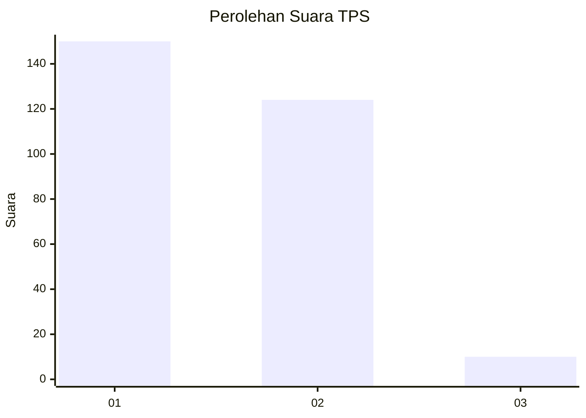
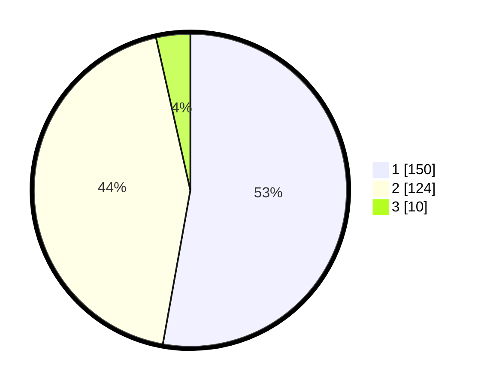

# Hasil

## Grafik

## Tabel

| No. | Nama Paslon    | Suara | Suara (raw) | Persentase |
|:--- |:-------------- | -----:| -----------:| ----------:|
| 1   | ANIES MUHAIMIN | 150   | [150][p-1]  | 52,82      |
| 2   | PRABOWO GIBRAN | 124   | [124][p-2]  | 43,66      |
| 3   | GANJAR MAHFUD  | 10    | [10][p-3]   | 3,52       |

[p-1]: https://github.com/gigit-pemilu/pemilu-2024/blob/main/pilpres/hitung-suara/sub/35-jawa-timur/sub/28-pamekasan/sub/13-pasean/sub/2004-sotabar/sub/001-tps/sub/paslon-1.txt
[p-2]: https://github.com/gigit-pemilu/pemilu-2024/blob/main/pilpres/hitung-suara/sub/35-jawa-timur/sub/28-pamekasan/sub/13-pasean/sub/2004-sotabar/sub/001-tps/sub/paslon-2.txt
[p-3]: https://github.com/gigit-pemilu/pemilu-2024/blob/main/pilpres/hitung-suara/sub/35-jawa-timur/sub/28-pamekasan/sub/13-pasean/sub/2004-sotabar/sub/001-tps/sub/paslon-3.txt

## Foto C Plano

https://sirekap-obj-formc.kpu.go.id/4ee6/pemilu/ppwp/35/28/13/20/04/3528132004001-20240217-183028--25d75e11-c8b7-4ac3-84a2-05d5a361832e.jpg

https://sirekap-obj-formc.kpu.go.id/4ee6/pemilu/ppwp/35/28/13/20/04/3528132004001-20240217-182903--50d88fb2-e35e-4c88-8ce2-b0e650e4c09b.jpg

https://sirekap-obj-formc.kpu.go.id/4ee6/pemilu/ppwp/35/28/13/20/04/3528132004001-20240215-015730--5ad70ca5-aa2c-433e-b01a-989e39ef877e.jpg

## Metadata

| Key        | Value               |
| ---------- | ------------------- |
| Time Stamp | 2024-02-25 15:00:00 |

