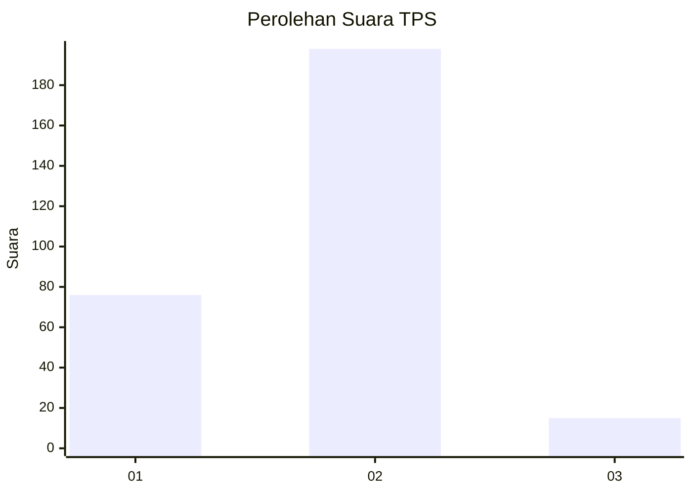
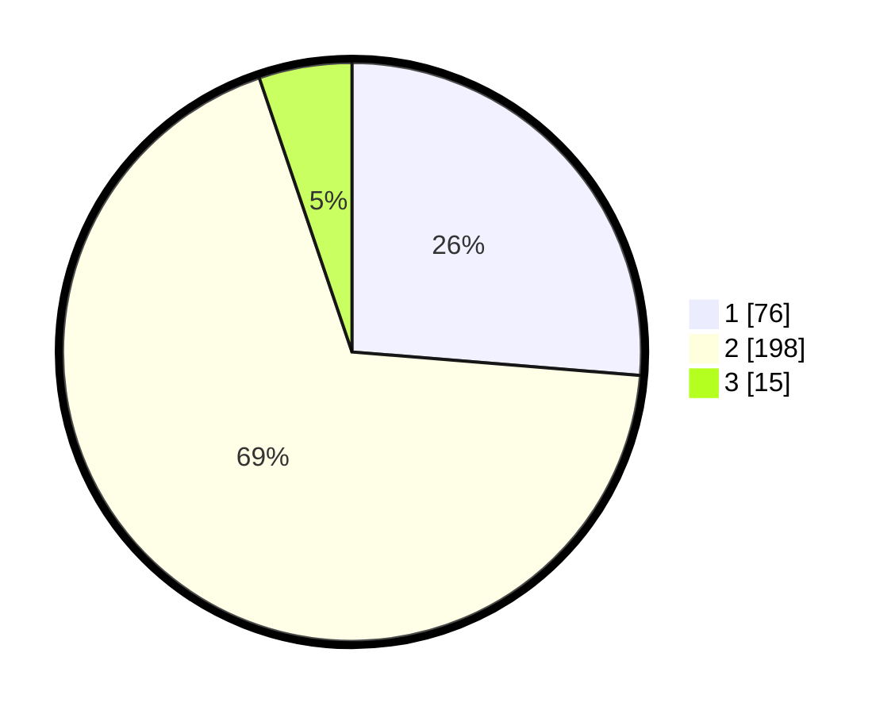

# Hasil

## Grafik

## Tabel

| No. | Nama Paslon    | Suara | Suara (raw) | Persentase |
|:--- |:-------------- | -----:| -----------:| ----------:|
| 1   | ANIES MUHAIMIN | 76    | [76][p-1]   | 26,30      |
| 2   | PRABOWO GIBRAN | 198   | [198][p-2]  | 68,51      |
| 3   | GANJAR MAHFUD  | 15    | [15][p-3]   | 5,19       |

[p-1]: https://github.com/gigit-pemilu/pemilu-2024/blob/main/pilpres/hitung-suara/sub/35-jawa-timur/sub/28-pamekasan/sub/13-pasean/sub/2004-sotabar/sub/004-tps/sub/paslon-1.txt
[p-2]: https://github.com/gigit-pemilu/pemilu-2024/blob/main/pilpres/hitung-suara/sub/35-jawa-timur/sub/28-pamekasan/sub/13-pasean/sub/2004-sotabar/sub/004-tps/sub/paslon-2.txt
[p-3]: https://github.com/gigit-pemilu/pemilu-2024/blob/main/pilpres/hitung-suara/sub/35-jawa-timur/sub/28-pamekasan/sub/13-pasean/sub/2004-sotabar/sub/004-tps/sub/paslon-3.txt

## Foto C Plano

https://sirekap-obj-formc.kpu.go.id/ef0f/pemilu/ppwp/35/28/13/20/04/3528132004004-20240215-042621--80db775e-7c39-49ff-a5af-c8fe7ccc94d3.jpg

https://sirekap-obj-formc.kpu.go.id/ef0f/pemilu/ppwp/35/28/13/20/04/3528132004004-20240215-015214--ddebad68-586b-495e-ae1a-9e38d1e2c54a.jpg

https://sirekap-obj-formc.kpu.go.id/ef0f/pemilu/ppwp/35/28/13/20/04/3528132004004-20240215-042927--21b9a371-6ebd-40fd-89db-2d70b3ba1aca.jpg

## Metadata

| Key        | Value               |
| ---------- | ------------------- |
| Time Stamp | 2024-02-19 06:16:00 |

