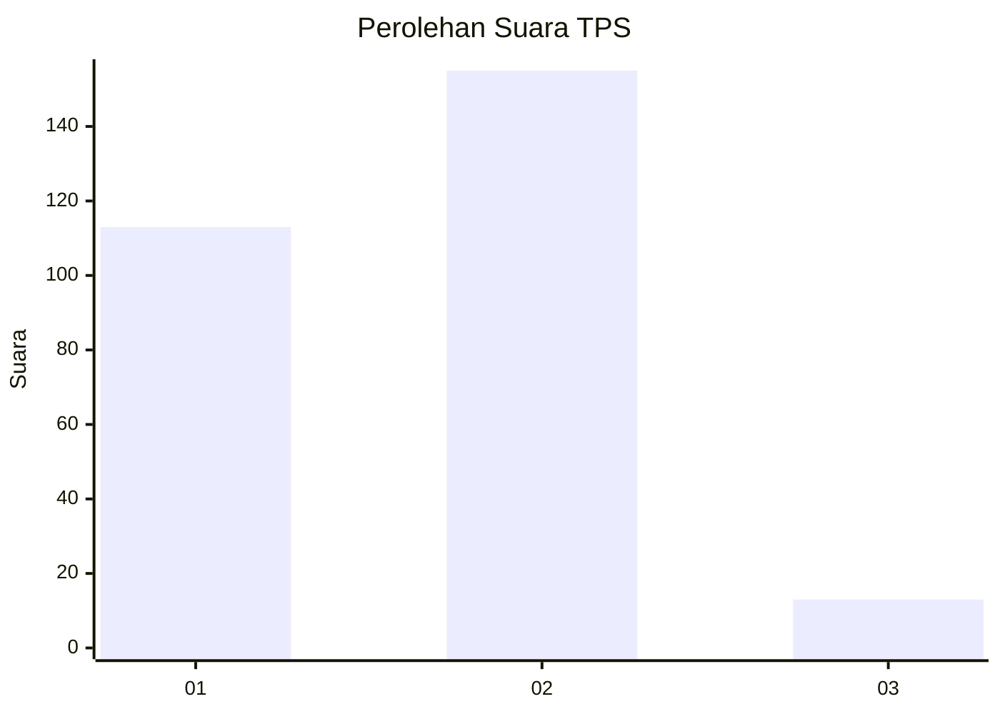
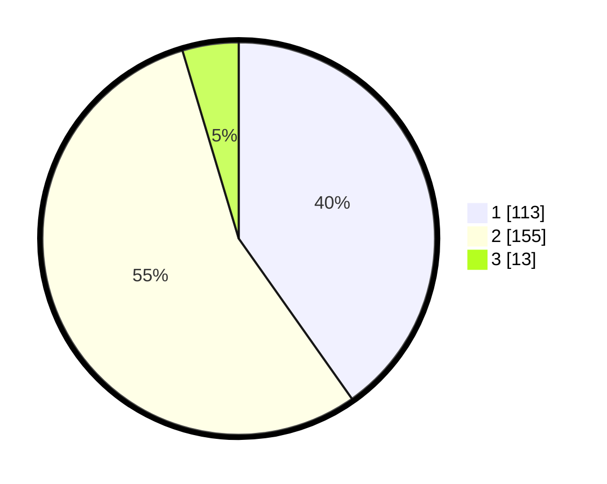

# Hasil

## Grafik

## Tabel

| No. | Nama Paslon    | Suara | Suara (raw) | Persentase |
|:--- |:-------------- | -----:| -----------:| ----------:|
| 1   | ANIES MUHAIMIN | 113   | [113][p-1]  | 40,21      |
| 2   | PRABOWO GIBRAN | 155   | [155][p-2]  | 55,16      |
| 3   | GANJAR MAHFUD  | 13    | [13][p-3]   | 4,63       |

[p-1]: https://github.com/gigit-pemilu/pemilu-2024/blob/main/pilpres/hitung-suara/sub/35-jawa-timur/sub/28-pamekasan/sub/13-pasean/sub/2004-sotabar/sub/007-tps/sub/paslon-1.txt
[p-2]: https://github.com/gigit-pemilu/pemilu-2024/blob/main/pilpres/hitung-suara/sub/35-jawa-timur/sub/28-pamekasan/sub/13-pasean/sub/2004-sotabar/sub/007-tps/sub/paslon-2.txt
[p-3]: https://github.com/gigit-pemilu/pemilu-2024/blob/main/pilpres/hitung-suara/sub/35-jawa-timur/sub/28-pamekasan/sub/13-pasean/sub/2004-sotabar/sub/007-tps/sub/paslon-3.txt

## Foto C Plano

https://sirekap-obj-formc.kpu.go.id/3cd4/pemilu/ppwp/35/28/13/20/04/3528132004007-20240215-063824--c2e9f312-7ac6-46bd-8a2d-d9d2144fbb1e.jpg

https://sirekap-obj-formc.kpu.go.id/3cd4/pemilu/ppwp/35/28/13/20/04/3528132004007-20240215-063951--fec940c1-a5f5-4090-8600-f1a7353ccf61.jpg

https://sirekap-obj-formc.kpu.go.id/3cd4/pemilu/ppwp/35/28/13/20/04/3528132004007-20240215-084632--50f740ae-9cea-4901-84e4-38b5c854e1a3.jpg

## Metadata

| Key        | Value               |
| ---------- | ------------------- |
| Time Stamp | 2024-02-19 06:16:00 |

