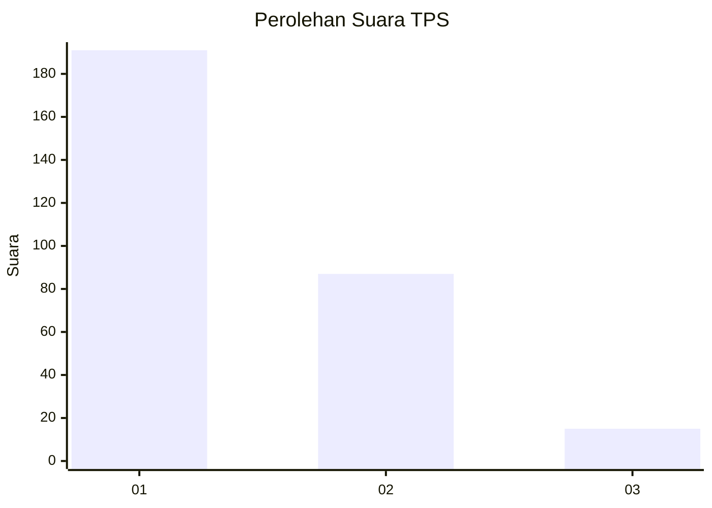
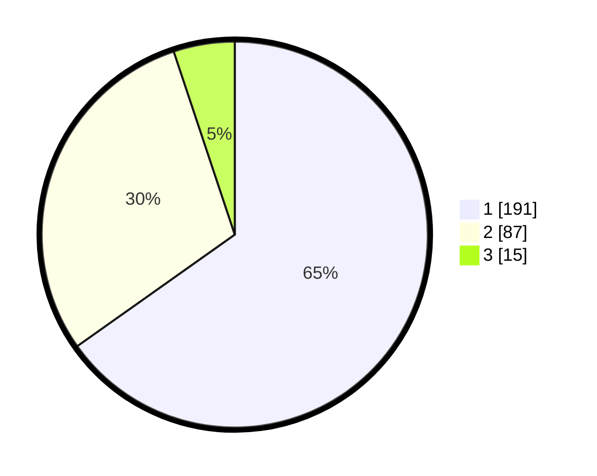

# Hasil

## Grafik

## Tabel

| No. | Nama Paslon    | Suara | Suara (raw) | Persentase |
|:--- |:-------------- | -----:| -----------:| ----------:|
| 1   | ANIES MUHAIMIN | 191   | [191][p-1]  | 65,19      |
| 2   | PRABOWO GIBRAN | 87    | [87][p-2]   | 29,69      |
| 3   | GANJAR MAHFUD  | 15    | [15][p-3]   | 5,12       |

[p-1]: https://github.com/gigit-pemilu/pemilu-2024-35-jawa-timur/blob/main/pilpres/hitung-suara/sub/35-jawa-timur/sub/28-pamekasan/sub/13-pasean/sub/2004-sotabar/sub/010-tps/sub/paslon-1.txt
[p-2]: https://github.com/gigit-pemilu/pemilu-2024-35-jawa-timur/blob/main/pilpres/hitung-suara/sub/35-jawa-timur/sub/28-pamekasan/sub/13-pasean/sub/2004-sotabar/sub/010-tps/sub/paslon-2.txt
[p-3]: https://github.com/gigit-pemilu/pemilu-2024-35-jawa-timur/blob/main/pilpres/hitung-suara/sub/35-jawa-timur/sub/28-pamekasan/sub/13-pasean/sub/2004-sotabar/sub/010-tps/sub/paslon-3.txt

## Foto C Plano

https://sirekap-obj-formc.kpu.go.id/cb25/pemilu/ppwp/35/28/13/20/04/3528132004010-20240215-094730--a75fc187-3809-4e1c-9da1-6fa2975211d4.jpg

https://sirekap-obj-formc.kpu.go.id/cb25/pemilu/ppwp/35/28/13/20/04/3528132004010-20240215-132705--e34a5998-c322-4d10-920b-5cdeda18dc74.jpg

https://sirekap-obj-formc.kpu.go.id/cb25/pemilu/ppwp/35/28/13/20/04/3528132004010-20240215-090252--501f7f06-7064-4790-8338-6483186a8185.jpg

## Metadata

| Key        | Value               |
| ---------- | ------------------- |
| Time Stamp | 2024-02-15 20:00:44 |

