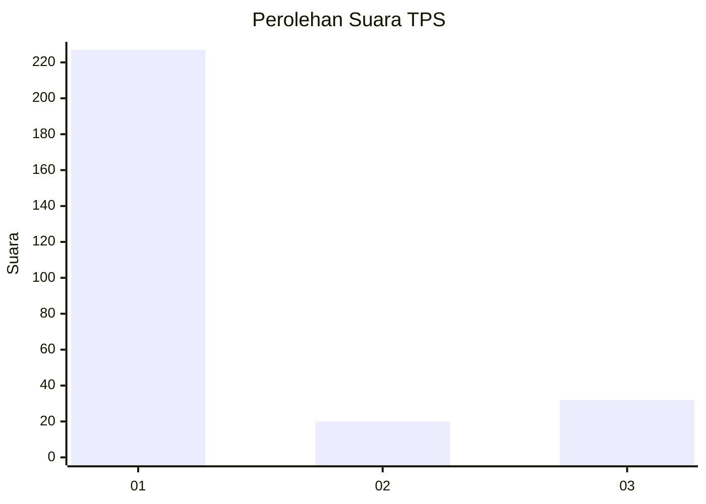
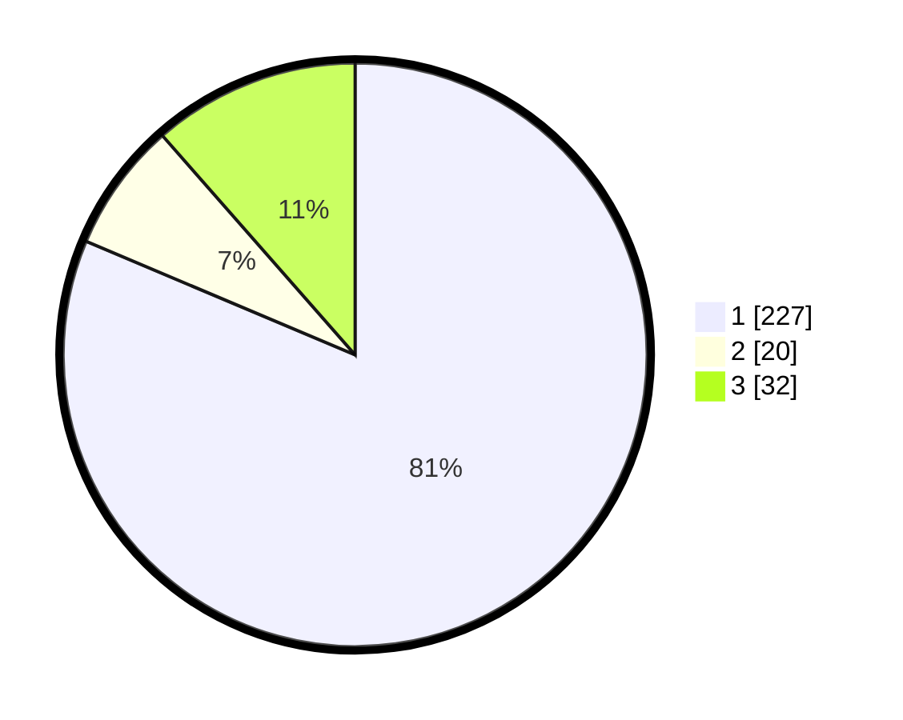

# Hasil

## Grafik

## Tabel

| No. | Nama Paslon    | Suara | Suara (raw) | Persentase |
|:--- |:-------------- | -----:| -----------:| ----------:|
| 1   | ANIES MUHAIMIN | 227   | [227][p-1]  | 81,36      |
| 2   | PRABOWO GIBRAN | 20    | [20][p-2]   | 7,17       |
| 3   | GANJAR MAHFUD  | 32    | [32][p-3]   | 11,47      |

[p-1]: https://github.com/gigit-pemilu/pemilu-2024/blob/main/pilpres/hitung-suara/sub/35-jawa-timur/sub/28-pamekasan/sub/13-pasean/sub/2005-tlonto-raja/sub/001-tps/sub/paslon-1.txt
[p-2]: https://github.com/gigit-pemilu/pemilu-2024/blob/main/pilpres/hitung-suara/sub/35-jawa-timur/sub/28-pamekasan/sub/13-pasean/sub/2005-tlonto-raja/sub/001-tps/sub/paslon-2.txt
[p-3]: https://github.com/gigit-pemilu/pemilu-2024/blob/main/pilpres/hitung-suara/sub/35-jawa-timur/sub/28-pamekasan/sub/13-pasean/sub/2005-tlonto-raja/sub/001-tps/sub/paslon-3.txt

## Foto C Plano

https://sirekap-obj-formc.kpu.go.id/a7e1/pemilu/ppwp/35/28/13/20/05/3528132005001-20240215-093052--116943cc-0267-4109-b05f-87a12685323e.jpg

https://sirekap-obj-formc.kpu.go.id/a7e1/pemilu/ppwp/35/28/13/20/05/3528132005001-20240214-225453--31e238d5-f7fb-4b23-8f8e-d2f48e3371da.jpg

https://sirekap-obj-formc.kpu.go.id/a7e1/pemilu/ppwp/35/28/13/20/05/3528132005001-20240214-225629--8860fc67-39a0-459a-a525-66be65892d2d.jpg

## Metadata

| Key        | Value               |
| ---------- | ------------------- |
| Time Stamp | 2024-02-17 11:30:03 |

