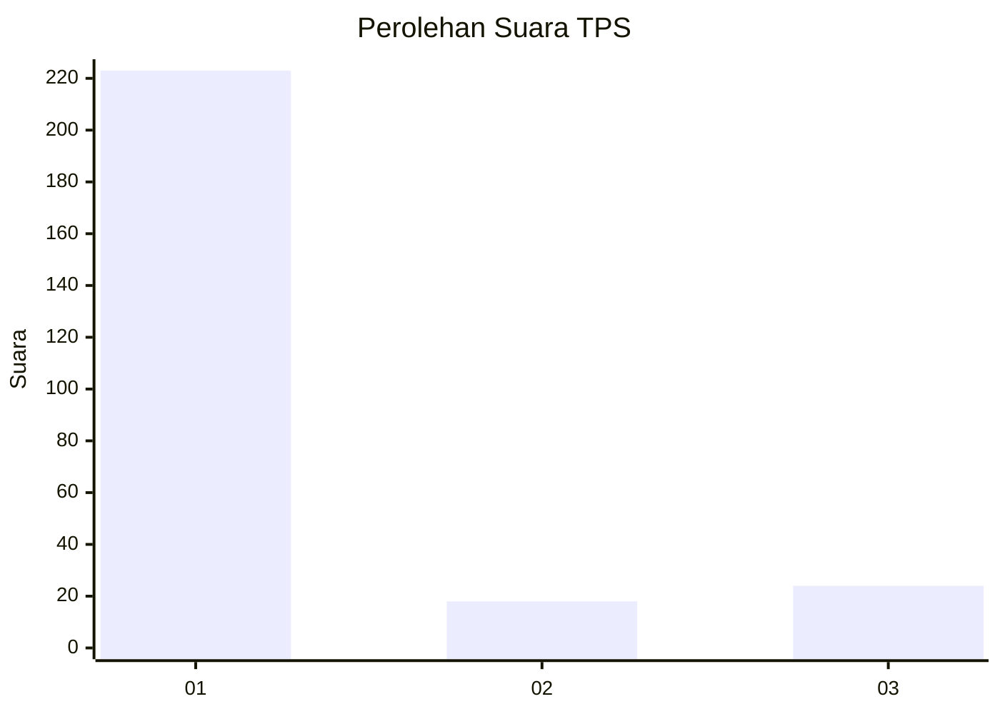
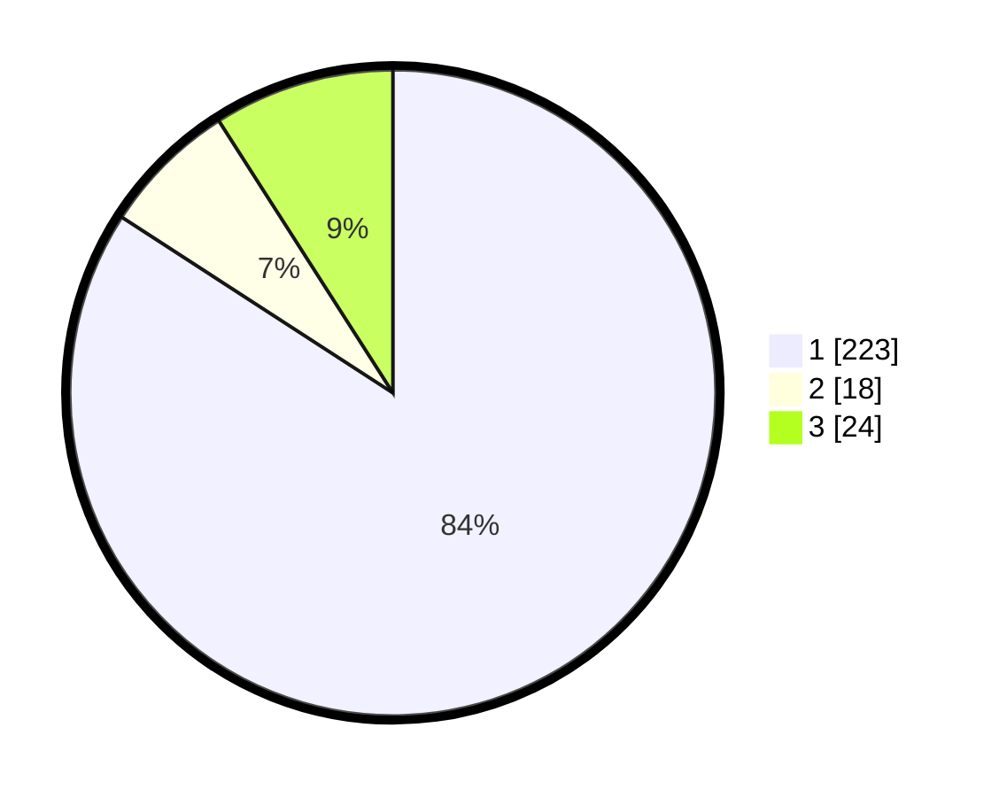

# Hasil

## Grafik

## Tabel

| No. | Nama Paslon    | Suara | Suara (raw) | Persentase |
|:--- |:-------------- | -----:| -----------:| ----------:|
| 1   | ANIES MUHAIMIN | 223   | [223][p-1]  | 84,15      |
| 2   | PRABOWO GIBRAN | 18    | [18][p-2]   | 6,79       |
| 3   | GANJAR MAHFUD  | 24    | [24][p-3]   | 9,06       |

[p-1]: https://github.com/gigit-pemilu/pemilu-2024-35-jawa-timur/blob/main/pilpres/hitung-suara/sub/35-jawa-timur/sub/28-pamekasan/sub/13-pasean/sub/2005-tlonto-raja/sub/006-tps/sub/paslon-1.txt
[p-2]: https://github.com/gigit-pemilu/pemilu-2024-35-jawa-timur/blob/main/pilpres/hitung-suara/sub/35-jawa-timur/sub/28-pamekasan/sub/13-pasean/sub/2005-tlonto-raja/sub/006-tps/sub/paslon-2.txt
[p-3]: https://github.com/gigit-pemilu/pemilu-2024-35-jawa-timur/blob/main/pilpres/hitung-suara/sub/35-jawa-timur/sub/28-pamekasan/sub/13-pasean/sub/2005-tlonto-raja/sub/006-tps/sub/paslon-3.txt

## Foto C Plano

https://sirekap-obj-formc.kpu.go.id/cb76/pemilu/ppwp/35/28/13/20/05/3528132005006-20240215-113623--7625a130-d658-4773-a993-982a36fa84ad.jpg

https://sirekap-obj-formc.kpu.go.id/cb76/pemilu/ppwp/35/28/13/20/05/3528132005006-20240215-113754--a3c65f73-0800-4af4-9877-b07c808bd8aa.jpg

https://sirekap-obj-formc.kpu.go.id/cb76/pemilu/ppwp/35/28/13/20/05/3528132005006-20240215-113848--b228c691-e3df-4a42-9cfd-ebfd7e4ee5cf.jpg

## Metadata

| Key        | Value               |
| ---------- | ------------------- |
| Time Stamp | 2024-02-17 11:30:03 |

