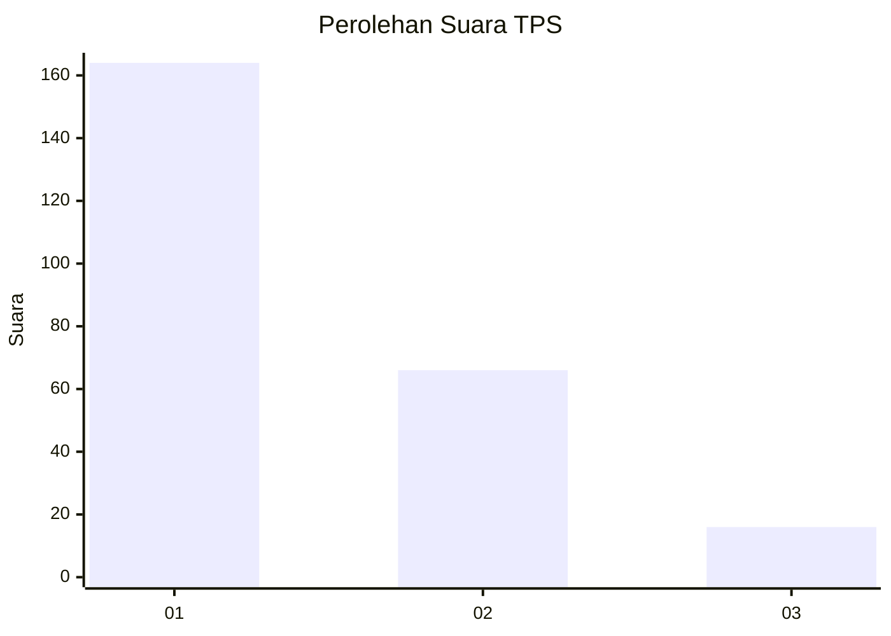
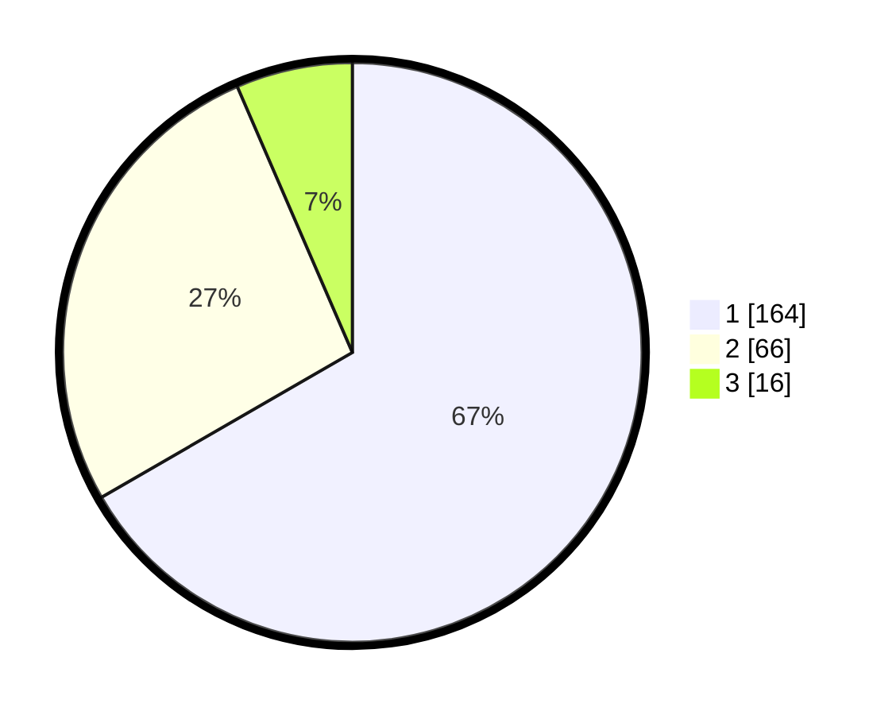

# Hasil

## Grafik

## Tabel

| No. | Nama Paslon    | Suara | Suara (raw) | Persentase |
|:--- |:-------------- | -----:| -----------:| ----------:|
| 1   | ANIES MUHAIMIN | 164   | [164][p-1]  | 66,67      |
| 2   | PRABOWO GIBRAN | 66    | [66][p-2]   | 26,83      |
| 3   | GANJAR MAHFUD  | 16    | [16][p-3]   | 6,50       |

[p-1]: https://github.com/gigit-pemilu/pemilu-2024/blob/main/pilpres/hitung-suara/sub/35-jawa-timur/sub/28-pamekasan/sub/13-pasean/sub/2005-tlonto-raja/sub/008-tps/sub/paslon-1.txt
[p-2]: https://github.com/gigit-pemilu/pemilu-2024/blob/main/pilpres/hitung-suara/sub/35-jawa-timur/sub/28-pamekasan/sub/13-pasean/sub/2005-tlonto-raja/sub/008-tps/sub/paslon-2.txt
[p-3]: https://github.com/gigit-pemilu/pemilu-2024/blob/main/pilpres/hitung-suara/sub/35-jawa-timur/sub/28-pamekasan/sub/13-pasean/sub/2005-tlonto-raja/sub/008-tps/sub/paslon-3.txt

## Foto C Plano

https://sirekap-obj-formc.kpu.go.id/136e/pemilu/ppwp/35/28/13/20/05/3528132005008-20240214-202039--686b931d-4554-499d-90d0-5faf51712d75.jpg

https://sirekap-obj-formc.kpu.go.id/136e/pemilu/ppwp/35/28/13/20/05/3528132005008-20240214-202157--f6bfcbb5-57df-47bb-bdf4-54bc4b3375ae.jpg

https://sirekap-obj-formc.kpu.go.id/136e/pemilu/ppwp/35/28/13/20/05/3528132005008-20240214-202252--77236153-77d0-4fd2-a2be-4fe14ca9e9f0.jpg

## Metadata

| Key        | Value               |
| ---------- | ------------------- |
| Time Stamp | 2024-02-19 06:16:00 |

