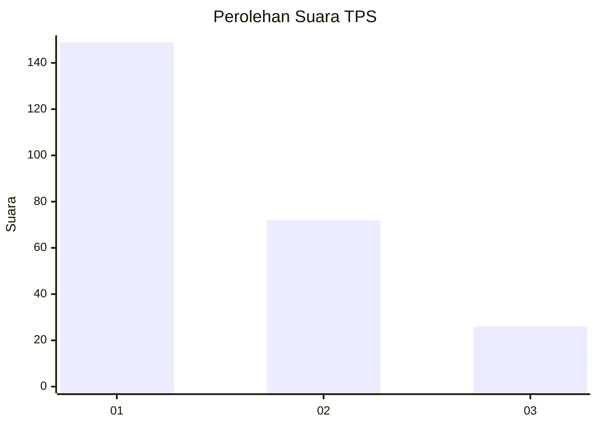
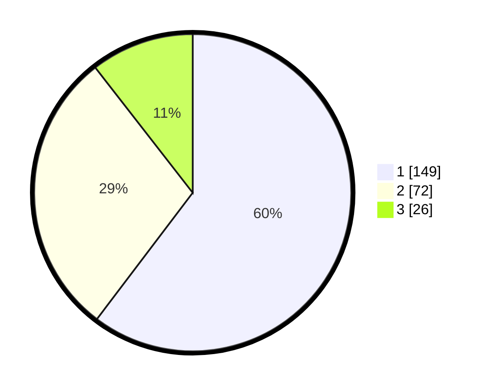

# Hasil

## Grafik

## Tabel

| No. | Nama Paslon    | Suara | Suara (raw) | Persentase |
|:--- |:-------------- | -----:| -----------:| ----------:|
| 1   | ANIES MUHAIMIN | 149   | [149][p-1]  | 60,32      |
| 2   | PRABOWO GIBRAN | 72    | [72][p-2]   | 29,15      |
| 3   | GANJAR MAHFUD  | 26    | [26][p-3]   | 10,53      |

[p-1]: https://github.com/gigit-pemilu/pemilu-2024-35-jawa-timur/blob/main/pilpres/hitung-suara/sub/35-jawa-timur/sub/28-pamekasan/sub/13-pasean/sub/2005-tlonto-raja/sub/009-tps/sub/paslon-1.txt
[p-2]: https://github.com/gigit-pemilu/pemilu-2024-35-jawa-timur/blob/main/pilpres/hitung-suara/sub/35-jawa-timur/sub/28-pamekasan/sub/13-pasean/sub/2005-tlonto-raja/sub/009-tps/sub/paslon-2.txt
[p-3]: https://github.com/gigit-pemilu/pemilu-2024-35-jawa-timur/blob/main/pilpres/hitung-suara/sub/35-jawa-timur/sub/28-pamekasan/sub/13-pasean/sub/2005-tlonto-raja/sub/009-tps/sub/paslon-3.txt

## Foto C Plano

https://sirekap-obj-formc.kpu.go.id/a069/pemilu/ppwp/35/28/13/20/05/3528132005009-20240215-134340--a172c67e-1fe2-4f1f-a25b-70575539318e.jpg

https://sirekap-obj-formc.kpu.go.id/a069/pemilu/ppwp/35/28/13/20/05/3528132005009-20240215-134355--e7229089-38b7-4f75-9ecd-732ff02551da.jpg

https://sirekap-obj-formc.kpu.go.id/a069/pemilu/ppwp/35/28/13/20/05/3528132005009-20240215-134407--29f1d718-0ffe-48aa-888d-20bd76716ee7.jpg

## Metadata

| Key        | Value               |
| ---------- | ------------------- |
| Time Stamp | 2024-02-19 06:16:00 |

