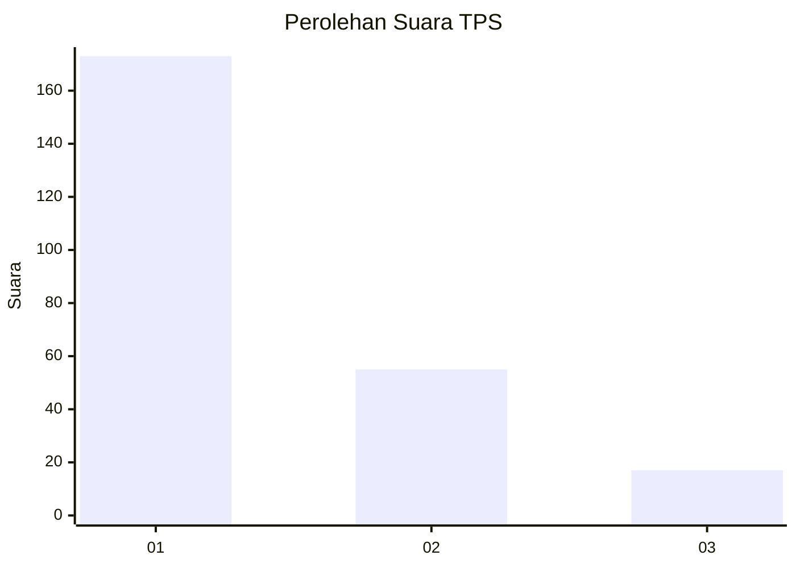
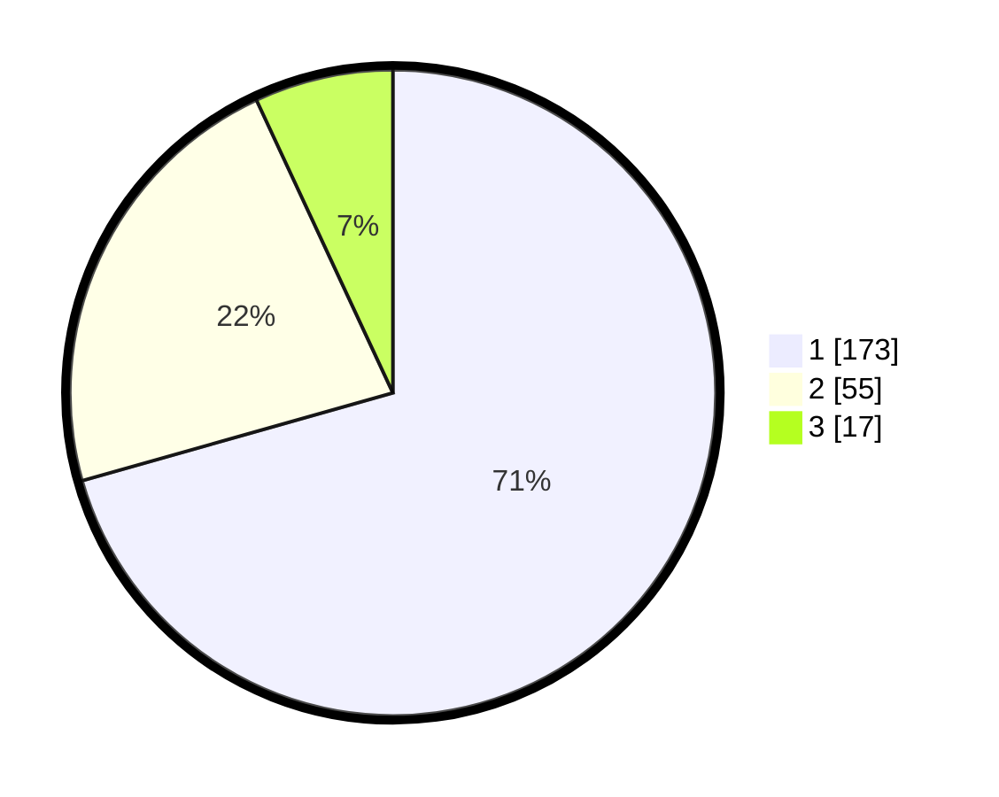

# Hasil

## Grafik

## Tabel

| No. | Nama Paslon    | Suara | Suara (raw) | Persentase |
|:--- |:-------------- | -----:| -----------:| ----------:|
| 1   | ANIES MUHAIMIN | 173   | [173][p-1]  | 70,61      |
| 2   | PRABOWO GIBRAN | 55    | [55][p-2]   | 22,45      |
| 3   | GANJAR MAHFUD  | 17    | [17][p-3]   | 6,94       |

[p-1]: https://github.com/gigit-pemilu/pemilu-2024/blob/main/pilpres/hitung-suara/sub/35-jawa-timur/sub/28-pamekasan/sub/13-pasean/sub/2005-tlonto-raja/sub/011-tps/sub/paslon-1.txt
[p-2]: https://github.com/gigit-pemilu/pemilu-2024/blob/main/pilpres/hitung-suara/sub/35-jawa-timur/sub/28-pamekasan/sub/13-pasean/sub/2005-tlonto-raja/sub/011-tps/sub/paslon-2.txt
[p-3]: https://github.com/gigit-pemilu/pemilu-2024/blob/main/pilpres/hitung-suara/sub/35-jawa-timur/sub/28-pamekasan/sub/13-pasean/sub/2005-tlonto-raja/sub/011-tps/sub/paslon-3.txt

## Foto C Plano

https://sirekap-obj-formc.kpu.go.id/cbc0/pemilu/ppwp/35/28/13/20/05/3528132005011-20240215-094512--21d0ab60-a7b1-4d48-9f66-21c0e3e5a2d3.jpg

https://sirekap-obj-formc.kpu.go.id/cbc0/pemilu/ppwp/35/28/13/20/05/3528132005011-20240215-094746--0ec6062f-e2b0-42c1-b33d-5c437aad1a4d.jpg

https://sirekap-obj-formc.kpu.go.id/cbc0/pemilu/ppwp/35/28/13/20/05/3528132005011-20240215-095043--2251df1a-b2eb-4b31-9228-d6f2f1321a63.jpg

## Metadata

| Key        | Value               |
| ---------- | ------------------- |
| Time Stamp | 2024-02-19 06:16:00 |

