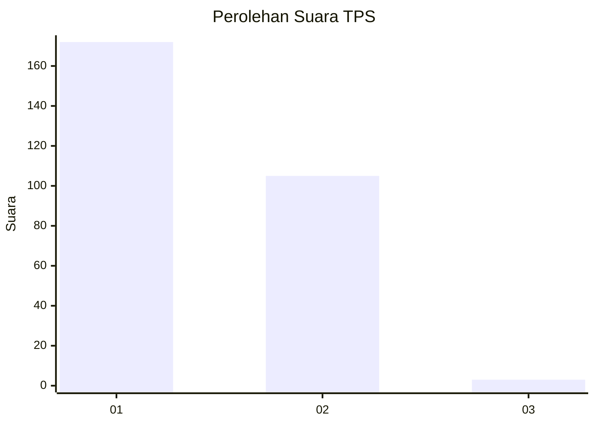
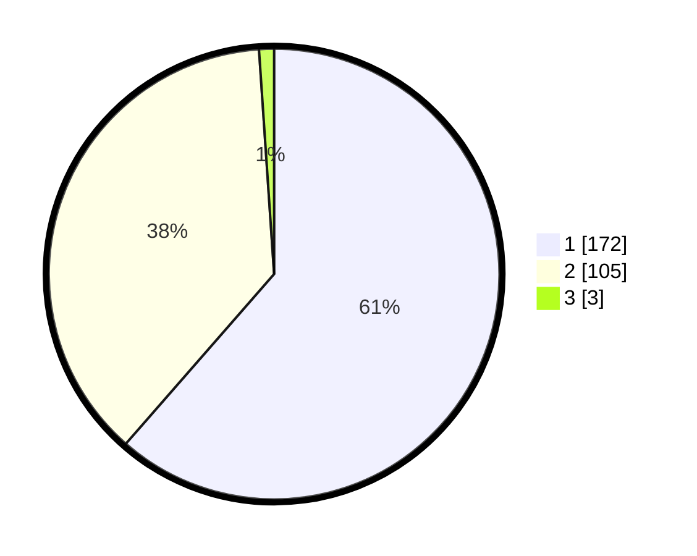

# Hasil

## Grafik

## Tabel

| No. | Nama Paslon    | Suara | Suara (raw) | Persentase |
|:--- |:-------------- | -----:| -----------:| ----------:|
| 1   | ANIES MUHAIMIN | 172   | [172][p-1]  | 61,43      |
| 2   | PRABOWO GIBRAN | 105   | [105][p-2]  | 37,50      |
| 3   | GANJAR MAHFUD  | 3     | [3][p-3]    | 1,07       |

[p-1]: https://github.com/gigit-pemilu/pemilu-2024-35-jawa-timur/blob/main/pilpres/hitung-suara/sub/35-jawa-timur/sub/28-pamekasan/sub/13-pasean/sub/2005-tlonto-raja/sub/015-tps/sub/paslon-1.txt
[p-2]: https://github.com/gigit-pemilu/pemilu-2024-35-jawa-timur/blob/main/pilpres/hitung-suara/sub/35-jawa-timur/sub/28-pamekasan/sub/13-pasean/sub/2005-tlonto-raja/sub/015-tps/sub/paslon-2.txt
[p-3]: https://github.com/gigit-pemilu/pemilu-2024-35-jawa-timur/blob/main/pilpres/hitung-suara/sub/35-jawa-timur/sub/28-pamekasan/sub/13-pasean/sub/2005-tlonto-raja/sub/015-tps/sub/paslon-3.txt

## Foto C Plano

https://sirekap-obj-formc.kpu.go.id/a6ae/pemilu/ppwp/35/28/13/20/05/3528132005015-20240214-214812--82338b0c-b0f1-40ee-a0d5-56875e529030.jpg

https://sirekap-obj-formc.kpu.go.id/a6ae/pemilu/ppwp/35/28/13/20/05/3528132005015-20240214-215151--75bf551a-9d8e-4b5a-a13f-de01bf1ead13.jpg

https://sirekap-obj-formc.kpu.go.id/a6ae/pemilu/ppwp/35/28/13/20/05/3528132005015-20240214-215318--a727fd93-9883-4be9-8b56-104ff5c2af1d.jpg

## Metadata

| Key        | Value               |
| ---------- | ------------------- |
| Time Stamp | 2024-02-17 11:30:03 |

