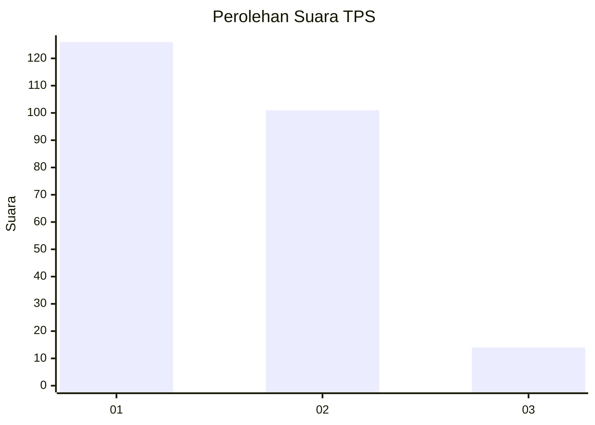
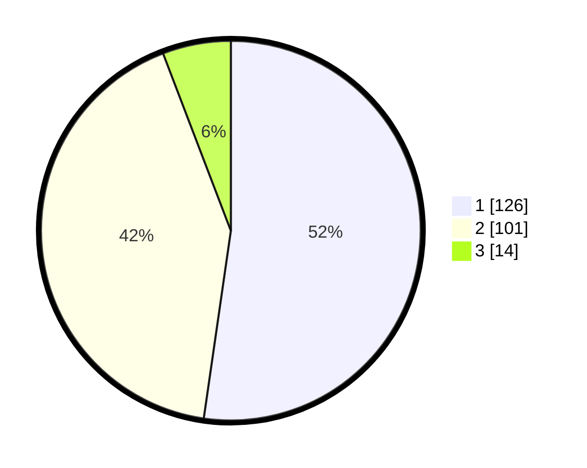

# Hasil

## Grafik

## Tabel

| No. | Nama Paslon    | Suara | Suara (raw) | Persentase |
|:--- |:-------------- | -----:| -----------:| ----------:|
| 1   | ANIES MUHAIMIN | 126   | [126][p-1]  | 52,28      |
| 2   | PRABOWO GIBRAN | 101   | [101][p-2]  | 41,91      |
| 3   | GANJAR MAHFUD  | 14    | [14][p-3]   | 5,81       |

[p-1]: https://github.com/gigit-pemilu/pemilu-2024/blob/main/pilpres/hitung-suara/sub/35-jawa-timur/sub/28-pamekasan/sub/13-pasean/sub/2005-tlonto-raja/sub/016-tps/sub/paslon-1.txt
[p-2]: https://github.com/gigit-pemilu/pemilu-2024/blob/main/pilpres/hitung-suara/sub/35-jawa-timur/sub/28-pamekasan/sub/13-pasean/sub/2005-tlonto-raja/sub/016-tps/sub/paslon-2.txt
[p-3]: https://github.com/gigit-pemilu/pemilu-2024/blob/main/pilpres/hitung-suara/sub/35-jawa-timur/sub/28-pamekasan/sub/13-pasean/sub/2005-tlonto-raja/sub/016-tps/sub/paslon-3.txt

## Foto C Plano

https://sirekap-obj-formc.kpu.go.id/2a9f/pemilu/ppwp/35/28/13/20/05/3528132005016-20240214-214311--a190072c-745e-4dea-be45-89ea1d57bab9.jpg

https://sirekap-obj-formc.kpu.go.id/2a9f/pemilu/ppwp/35/28/13/20/05/3528132005016-20240214-214440--eecb69f3-7085-47f9-85ab-7b04167e33d4.jpg

https://sirekap-obj-formc.kpu.go.id/2a9f/pemilu/ppwp/35/28/13/20/05/3528132005016-20240214-214534--7d20e813-4d23-4542-9a13-f68c91464631.jpg

## Metadata

| Key        | Value               |
| ---------- | ------------------- |
| Time Stamp | 2024-02-19 06:16:00 |

