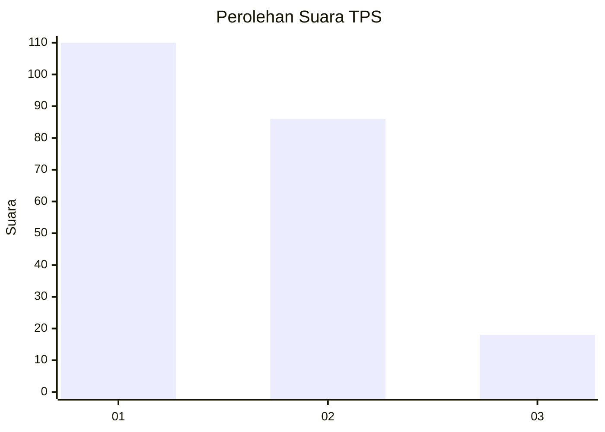
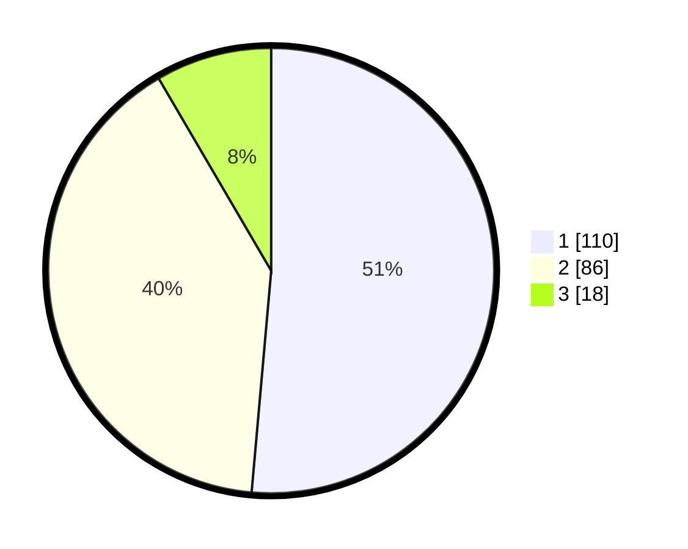

# Hasil

## Grafik

## Tabel

| No. | Nama Paslon    | Suara | Suara (raw) | Persentase |
|:--- |:-------------- | -----:| -----------:| ----------:|
| 1   | ANIES MUHAIMIN | 110   | [110][p-1]  | 51,40      |
| 2   | PRABOWO GIBRAN | 86    | [86][p-2]   | 40,19      |
| 3   | GANJAR MAHFUD  | 18    | [18][p-3]   | 8,41       |

[p-1]: https://github.com/gigit-pemilu/pemilu-2024-35-jawa-timur/blob/main/pilpres/hitung-suara/sub/35-jawa-timur/sub/28-pamekasan/sub/13-pasean/sub/2005-tlonto-raja/sub/017-tps/sub/paslon-1.txt
[p-2]: https://github.com/gigit-pemilu/pemilu-2024-35-jawa-timur/blob/main/pilpres/hitung-suara/sub/35-jawa-timur/sub/28-pamekasan/sub/13-pasean/sub/2005-tlonto-raja/sub/017-tps/sub/paslon-2.txt
[p-3]: https://github.com/gigit-pemilu/pemilu-2024-35-jawa-timur/blob/main/pilpres/hitung-suara/sub/35-jawa-timur/sub/28-pamekasan/sub/13-pasean/sub/2005-tlonto-raja/sub/017-tps/sub/paslon-3.txt

## Foto C Plano

https://sirekap-obj-formc.kpu.go.id/687e/pemilu/ppwp/35/28/13/20/05/3528132005017-20240215-122238--852aedaf-3ea4-4ed2-811e-be27b6427ff5.jpg

https://sirekap-obj-formc.kpu.go.id/687e/pemilu/ppwp/35/28/13/20/05/3528132005017-20240215-120145--328de63b-260c-4e34-a863-a9141cb5f41b.jpg

https://sirekap-obj-formc.kpu.go.id/687e/pemilu/ppwp/35/28/13/20/05/3528132005017-20240215-114435--1124a33e-91e6-4fae-a68c-1b107a2682a2.jpg

## Metadata

| Key        | Value               |
| ---------- | ------------------- |
| Time Stamp | 2024-02-25 21:00:00 |

