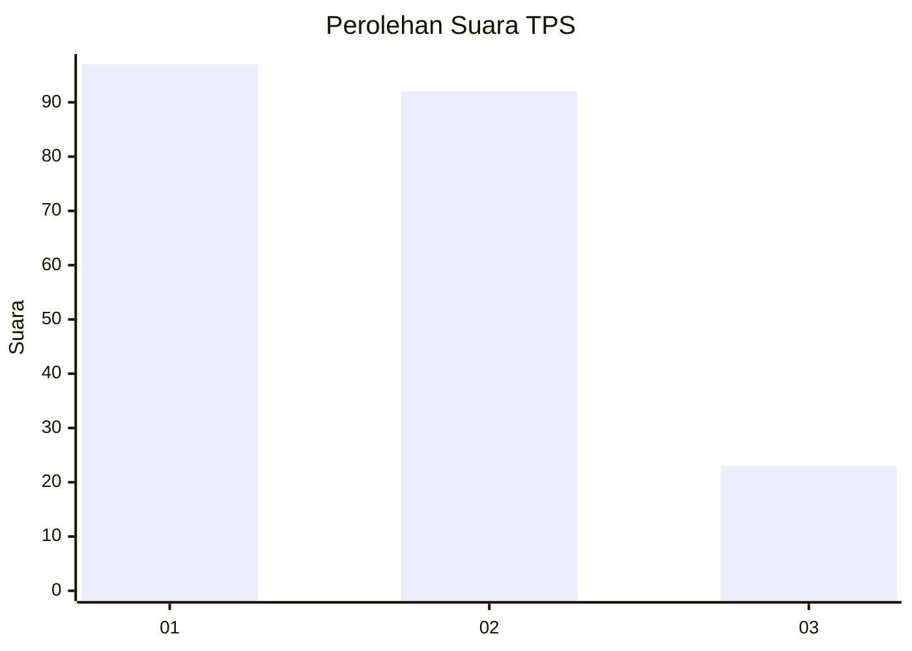
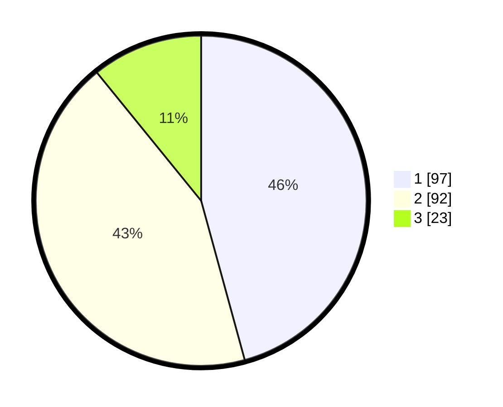

# Hasil

## Grafik

## Tabel

| No. | Nama Paslon    | Suara | Suara (raw) | Persentase |
|:--- |:-------------- | -----:| -----------:| ----------:|
| 1   | ANIES MUHAIMIN | 97    | [97][p-1]   | 45,75      |
| 2   | PRABOWO GIBRAN | 92    | [92][p-2]   | 43,40      |
| 3   | GANJAR MAHFUD  | 23    | [23][p-3]   | 10,85      |

[p-1]: https://github.com/gigit-pemilu/pemilu-2024-35-jawa-timur/blob/main/pilpres/hitung-suara/sub/35-jawa-timur/sub/28-pamekasan/sub/13-pasean/sub/2005-tlonto-raja/sub/018-tps/sub/paslon-1.txt
[p-2]: https://github.com/gigit-pemilu/pemilu-2024-35-jawa-timur/blob/main/pilpres/hitung-suara/sub/35-jawa-timur/sub/28-pamekasan/sub/13-pasean/sub/2005-tlonto-raja/sub/018-tps/sub/paslon-2.txt
[p-3]: https://github.com/gigit-pemilu/pemilu-2024-35-jawa-timur/blob/main/pilpres/hitung-suara/sub/35-jawa-timur/sub/28-pamekasan/sub/13-pasean/sub/2005-tlonto-raja/sub/018-tps/sub/paslon-3.txt

## Foto C Plano

https://sirekap-obj-formc.kpu.go.id/dbef/pemilu/ppwp/35/28/13/20/05/3528132005018-20240215-142928--97ff2b6d-c7e8-4515-8f0c-575f44ce4904.jpg

https://sirekap-obj-formc.kpu.go.id/dbef/pemilu/ppwp/35/28/13/20/05/3528132005018-20240215-143127--be53d27b-7a0e-4d49-a56a-40bf3a27eacb.jpg

https://sirekap-obj-formc.kpu.go.id/dbef/pemilu/ppwp/35/28/13/20/05/3528132005018-20240215-143318--39e835de-1ab9-4997-ace2-6ff7245e1c97.jpg

## Metadata

| Key        | Value               |
| ---------- | ------------------- |
| Time Stamp | 2024-02-19 06:16:00 |

