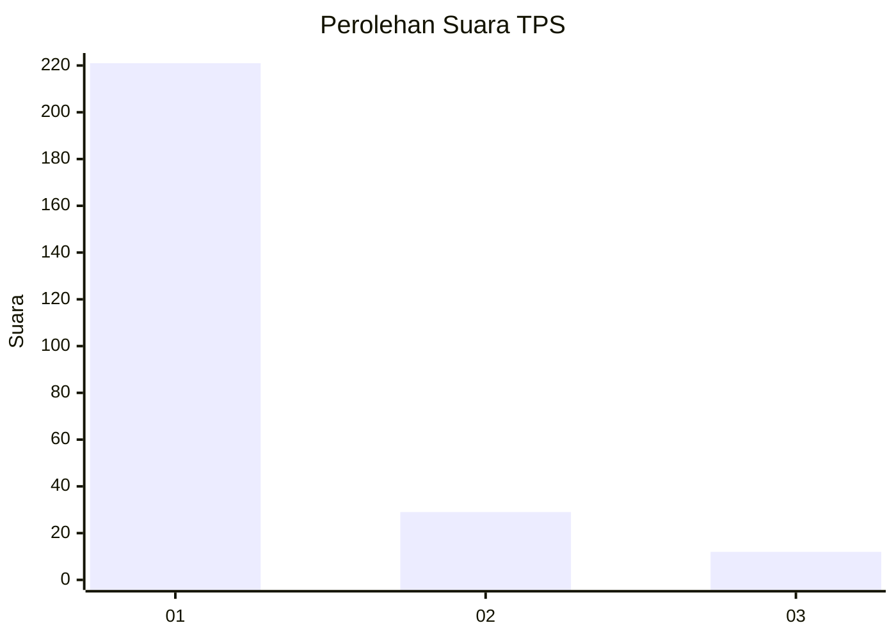
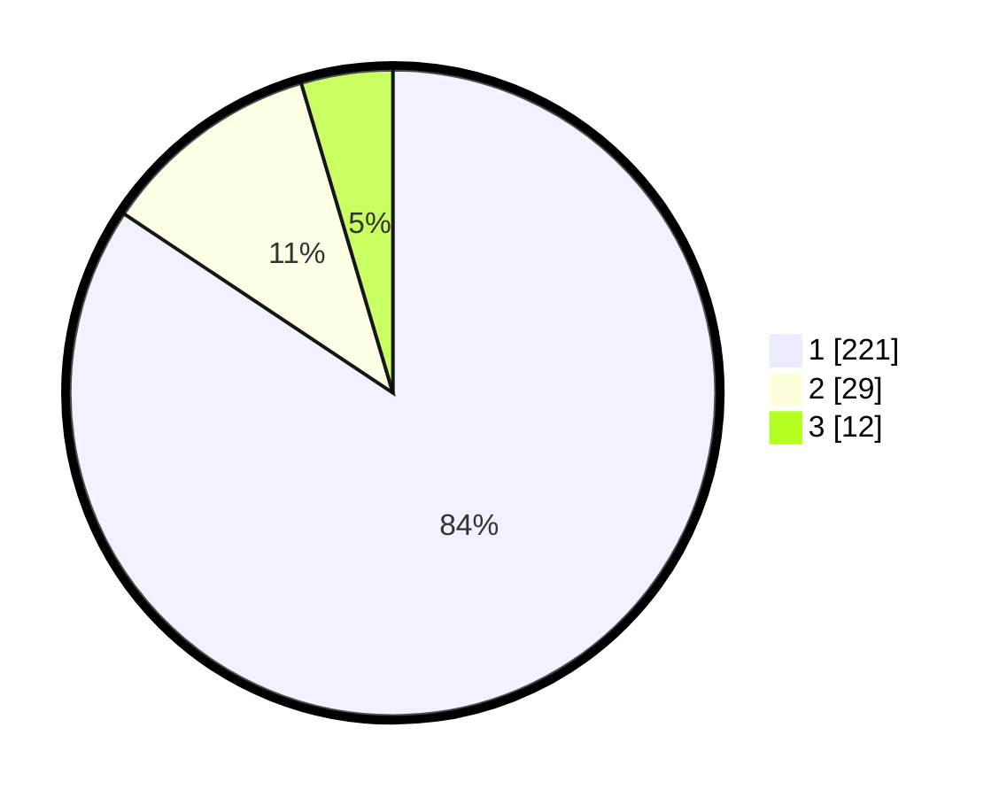

# Hasil

## Grafik

## Tabel

| No. | Nama Paslon    | Suara | Suara (raw) | Persentase |
|:--- |:-------------- | -----:| -----------:| ----------:|
| 1   | ANIES MUHAIMIN | 221   | [221][p-1]  | 84,35      |
| 2   | PRABOWO GIBRAN | 29    | [29][p-2]   | 11,07      |
| 3   | GANJAR MAHFUD  | 12    | [12][p-3]   | 4,58       |

[p-1]: https://github.com/gigit-pemilu/pemilu-2024-35-jawa-timur/blob/main/pilpres/hitung-suara/sub/35-jawa-timur/sub/28-pamekasan/sub/13-pasean/sub/2005-tlonto-raja/sub/019-tps/sub/paslon-1.txt
[p-2]: https://github.com/gigit-pemilu/pemilu-2024-35-jawa-timur/blob/main/pilpres/hitung-suara/sub/35-jawa-timur/sub/28-pamekasan/sub/13-pasean/sub/2005-tlonto-raja/sub/019-tps/sub/paslon-2.txt
[p-3]: https://github.com/gigit-pemilu/pemilu-2024-35-jawa-timur/blob/main/pilpres/hitung-suara/sub/35-jawa-timur/sub/28-pamekasan/sub/13-pasean/sub/2005-tlonto-raja/sub/019-tps/sub/paslon-3.txt

## Foto C Plano

https://sirekap-obj-formc.kpu.go.id/5856/pemilu/ppwp/35/28/13/20/05/3528132005019-20240215-003841--c3829d3b-318c-43d9-81f2-8efb95070b1a.jpg

https://sirekap-obj-formc.kpu.go.id/5856/pemilu/ppwp/35/28/13/20/05/3528132005019-20240215-003931--6dffd33c-1674-4854-a3cf-3ed8b6d486dc.jpg

https://sirekap-obj-formc.kpu.go.id/5856/pemilu/ppwp/35/28/13/20/05/3528132005019-20240215-004010--86041c3c-8e89-4c22-9077-0c1f13a51f17.jpg

## Metadata

| Key        | Value               |
| ---------- | ------------------- |
| Time Stamp | 2024-02-19 06:16:00 |

