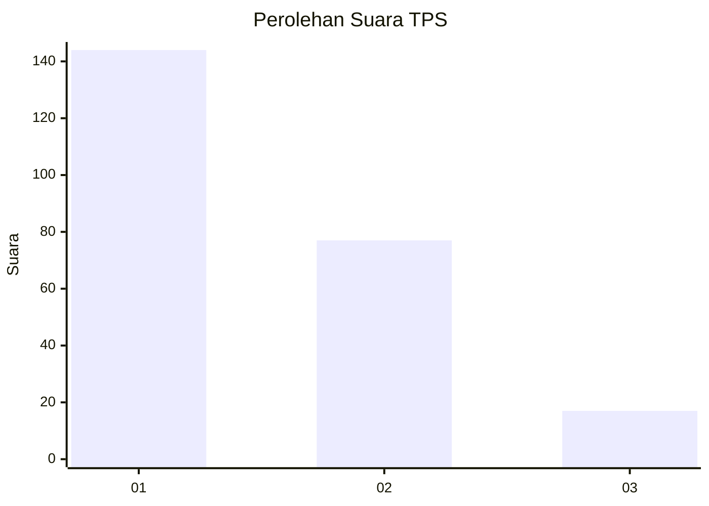
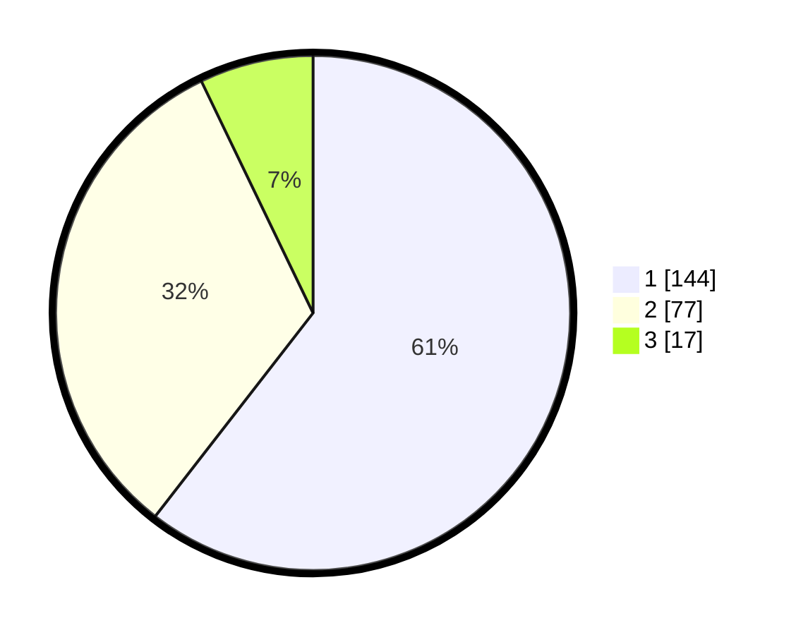

# Hasil

## Grafik

## Tabel

| No. | Nama Paslon    | Suara | Suara (raw) | Persentase |
|:--- |:-------------- | -----:| -----------:| ----------:|
| 1   | ANIES MUHAIMIN | 144   | [144][p-1]  | 60,50      |
| 2   | PRABOWO GIBRAN | 77    | [77][p-2]   | 32,35      |
| 3   | GANJAR MAHFUD  | 17    | [17][p-3]   | 7,14       |

[p-1]: https://github.com/gigit-pemilu/pemilu-2024-35-jawa-timur/blob/main/pilpres/hitung-suara/sub/35-jawa-timur/sub/28-pamekasan/sub/13-pasean/sub/2005-tlonto-raja/sub/030-tps/sub/paslon-1.txt
[p-2]: https://github.com/gigit-pemilu/pemilu-2024-35-jawa-timur/blob/main/pilpres/hitung-suara/sub/35-jawa-timur/sub/28-pamekasan/sub/13-pasean/sub/2005-tlonto-raja/sub/030-tps/sub/paslon-2.txt
[p-3]: https://github.com/gigit-pemilu/pemilu-2024-35-jawa-timur/blob/main/pilpres/hitung-suara/sub/35-jawa-timur/sub/28-pamekasan/sub/13-pasean/sub/2005-tlonto-raja/sub/030-tps/sub/paslon-3.txt

## Foto C Plano

https://sirekap-obj-formc.kpu.go.id/f013/pemilu/ppwp/35/28/13/20/05/3528132005030-20240214-212449--747ca6ec-192c-4f4b-936a-6dded5ecc582.jpg

https://sirekap-obj-formc.kpu.go.id/f013/pemilu/ppwp/35/28/13/20/05/3528132005030-20240214-225757--dc934879-7456-47dc-81ba-17c3867fddf5.jpg

https://sirekap-obj-formc.kpu.go.id/f013/pemilu/ppwp/35/28/13/20/05/3528132005030-20240214-213323--a6e10f4a-f4c4-4f89-9ce4-350b04d40267.jpg

## Metadata

| Key        | Value               |
| ---------- | ------------------- |
| Time Stamp | 2024-02-24 22:31:28 |

